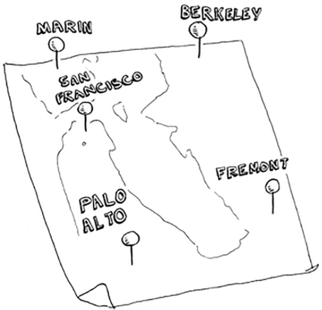
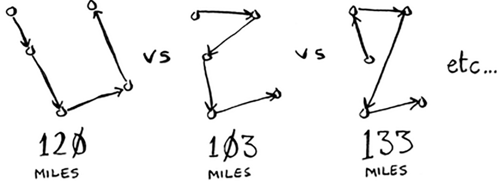

# TRAVELING SALESPERSON

## Use cases

- search the way to visit all cities with the shortest distance;

## Input

- a list of points with their coordinates.

## Output

- the shortest distance.

## Example 1. Find the shortest way to visit all cities

The salesperson has to go to 5 cities.

He wants to visit the cities while travelling the minimum distance, so he tries to find the shortest way.

## Complexity

$O(n!)$

| Cities amount | Operations amount |
| ------------- | ----------------- |
| 2             | 2                 |
| 3             | 6                 |
| 4             | 24                |
| 5             | 120               |
| ...           | ...               |
| 15            | 1,307,674,368,000 |
