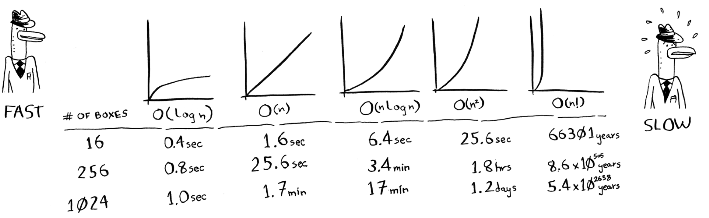

# GROKKING ALGORITHMS

## BIG O NOTATION

Big $O$:

- tells how the running time increases as the list size increases – how fast your algorithm grows;
- cannot tell the exact or at least approximate running time;
- tells you the number of operations an algorithm will make;
- establishes a worst-case run time; in some cases, your algorithm can run faster than Big $O$ establishes; it is reassurance – you will know that your algorithm will never be slower than $O$ tells;
- has no any demension – it is a bare number;
- is a simplification; you can convert Big $O$ neigher to a number of operations nor to seconds;

Example:

Binary search needs $log{_2}n$ operations to check a list of size $n$. What is the running time in Big $O$ notation? It is $O(log{_2}n)$.

### SOME COMMON BIG $O$ RUN TIMES

The 5 most common run times (there are others).

- $O(log{_2}n)$. Example: binary search.
- $O(n)$. Example: simple search.
- $O(n * log{_2}n)$. Example: a fast sorting algorithm, like quicksort.
- $O(n^2)$. Example: a slow sorting algorithm, like selection sort.
- $O(n!)$. Example: A really slow algorithm, like a travelling salesperson.

