# SUMMARY: CLEAN ARCHITECTURE BY ROBERT C. MARTIN

## GLOSSARY

- **SRP** – single responsibility principle;
- **OCP** – open / closed principle;
- **LSP** – Liskov substitution principle;
- **ISP** – interface segregation principle;
- **DIP** – dependency inversion principle;
- **REP** – reuse / release equivalence principle;
- **CCP** – common closure principle;
- **CRP** – common reuse principle;
- **ADP** – acyclic dependencies principle;
- **SDP** – stable dependencies principle;
- **SAP** – stable abstractions principle;

## FOREWORD

> **Architecture** represents the **significant design decisions that shape a system**, where significant is measured by cost of change.

System's development changes should be:

- ~~💸 costly~~;
- ~~🤯 hard to make~~;
- ~~🏭 managed projects of their own~~;
- 🥱 easy to implement;
- 🧘 folded into the daily workflow.

There are a lot of paths to build the architecture:

- 🗿 Architecture can be too strong and stable, born from **authority and rigidity**.  
  If change is expensive, change is eliminated, which causes subdued or headed off into a bureacratic ditch.  
  Totalitarism in architecture becomes a dystrophia for developers and a constant source of frustration for all.
- 🤡 Architecture can have a strong smell of **speculative generality**.  
  Your project becomes filled with hard-coded guesswork, countless parameters, tombs of dead code, and more complexity than your maintanance budget can allow.
- 😊 Architecture can be **maintanable and flourishing**.
  - software softness is preserved as a first-class property of the system;
  - new things are discovered and created;
  - questions are asked;
  - experiments are ran.

A good architecture is ~~a destination or a frozen artifact~~ an ongoing process like a jorney or enquiry.

## PREFACE

Software systems are created for different domains and using various technologies. But they share similar rules of architecture: rules are about ordering and assembling the building blocks of programs.

## PART I. INTRODUCTION

Getting software working is easy. Kids, students and juniors create programs. The code they produce may not be pretty, but it works because getting something to work – once – is easy.

Gettings software right is hard. It requires knowledge, skills that most programmers don't take time to develop. It requires high level of and discipline and didication that most programmers never dreamed they'd need. It takes a passion for the craft and the desire to be a professional.

When your software is done right:

- ~~you need hords of programmers to keep it working~~;
- ~~you need massive requirements documents and huge issue tracking systems~~;
- ~~you need 24/7 programming~~;
- ~~bad code and rotten design~~;
- ~~exhausted patience of the managers~~;
- ~~trivial changes require two-week digging and involve high risks~~;
- the system structure is intuitive;
- you need only a fraction of human resources to create and maintain;
- changes are simple and rapid;
- defects are few and far between;
- effort is minimized;
- functionality and flexibility are maximized;
- customers are happy, managers trust you.

### CHAPTER 1. WHAT IS DESIGN AND ARCHITECTURE

Design and architecture are the same. The word «architecture» is often used to describe high-level concepts that are divorced from low-level details. The word «design», conversely, more often implies structures and decisions at a low level.  
But this separation is nonsensical when you look what a real architect does.  
Low-level details and high-level decision are all part of the same whole. There is no clear dividing line between them. There is simply a continuum of decisions from the highest to the lowest levels.

#### THE GOAL

> The **goal** of software architecure is to **minimize the human resources required** to build and maintain the required system.

The **measure of design quality** is the measure of the **effort required** to meet the customer's needs.  
The effort is low, and stays low throughout the lifetime of the system? The design is good.  
The effort grows with each release? The design is bad.

#### CASE STUDY

You can measure how some interesting measures change during the system lifetime.

- engineering staff amount;
- time per codeline;
- codeline cost;
- company's monthly development payroll;
- other productivity indices.

#### THE SIGNATURE OF A MESS

When a system is messy, the developers' job becomes «moving the mess from one place to the next, and the next», so that they can add one more inadequately little feature. The company's earnings fall down, developers frustrate, managers are in rage.

#### WHAT WENT WRONG

The morals of the «Tortoise and the Hare» story:

- slow and steady wins the race;
- the race is not to the swift, nor the battle to the strong;
- the more haste, the less speed.

Most developers work hard, but a part of their brain sleeps – the part that knows that clean, well-designed code matters.

Another mistake: «We can clean it up later, we just have to get to market first!» – the Hare's mistake.  
Why later? Do you think you won't have to get new features done? Or maybe the «Pause the market» button will suddenly appear?  
These developers are overconfident in their ability to remain productive.  
Writing messy code makes them go fast in the short term and slows them down in the long term.

> The only way to go fast, is to go well.

Stop be overconfident.  
Start taking the responsibility for the mess you've made.

The solution is ~~to start over from scratch and redesign the whole system~~. No, it will be just another manifestation of the same overconfidence that led to the mess.  
Their overconfidence will drive the redesign into the same mess as the original project.

#### CONCLUSION

- Recognize and **avoid your overconfidence**.
- Start taking the quality of your software **seriously**.
- You need to **know what good architecture is**, what **its attributes** are.

### CHAPTER 2. A TALE OF TWO VALUES

Every software system provides two different values to the stakeholders: behavior and structure.  
Developers are responsible for ensuring that both of them remain high.  
Unfortunetely, developers often focus of one of them, leaving the software system eventually valueless.

#### BEHAVIOR

Developers are hired to make machines to behave in a way that makes or saves money for the stakeholders.  
We do this by helping the stakeholders to develop a functional specification, or requirements document.  
Many programmers think that is the entirely of their job. They are sadly mistaken.

#### ARCHITECTURE

The second value of software relates to the softness of software. Software is intended to be a way to easily change the behavior of machines.

To fulfill its purpose, software must be soft.  
**When the stakeholders change their minds about a feature**, that change should be **easy to make**.  
The difficulty in making such a change should be proportional only to the scope of the change, and not to the shape of the change.

#### THE GREATER VALUE

What is more important for the software system – to work, or to be easy to change?

Business managers likely say it's more important for the software system to work. Developers, in turn, often go alogn with this attitude. But it's a wrong attitude.  
Let's examine the extremes:

- Extreme 1:
  - a program works perfectly;
  - it's impossible to make changes when the requirements change;
  - therefore the program will become useless.
- Extreme 2:
  - a program doesn't work;
  - it is easy to make it work;
  - it is easy to keep it working as requirements change;
  - therefore the program will remain continually useful.

Yes, these are theoretical extremes and there are no programs that are unable to be changed.  
But there are changes-unfriendly systems, when the cost of change exceeds the benefit of change.  
Many systems reach that point in some of their features or configurations.

- 🧑‍💻 Do you want to be able to make changes in the future?
- 🧑‍💼 Of course, but the current functionality is more important than any later flexibility.
- ⏱️ A couple of months later ...
- 🧑‍💼 We need to make changes accordint to this requirements list.
- 🧑‍💻 Estimated cost of these changes will unaffordably high.
- 🧑‍💼 How did you let the system get to this point?

#### EISENHOWER'S MATRIX

|                      |                          |
| -------------------- | ------------------------ |
| Important + urgent   | Important + not urgent   |
| Unimportant + urgent | Unimportant + not urgent |

The first value of software – behavior – is urgent but never particulary important.  
The second value of software – architecture – is important but never particulary urgent.

Of course, some things are both important and urgent, and some – both unimportant and not urgent.

The dilemma for developers is that managers are not equipped to evaluate the importance of architecture. That's what developers were hired to do.  
It's the **responsibility of the software development team to assert the importance of the architecture** over the urgency of features.

#### FIGHT FOR THE ARCHITECTURE

Fulfilling this responsibility means wading into a fight.  
The development team has to **struggle for** what they believe to be **best for the company**.  
And so do the management team, and the marketing team, and the sales team.

Effective software developers uabashedly squabble with all the other stakeholders as equals.  
Remember, as a software **developer**, you are a **stakeholder**. You have a **stake** in the software that you need to **safeguard**.  
It's a part of you **role**, of your **duty**. It's a big part of **why you were hired**.

This challenge is doubly important if you're a software architect. Architects are focused on creating an architecture that allows features to be easily developed, modified and extended.

If architecture comes last, then the system will become ever more costly to develop. This means that the software development team did not fight hard enough.

## PART II. STARTING WITH THE BRICKS: PROGRAMMING PARADIGMS

### CHAPTER 3. PARADIGM OVERVIEW

No content.

#### STRUCTURED PROGRAMMING

Imposes discipline on direct transfer of control.

#### OBJECT-ORIENTED PROGRAMMING

Imposes discipline on indirect transfer of control.

#### FUNCTIONAL PROGRAMMING

Imposes discipline on variable assignment.

#### FOOD FOR THOUGHT

Each of the paradigms **removes capabilities** from the programmer. None of them adds new capabilities. Each imposes extra **discipline**. The paradigms tell us **what not to do**, more than what to do.

#### CONCLUSION

No content.

### CHAPTER 4. STRUCTURE PROGRAMMING

No content.

#### PROOF

No content.

#### A HARMFUL PROCLAMATION

No content.

#### FUNCTIONAL DECOMPOSITION

No content.

#### NO FORMAL PROOFS

No content.

#### SCIENCE TO THE RESQUE

No content.

#### TESTS

No content.

#### CONCLUSION

No content.

### CHAPTER 5. OBJECT-ORIENTED PROGRAMMING

> OOP is a programming paradighm that relies on the **concept of classes and objects**.

OO is the proper **admixture** of encapsulation, inheritance and polymorphism.

#### ENCAPSULATION

No content.

#### INHERITANCE

No content.

#### POLYMORPHISM

No content.

##### THE POWER OF POLYMORPHISM

No content.

##### DEPENDENCY INVERSION

No content.

#### CONCLUSION

OOP is the ability, through the use of polymorphism, to gain absolute control over every source code dependency in the system.

### CHAPTER 6. FUNCTIONAL PROGRAMMING

No content.

#### SQUARES OF INTEGERS

No content.

#### IMMUTABILITY AND ARCHITECTURE

No content.

#### SEGREGATION OF MUTABILITY

No content.

#### EVENT SOURCING

No content.

#### CONCLUSION

🚨 Each of the paradighms take something away from us. None of them has added to our power or out capabilities.  
🙅 What we have learned over the last half-of-century is what not to do.  
📖 The rules of software are the same today as they were in 1946.  
👉 Software is composed of sequence, selection, iteration, and indirection.

## PART III. DESIGN PRINCIPLES

No content.

### CHAPTER 7. THE SINGLE RESPONSIBILITY PRINCIPLE

No content.

#### SYMPTOM 1: ACCIDENTAL DUPLICATION

No content.

#### SYMPTOM 2: MERGES

No content.

#### SOLUTIONS

No content.

#### CONCLUSION

No content.

### CHAPTER 8. THE OPEN-CLOSED PRINCIPLE

No content.

#### A THOUGH EXPERIMENT

Suppose, we have a system that displays a financial summary on a web page. The data is scrollable, negative numbers are rendered in red.

The stakeholders ask to make it printable as a report on a black-and-white printer. It should have pagination, page header, footer and labels. Negative numbers should be surrounded with parentheses.

Clearly, some new code must be written. But how much old code will have to change?

A good software architecture reduces the amount of changed code to the barest minimum. Ideally, zero.

How?

- by properly separating the things that change for different reasons (SRP);
- and then organizing the dependencies between those things properly (DIP);

First, apply the SRP:

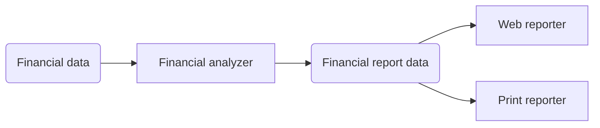

The general insight here is that generating the report involves two separate responsibilities:

- report data calculation;
- presentation of the data into a web- and printer-friendly form.

Having made this separation, we need to organize the source code dependencies to ensure that changes to one of those responsibilities don't cause changes in the other.

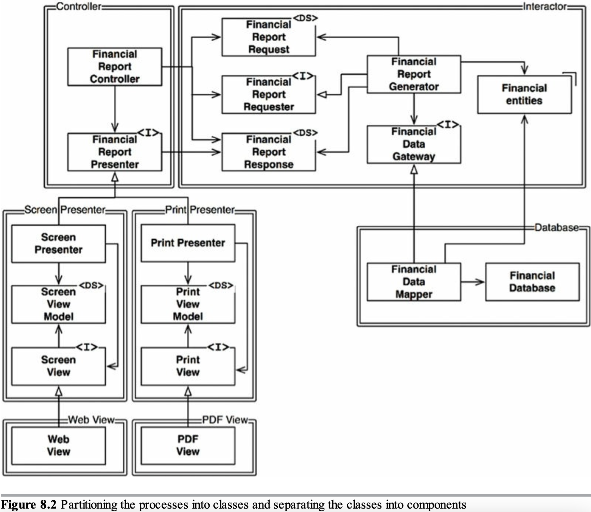

Legend:

- separate components are indicated by a double-line border;
- `<I>` – interfaces;
- `<DS>` – data structures;
- open arrowheads – _using_ relationships;
- closed arrowheader – _implements_ or _inheritance_ relationships;

Some things to notice:

1. All the dependencies are the source code dependencies.  
   `class A --> class B` means that the source code of `A` mentions the name of `B`, but `B` mentions nothing about `A`.  
   For example, `FinancialDataMapper` knows about `FinancialDataGateway` through an _implements_ relationship, but `FinancialDataGateway` knows nothing at all about `FinancialDataMapper`.
2. Each double line is crossed in one direction only.  
   These arrow point toward the components that we want to protect from change.

> If a component A should be protected from changes in component B, then component B should depend on component A.

In our scheme we want to:

- protect the Presenters from changes in the Views;
- protect the Controller from changes in the Presenters;
- protect the Interactor from changes from anything.

The Interactor is in the position that best comforms to the OCP.  
Changes to the Database, or the Controller, or the Presenters, or the Views will have no impact on the Interactor.

Why should the Interactor hold such a priveleged position?

- the Interactor contains the BR;
- the Interactor contains the highest-level policies of the app;
- all the other components deal with peripheral concerns;
- the Interactor deals with the central concern;

More about the scheme:

- the Controller is peripheral to the Interactor, but it's central to the Presenters and Views;
- the Presenters are peripheral to the Controller, but they're central to the Views;

There is a hierarchy of protection:

- Interactors are the highest-level concepts, so they're most protected;
- Views are the lowest-level concepts, so they're the least protected;
- protection of components gradualy reduces from Interactors to Views.

This is how the OCP works at the architectural level:

- architects separate functionality based on how, why, and when it changes;
- then they organize that separated functionality into a hierarchy of components;
- higher-level components in that hierarcy are protected from changes made to lower-level components.

#### DIRECTIONAL CONTROL

Much of the complexity in the diagram is intended to point the dependencies between the components in the correct direction.

For example, the `FinancialDataGateway` interface between the `FinancialReportGenerator` and the `FinancialDataMapper` exists to invert the dependency that would otherwise have pointed from the Interactor component to the Database component.  
The same is true for the `FinancialReportPresenter` and the two View interfaces.

#### INFORMATION HIDING

The `FinancialReportRequester` interface serves a different purpose. It protects the `FinancialReportController` from knowing too much about the internals of the Interactor. Without `FinancialReportRequester`, the Controller would have transitive dependencies on the `FinancialEntities`.

Transitive dependencies are a violation of the general principle that software entities shouldn't depend on things that they don't directly use.

Our first priority is to protect the Interactor from changes to the Controller.  
We also want to protect the Controller from changes to the Interactor by hiding the internal of the interactor.

#### CONCLUSION

No content.

### CHAPTER 9. THE LISKOV SUBSTITUTION PRINCIPLE

No content.

#### GUIDING THE USE OF INHERITANCE

Imagine that we have a `License` class.  
This class has a method `calcFee`, which is called by the `Billing` app.  
There are two «subtypes» of `License`: `PersonalLicense` and `BusinessLicense`. They use different algorithms to calculate the license fee.

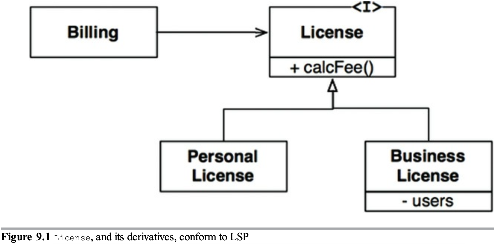

The design conforms to the LSP because the behavior of the `Billing` app doesn't depend, in any way, on which of the two subtypes it uses. Both of the subtypes are substitutable for the `License` type.

#### THE SQUARE / RECTANGLE PROBLEM

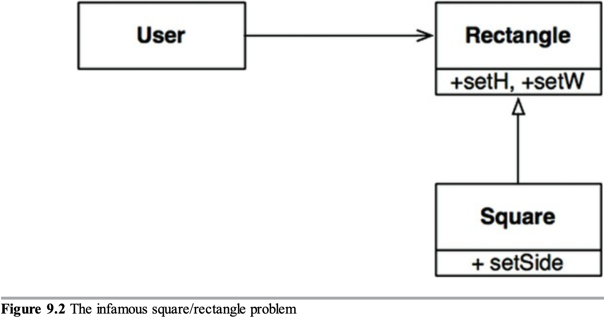

In this example, `Square` isn't a proper subtype of `Rectangle`, because the height and width of the `Rectangle` are independently mutable; in contrast, the height and width of the square must change together.  
The LSP is violated.

#### LSP AND ARCHITECTURE

The LSP concerns not only how to use **inheritance**.  
The LSP has morphed into a **broader principle** that pertains to **interfaces** and **implementations**.

The LSP is applicable when users depend on **well-defined interfaces**, and on the **substitability of the implementations** of those interfaces.

#### EXAMPLE LSP VIOLATION

Suppose we have a RESTful system that serves for a taxi aggregator.

An order endpoint example:

```
purplecab.com/driver/Bob
  /pickupAddress/24 Maple St.
  /pickupTime/153
  /destination/ORD
```

A new taxi vendor «Acme» has been joined to our aggregator.  
Their developers didn't read the aggregator API docs very carefully and used `dest` instead of `destination` in URL.  
Suppose, there is no way to fix this on their side.

What would happen to our architecture? Obviously, we'd need to add a special case. Requests from «Acme» drivers should be processed using a different set of rules.

The simplest way to accomplish this goal is:

```
if (driver.getDispatchUri().startsWith("acme.com")) { ... }
```

No sane architect would add such a construct to the system that mentions `"acme.com"`. We don't want to have mysterious errors and other consequenses. If there will be another case for the «PurpleTaxi» vendor, will we add one more `if`?

More clean and scalable solution would be to add a configuration file like this:

```
{
  "Acme.com": "/pickupAddress/%s/pickupTime/%s/dest/%s",
  "*.*": "/pickupAddress/%s/pickupTime/%s/destination/%s",
}
```

#### CONCLUSION

The LSP can, and should, be extended to the level of architecture. A simple violation of substitutability can cause a system's architecture to be polluted with a significant amount of extra mechanisms.

### CHAPTER 10. THE INTERFACE SEGREGATION PRINCIPLE

No content.

#### ISP AND LANGUAGE

No content.

#### ISP AND ARCHITECTURE

No content.

#### CONCLUSION

No content.

### CHAPTER 11. THE DEPENDENCY INVERSION PRINCIPLE

No content

#### MORE ABOUT DEPENDENCY INVERSION

No content.

#### STABLE ABSTRACTIONS

No content.

#### FACTORIES

Creation of volatile concrete objects requires special handling.  
In most OO languages we'd use an Abstract Factory to manage this undesirable dependency.

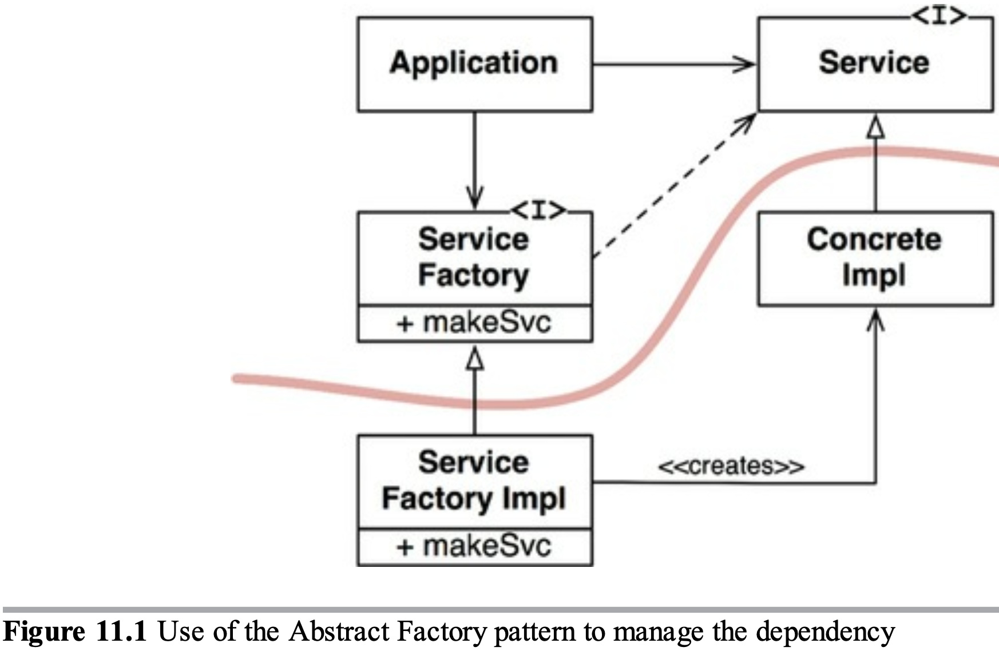

The `Application` uses the `ConcreteImpl` through the `Service` interface. However, the `Application` must somehow create instances of the `ConcreteImpl`. To achieve this without creating a source code dependency on the `ConcreteImpl`, the `Application` calls the `makeSvc` method of the `ServiceFactory` interface. This method is implemented by the `ServiceFactoryImpl` class, which derives from `ServiceFactory`. That implementation instantiates the concrete `ConcreteImpl` and returns it as a `Service`.

The curved line is an architectural boundary. It separates the abstract component from the concrete component. All source code dependencies cross that curved line pointing in the same direction, toward the abstract side.  
The abstract component contains all the high-level BR. The concrete component contains all the implementation details of those BR.

The flow of control crosses the curved line in the opposite direction of the source code dependencies – which is why we refer to this principle as Dependency Inversion.

#### CONCRETE COMPONENTS

The concrete component in figure 11.1 contains a single dependency, so it violates the DIP. This is typical. DIP violations cannot be entirely removed but they can be gathered into a small number of concrete components and kept separate from the rest of the system.

#### CONCLUSION

As we cover higher-level architectural principles, the DIP will show up again and again.  
The DIP will be the most visible organizing principle in our architecture diagrams.  
The curved line in figure 11.1 will become the architectural boundaries in later chapters.  
The way the dependencies cross the curved line in one direction, and toward more abstract entities, will become a new rule called the Dependency Rule.

## PART IV. COMPONENT PRINCIPLES

SOLID tells us how to arrange bricks into walls and rooms. Component principles tells us how to arrage the rooms into buildings.

### CHAPTER 12. COMPONENTS

A component is an **independently developable and independently deployable unit**.

#### A BRIEF HISTORY OF COMPONENTS

No content.

#### RELOCATIBILITY

No content.

#### CONCLUSION

After 50 years, we has arrived to component plugin architecture to be the casual default.

### CHAPTER 13. COMPONENTS COHESION

Which modules belong to which components?

The three principles of component cohesion:

- **REP**: the reuse / release equivalence principle;
- **CCP**: the common closure principle;
- **CRP**: the common reuse principle.

#### THE REUSE / RELEASE EQUIVALENCE PRINCIPLE

> A granule of reuse it a granule of release.

Anything that we reuse must be released and tracked.

Release **numbers** and release **notes** for a component allow:

- reused components are compatible with each other;
- ease integration of new versions.

REP gives us our first **hint at how to partition** our design into components.

The principle means that the **modules formed into a component** must belong to a **cohesive group**. A component cannot consist of a random mixture of modules. There must be a **common purpose** all modules share. It's quite obvious.

What is not obvious: modules grouped together into a component should be **releasable**. The same release number, release tracking and release docs should make sense both to the author and the users.

#### THE COMMON CLOSURE PRINCIPLE

> Gather together into components those modules that change at the same times and for the same reasons. Separate those modules that change at different times and for different reasons.

This is the SRP restated for components.

For most apps, **maintainability is more important than reusability**. If an app code must change, you would prefer the **changes** to be **concentrated in a single component**, rather than be distributed across many components. So, we deploy only the changed component. The others do not even know about the changes.

#### THE COMMON REUSE PRINCIPLE

> Do not force users of a component to depend on things they do not need.

CRP is another principle that helps us to decide which modules should be placed into a component. **Modules that tend to be reused together belong to the same component.** In such a component, we would expect to see **modules** that have lots of **dependencies on each other** – coupled modules.

The CRP tells us:

- which modules **to put together** in a component;
- which modules **not to put together** in a component;

CRP tells us that **modules that aren't tightly bound** to each other should be in **separate** components.

The more our app grows, the more we begin to concern about reusable components, the more the CRP influences the components composition.

##### RELATION TO ISP

**CRP** is the **generic** version of **ISP**:

- ISP tells us not to depend on **modules** that have **methods** we do not use;
- CRP tells us not to depend on **components** that have **modules** we do not use.

In general: **do not depend on things you do not need**.

#### THE TENSION DIAGRAM FOR COMPONENT COHESION

The three component principles tend to fight each other:

- **REP** and **CCP** are **inclusive**: both tell to **make components larger**;
- **CRP** is **exclusive**: it tells to **make components smaller**.

This is the **tension** between these principles that good architects seek **to resolve**.

**Tension diagram** tells **how** the three **principles** of cohesion **interact** with each other.  
The edges of the diagram describe the **cost of abandoning** the principle on the opposite vertex.

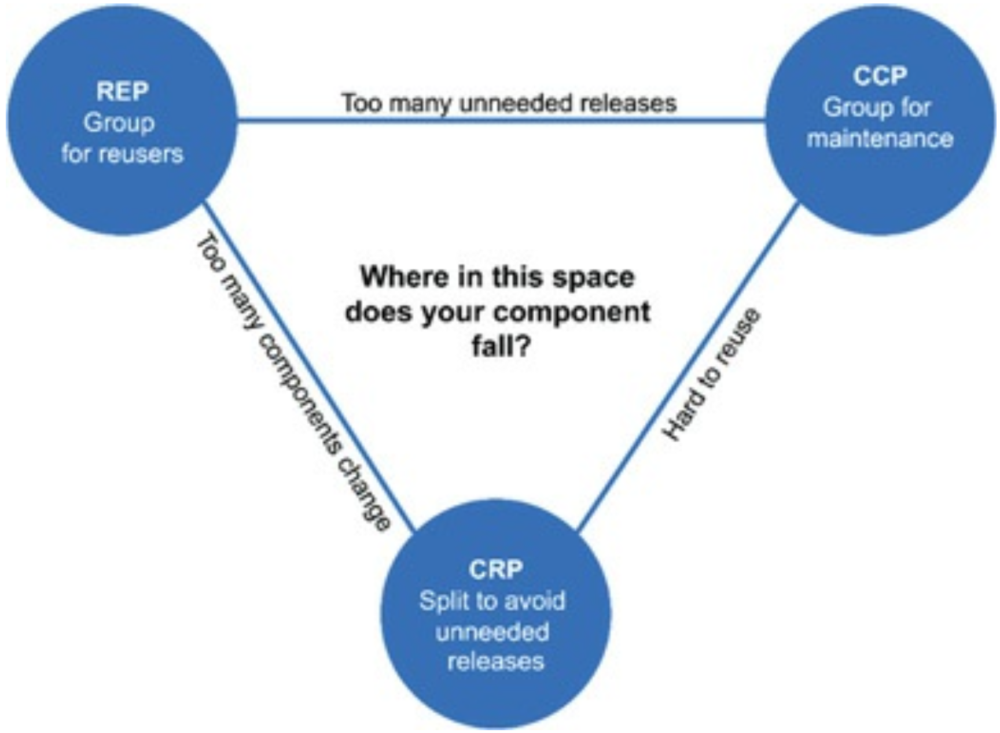

Conclusions:

- **focusing** on just the **REP and CRP** causes that too **many components are impacted** when simple changes are made;
- **focusing** on just the **REP and CCP** causes too many **unneedeed releases** to be generated.

A good architect **finds a position** in that tension triangle **that meet the current concerns** of the development team.  
A good architect is also aware that those **concerns change over time**. For example, early in the development of a project, the CCP is much more important than the REP, because develop-ability is more important than reuse.

Generally, projects **tend to start on the right** hand side of the triangle, where **the only sacrifice is reuse**. As the project **matures** and other projects begin to draw from it, the project will **slide over to the left**. This means that the **component structure** of a project can **vary with time and maturity**. It has more to do with the way the project is developed and used than with what the project actually does.

#### CONCLUSION

**Balancing** these forces with the needs of the app is **nontrivial**. Moreover, the **balance is** almost always **dynamic**.

### CHAPTER 14. COMPONENT COUPLING

The next **3 principles** deal with the **relationships between components**. Here again we'll run into **tension between develop-ability and logical design**. The forces that impinge upon the architecture are technical, political and volatile.

#### THE ACYCLIC DEPENDENCIES PRINCIPLE

> Allows no cycles in the component dependency graph.

The dependency structure must always be **monitored for cycles**. When **cycles** occur, they **must be broken**. Sometimes, this will mean creating a new component, making the dependency structure grow.

##### THE WEEKLY BUILD

No content.

##### ELIMINATING DEPENDENCY CYCLES

We should **partition** the development environment **into releasable components**. A component becomes a **unit of work** that can be **responsibility of a developer or a team**. When developers get a component working, they give it a number and **release** it **for** the **others**. Each team start **using** the new version **as soon as** they are **ready** to migrate to it. **Small steady increments** instead of immediate affects.

To make it work, you must manage the dependency structure of the components.

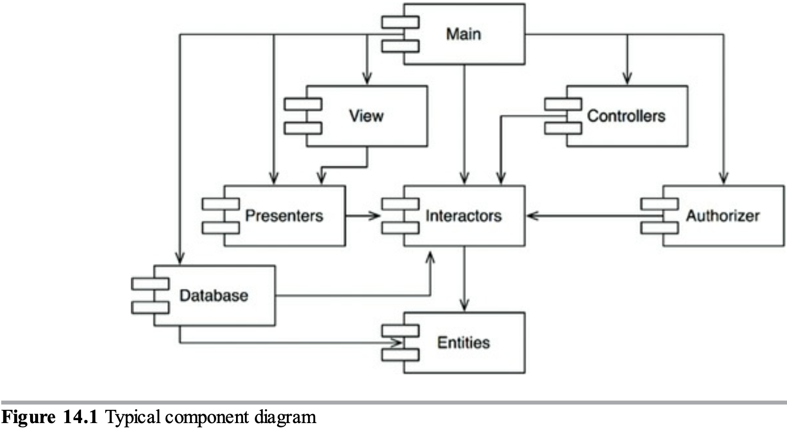

The structure has **no cycles**, it is a **directed acyclic graph**.

Example:

- a new version of `Presenters` is released;
- we need to find affected components;
- we just follow the dependency arrows backward (`View` and `Main`).

When `Main` is released, it has no effect on any component of the system. They do not know about `Main` and they don't care when it changes. It means that the impact of releasing `Main` is relatively small.

The **process of building** the entire system is very **clear** because we **understand the dependencies** between its parts. It proceeds from the bottom up: first – `Entities`, last – `Main`.

##### THE EFFECT OF A CYCLE IN THE COMPONENT DEPENDENCY GRAPH

Cycles in dependency graph cause «morning after syndrome» (breaking code when someone else makes changes in the codebase) and make it difficult to release components.

With cycles, it can be **difficult** to work out the **order** in which you must build the components. There **probably** is **no correct order**.

##### BREAKING THE CYCLE

There are two ways:

1. apply the DIP;
2. create a new component that cycled components will both depend on.

##### THE "JITTERS"

No content.

##### TOP-DOWN DESIGN

A conclusion from the issues discussed so far: a **component structure cannot be designed from the top down**.

We should localize and **isolate volatility**.  
We **do not want components that change frequently** and for capricious reasons **to affect components that ought to be stable**. For example, we **do not want** cosmetic changes to the **GUI** to have an **impact** on our **BR**.  
**Component dependency graph** is created by architects to **protect stable high-value components from volatile components**.

If we tried to design the component dependency structure before we designed any modules, we would likely fail. We would not know much about common closure -> we would be unaware of any reusable elements, and we would cernainly create components that produced dependency cycles. Thus the **component dependency structure evolves with the logical design of the system**.

#### THE STABLE DEPENDENCIES PRINCIPLE

> Depend in the direction of stability.

Design can't be completely static, **some volatility is necessary**. With CCP, we create components that are **sensetive** to certain kinds of changes but **immune** to others. **Some** of these components are **designed to be volatile**, we expect them to change.

A module that you designed to be easy to change **can be made difficult to change** by someone else who simply hangs a dependency on it.

**SDP says** that modules that are intended to be easy to change should not be depended on by modules that are harder to change.

##### STABILITY

Stability is related to the **amount of work required to make a change**.

One way to make a component difficult to change is to make lots of other software components depend on it. A **component with lots of incoming dependencies is very stable** because it **requires** a great deal of **work** to reconcile any changes with all the dependent components.

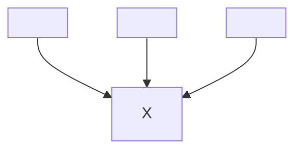

About `X`:

- **3 components depend on `X`**, so `X` has three good **reasons not to change**; **`X` is responsible to** those three components;
- conversely, **`X` depends on nothing**, so it has **no external influence** to make it change; `X` is **independent**.

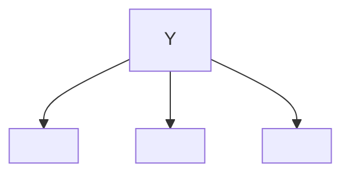

About `Y`:

- **no components depend on `Y`**, so `Y` is **irresponsible**;
- there are three components that **`Y` depends on**, so **changes may come from 3 external sources**; `Y` is **dependent**.

##### STABILITY METRICS

One way to measure the stability of a component is to **count** the number of **dependencies** (imports) that **enter and leave** that component (it is called «positional» stability):

- **Fan-in**: **incoming dependencies** – the number of modules outside the component that depend on modules that are within the component.
- **Fan-out**: **outgoing dependencies** – the number of modules inside this component that depend on modules outside this component.
- Instability ranges from 0 to 1.  
  **I = 0** indicates a maximally **stable** component, **I = 1 – unstable**.

$$ Instability = {Fan–out \over Fan–in + Fan–out} $$

```mermaid
graph LR
  subgraph ComponentA
    ModuleU
    ModuleV
  end

  subgraph ComponentB
    ModuleW
  end

  subgraph <b>ComponentC</b>
    ModuleX
    ModuleY
  end

  subgraph ComponentD
    ModuleZ
  end

  ModuleU-->ModuleX
  ModuleV-->ModuleY
  ModuleW-->ModuleY
  ModuleY-->ModuleZ
```

About the `ComponentC`:

- Fan-in = 3;
- Fan-out = 1;
- Instability = 1 / (3 + 1) = 0.25.

> `I` of a component should be larger than `I` of the component that it depends on. `I` should decrease in the direction of dependency.

#### NOT ALL COMPONENTS SHOULD BE STABLE

If all the components in the system were maximally stable, the system would be unchangeable, which is not desired. We want some components to be stable and some – unstable.

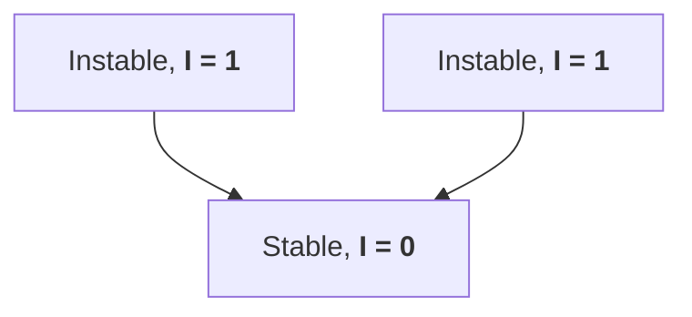

The figure above: the changeable components on top depend on the stable component at the bottom.

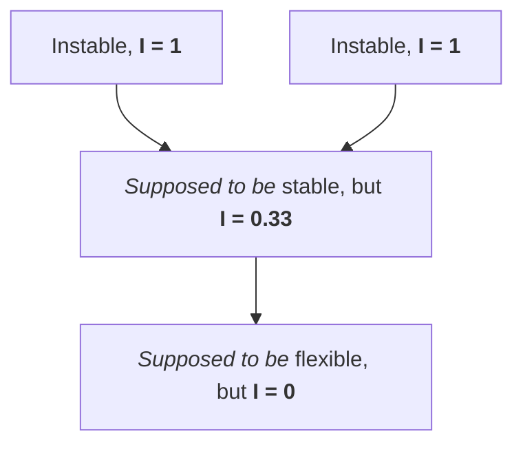

The figure above:

- `Flexible` is a component we have designed to be easy to change, we want it to be flexible and unstable;
- some developer working on `Stable` has hung a dependency on `Flexible` – `Stable` depends on `Flexible`;
- as a result, `Flexible` is no longer easy to change; a change to `Flexible` will force us to deal with `Stable` and its dependents.

> Any component that we expect to be volatile should not be depended on by a component that is difficult to change. Otherwise, the volatile component will also be difficult to change.

We can fix it by using the DIP.

#### THE STABLE ABSTRACTIONS PRINCIPLE

> A component should be as abstract as it's stable.

##### WHERE DO WE PUT THE HIGH-LEVEL POLICY?

**High-level architecture and policy decisions** should not change very often. We do **not** want them to be **voliatile**. Such software should be **placed into stable components** (`I = 0`). **Unstable components** (`I = 1`) should **contain** only the software that is **volatile** – software that we want to be able to **easily change**.

However, **if high-level policies** are placed **into stable components**, then the source code that represents those policies **will be difficult to change**. This could make the overall **architecture inflexible**. How a component with `I = 0` be flexible enough to windstand change? The **OCP helps** us. The OCP tells that it's possible and desirable to create classes that are flexible enough to be extended without requiring modification. Which kind of classes conform this principle? **Abstract classes.**

##### INTRODUCING THE STABLE ABSTRACTIONS PRINCIPLE

The **SAP** sets up a **relationship between stability and abstractness**.

The SAP states:

- a **stable component should be abstract** so that its stability does not prevent it from **being extended**;
- an **unstable components should be concrete** since it its instability allows the concrete code within it **to be easily changed**.

Thus, if a **component** is to be **stable**, it **should consist of interfaces and abstract classes** so that it **can be extended**. Stable components that are extensible are flexible and do not overly constrain the architecture.

**SAP + SDP = DIP for components.** Because SDP says that dependencies should run in the direction of stability, and SAP says that stability implies abstraction. Thus dependencies run in the direction of abstraction.

The DIP, however, deals with classes – and with classes there are no shades of gray. Either a class is abstract or it is not. SAP + SDP deals with components and allows that a component can be partially abstract and partially stable.

##### MEASURING ABSTRACTION

Abstractness (`A`) is the **ratio of interfaces and abstract classes** in a component **to** the **total** number of **classes** in the component.

- `Nc` – the number of classes in a component;
- `Na` - the number of abstract classes and interfaces in the component;
- `A` – abstractness, `A = Na / Nc`.

`A` ranges from 0 to 1. `A = 0` implies that the component has no abstract classes at all. `A = 1` implies that the component contains nothing but abstract classes.

##### THE MAIN SEQUENCE

Let's define relationships between `I` and `A`.

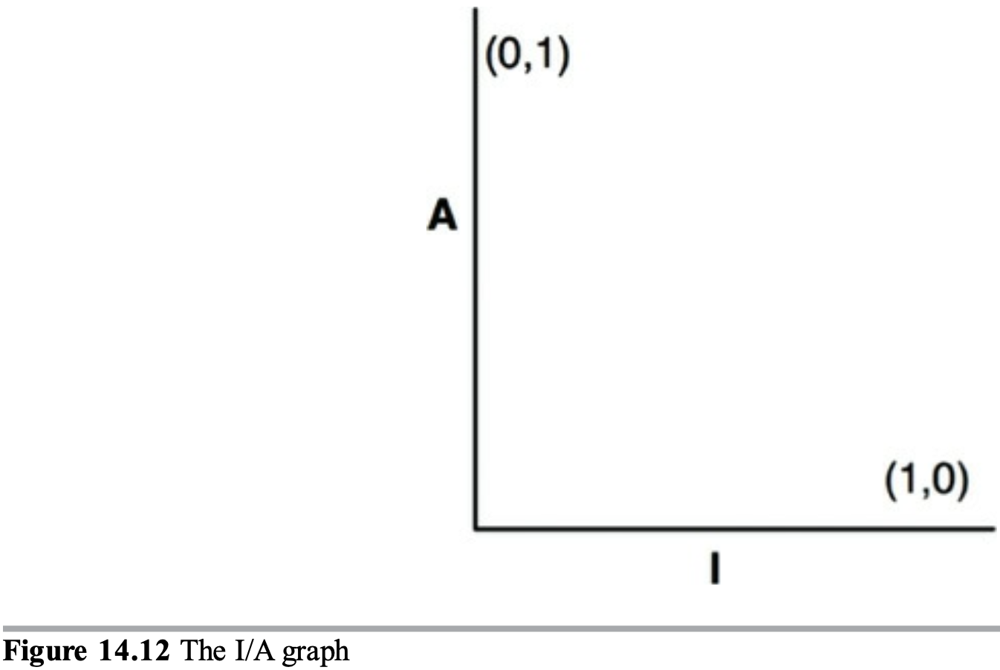

There are two «good» kinds of components in this graph:

- stable and abstract at (0, 1);
- unstable and concrete (1, 0).

Not all components fall into one of these two positions, because components often have degrees of abstraction and instability.

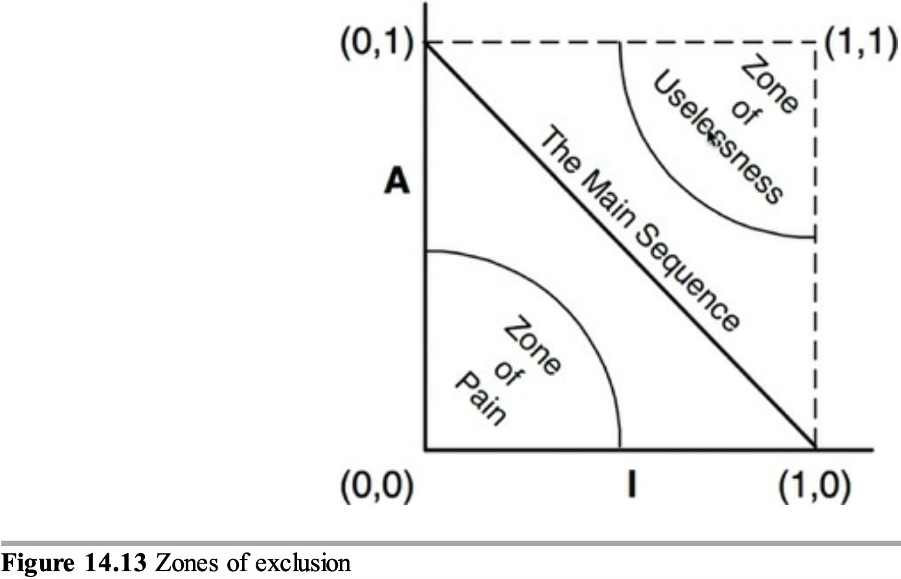

«Zones of exclusion» shows reasonable positions and «bad» zones for components.

###### THE ZONE OF PAIN

A component at (0, 0):

- is **difficult to change** because it is highly stable and concrete;
- is not desirable because it is **rigid**;
- **cannot be extended** because it is **not abstract**;
- a well-designed component cannot take a position near (0, 0).

Example: a DB schema.  
It is volatile, concrete and highly depended on. Updating a DB schema is painful.

###### THE ZONE OF USELESSNESS

A component at (1, 1):

- maximally **abstract** + **no dependents** = **useless**;
- they are often abstract classes that noone ever implemented;

##### AVOIDING THE ZONES OF EXCLUSION

Our most **volatile components** should be kept from as **far from** both **zones of execution** as possible. The locus of points that are **maximally distant from each zone** is the **line** that connects (0, 1) and (1, 0), called the **main sequence**.

A component that sits on the main sequence:

- is **not "too abstract"** for its stability;
- is **not "too unstable"** for its abstractness;
- is **not** particularly **useless**;
- is **not** particularly **painful**;
- is **depended on** to the extent that it is abstract;
- is **depends on others** to the extent that it is concrete.

The **most desirable** positions are **(0, 1) and (1, 0)**. Good architects strive to position the majority of their components at those endpoints. In practice, some small fraction of components are neither perfectly anstract nor perfectly stable. Those components have the **best characteristics** if they are **on, or close, to the main sequence**.

##### DISTANCE FROM THE MAIN SEQUENCE

$$ D = |A + I - 1| $$

`D` ranges from 0 to 1. Components with `D` not near to zero can be reexamined and restructured. You can set a reasonable threshold, for example 0.1.

What can be calculated:

- `D` for each component:
  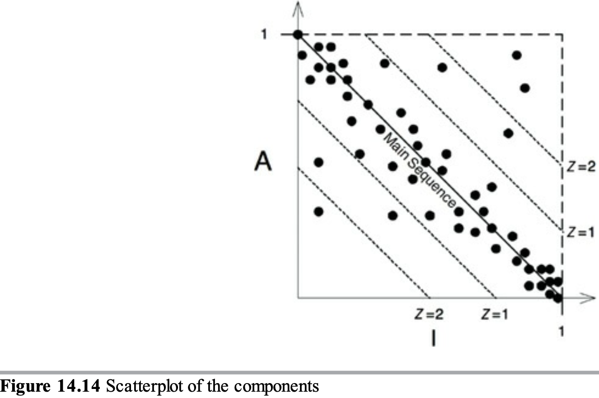
- `D` for each component over time:
  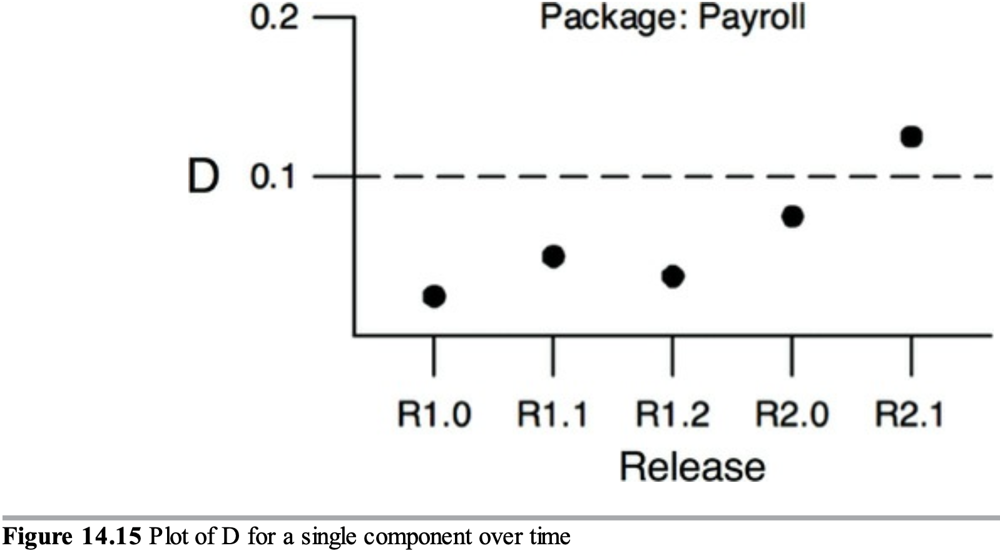
- mean `D` for an entire project;

#### CONCLUSION

No content.

## PART V. ARCHITECTURE

### CHAPTER 15. WHAT IS ARCHITECTURE?

Architects:

- ~~pull back from code to focus on higher-level issues, because they are not average devs~~;
- may **not** write as **much code** as other programmers do;
- **take programming tasks**, while they **also guide the team** toward a design that maximizes productivity;
- **take programming tasks to experience the effects** of their architectural decisions.

The **architecture** of a software **system** is its **shape**:

- **division** of the system into components;
- **arrangement** of those components;
- **communication** between those components.

The **purpose** of architecture is to **facilitate the development, deployment, operation, and maintenance** of the software system.

The **strategy** behind the facilitation is to leave as many **options open** as possible, for as long as possible.

For architecture, **supporting proper behavior** is:

- ~~the main goal~~;
- one of the responsibilities;
- critical;
- ~~active and essential~~;
- passive and cosmetic.

There are many systems with terrible architectures, that work just fine. Their troubles do not lie in their operation, but in their deployment, maintenance, and development.

The **primary purpose** of architecture is to **support the life cycle** of the system.

Good architecture makes the system:

- easy to understand;
- easy to develop;
- easy to maintain;
- easy to deploy.

The **ultimate goal** is to **minimize** the lifetime **cost** of the system and to **maximize** programmer **productivity**.

#### DEVELOPMENT

A system is **easy to develop** -> the system has **long and healthy lifetime**.

Different teams imply different architectural decisions:

- On the **one hand**, a **small team** can **effectively develop a monolithic system** without well-defined components or interfaces. Such a team would likely find the limitations of an architecture something of an impediment during the early days of development. This is a reason why some systems lack good architecture: they were begun with none, because the team was small and did not want the impediment of a superstructure.
- On the **other hand**, a system being developed by **several big teams**, **cannot progress unless** the system is **divided** into well-defined **components with** reliable stable **interfaces**.

#### DEPLOYMENT

A goal of architecture is to make deployment **fast and cheap** (ideally, deploy with a single action).

#### OPERATION

The **impact** of architecture on operation is **less** than on development, deployment and maintenance. Because hardware is cheap and people are expensive, many operational difficulties can be resolved by throwing more hardware (storage and servers) at the system.

The architecture should make the **operation appartent** and **elevate**:

- the use cases,
- the features,
- the required behavior

of the system to first-class entities that are visible landmarks for the devs.

This **simplifies understanding** of the system and greatly aids in depevelopment and maintenance.

#### MAINTENANCE

Of all the aspects of a software system maintenance is the most **costly**.

The **primary cost of maintenance** is in **spelunking and risk**.

**Spelunking is** the cost of **digging through the existing software**, trying to determine the best place and the best strategy to add a new feature or to repair a defect. Making such changes is **costly and risky** because it introduces inadvertent defects.

A carefully thoughtful architecture **mitigates these costs**. Separating the system into components, and isolating those components through stable interfaces **illuminates the pathways** for future features and **reduces the risks** of inadvertent breakage.

#### KEEPING OPTIONS OPEN

Keep software soft. The softness depends on how the components are formed and interconnected.

The way you keep software soft is to leave as **many options open** as possible, for as **long** as possible. These options are the details that do not matter.

A **system** can be decomposed into **two major elements** – policy and details:

- **Policy** contains the **true value** of the system, it embodies BR and procedures.
- **Details enable** humans, developers and other systems **to communicate with the policy**, but that **do not impact** the behavior of the **policy** at all. Details include DBs, servers, frameworks, communication protocols, etc.

A good architecture recognizes **policy** as the most **essential** element of the system while making the **details irrelevant** to that policy. This **allows decision about** those **details** to be **delayed**.

- **build the architecture without committing any details**;
- **delay decisions** about the **details** as long as possible -> have the **options open** longer;
- run **experiments** and use various details (various DBs, frameworks, servers, etc);
- at the moment when the decisions can no longer be deferred, have **more information** about the details applicability, performance, etc to **make the decisions properly**.

**If** the decisions have **already** been **made** by someone else, **pretend that** they have **not** beed **and shape the system** such that those decisions can still be deferred or changed for as long as possible.

> Maximize the number of decisions not made.

#### DEVICE INDEPENDENCE

No content.

#### JUNK MAIL

No content.

#### PHYSICAL ADDRESSING

No content.

#### CONCLUSION

No content.

### CHAPTER 16. INDEPENDENCE

As we previously stated, a good architecture must support:

- use cases and operation;
- maintenance;
- development;
- deployment.

#### USE CASES

The **first priority** of the architecture is to **support the intent** of the system. If the system is a shopping cart app, then the architecture must support shopping cart use cases.

Architecture **does not manage behavior**. Instead, it **supports behavior by clarifying and exposing that behavior** so that the intent of the system is visible at the architectural level.

A shopping cart app should look like a shopping cart app. Its **use cases should be plainly visible** within the structure of the system. Developers should not have to hunt for behaviors. The behaviors should be first-class elements visible at the top level of the system. Those elements should be modules that have prominent positions within the architecture and they should have names that clearly describe their function.

Chapter 21 «Screaming architecture» will make this point much clearer.

#### OPERATION

If the system must handle 100,000 customers per second or to query big data in milliseconds, then the **architecture must be structured to allow it**.

It may mean:

- an array of services running in parallel on different servers;
- an array of services running in parallel on a server in different threads;
- a simple monolithic program running in a single thread.

This decision is one of the options that a good architect leaves open. For example, it is hard to upgrade a monolith to a multiple processes, threads or services should the need arise.

#### DEVELOPMENT

Architecture plays a significant role in supporting the dev environment.

Conway's law:

> Any organization that designs a system will produce a design whose structure is the copy of the organization's communication structure.

A system that must be developed by many teams with different concerns must have an architecture that **facilitates independent actions** by those teams, so that the **teams do not interfere with each other** during development. This is accomplished by properly **partitioning** the system **into** well-isolated, independently developable **components**. Those components can be allocated to teams that can work independently of each other.

#### DEPLOYMENT

**The goal** is «immediate deployment» after build. A good architecture does not rely on dozens of configurations scripts and properly file tweaks.

Again, this is achieved through the proper **partitioning** and isolation of the **components**, including those master components that tie the whole system together and ensure that each component is properly started, integrated and supervised.

#### LEAVING OPTIONS OPEN

A good architecture **balances all of those concerns** with a component structure that mutually satisfies them all.

Achieving this balance is pretty hard. The problem is that all the **use cases**, the operational constrains and the deployment **requirements** are **unknown or dynamic** as the system moves through its life cycle. The goals we must meet are indistinct and inconstant.

Architecture principles help balance those concerns even when you do not have a clear picture. They help partition our system into well-isolated components that allow to leave as many options as possible, for as long as possible, making the system easy to change.

#### DECOUPLING LAYERS

The architect wants the structure that supports all the necessary use cases. He does not know what they are, but he knows the basic intent of the system. It is a shopping cart / bill of materials / orders processing. So the archictect can employ SRP and CCP to **separate** those things that change for different reasons and **collect** those things that change for the same reasons – **giving the context of the intent** of the system.

For example, GUI and BR change for different reasons. Separate them so that they can be independently changed.

BR may be closely tied to the app, or may be general. For example, the validation of the inputs is a BR that is closely tied to the app. In contrast, the calculation of interest and the counting of inventory are BR that are more closely associated with the domain. These two **different kinds of BR** will change at different rates, and for different reasons – they should be **separated** to be changed independently.

The DB, the query language are **technical details** that **have nothing to do with the BR or the UI**. The architecture should **separate them from the rest of the system** so that they can be independently changed.

Thus we find the system divided into **decoupled horisontal layers** – GUI, app-specific BR, app-independent BR, DB, etc.

#### DECOUPLING USE CASES

The **use cases themselves** also change for different reasons. «Adding an order» and «deleting an order» are two use cases that change at different rates and for different reasons. Use cases are a very natural way to **divide** the system.

At the same time, **use cases** are narrow **vertical slices** that **cut through the horizontal layers** of the system. Each use case uses some UI, app-specific BR, app-independed BR, DB functionality. Thus, divide the system into horizontal layers and vertial use cases.

|                    | Add an order | Remove an order | Edit an order | List orders |
| ------------------ | ------------ | --------------- | ------------- | ----------- |
| UI                 | x            | x               | x             |             |
| App-specific BR    | x            | x               | x             |             |
| App-independent BR | x            | x               | x             |             |
| DB                 | x            | x               | x             |             |

To achieve this decoupling, we **separate** the **«add-order» UI** from the **«delete order» UI**, etc.

**You can add new use cases without interferring with old ones.** Each use case uses a different aspect of the UI and DB, then adding new use cases will unlikely affect older ones.

#### DECOUPLING MODE

Lets think about independence in context of operations. **If** the UI and the DB are **separated** from the BR, then they **can run in different servers**.

To run components in separate servers, the components should not depend on being together on the same server / process / thread. They must be independed services, which communicate over a network of some kind.

Such components are often called «services» or «micro-services», and an architecture based on them is called «services-oriented» (SOA).

It is not about that SOA is the best possible architecture. The point is that **sometimes we have to separate** our **components** all the way to the **service level**.

#### INDEPENDENT DEVELOP-ABILITY

When **components decoupled**, the **interference** between teams is **mitigated**.

- The BR do not know about the UI. Good. Thus the UI team does not affect the BR team.
- The use cases are docoupled from one another. Good. Thus the team focusing on the «add order» use case will not interfere with the team focusing on the «delete order» use case.

Layers and use cases are decoupled -> architecture supports teams organization, irrespective of whether they are organized as feature teams, component teams, layer teams, etc.

#### INDEPENDENT DEPLOYABILITY

With well-done decoupling, it is possible to hot-swap layers and use cases in running systems. Adding a new case should be as easy as adding a new source code file.

#### DUPLICATION

Developers often fall into a duplication fear trap. Duplication is generally a bad thing in software.

But there are different kinds of duplication:

- **True** duplication, in which every change in one instance necessitates **the same change to every duplicate** of it.
- **False (accidental)** duplication. If two appartently duplicated sections of code evolve along different paths – if they **change at different rates and for different reasons** – then they are not true duplicates. In a few years you will find them very different from each other.

How to resolve it:

- a **true** duplication is **recognized** -> the **instances are merged** into one instance -> code **maintanance** is made **cheaper**;
- an **accidental** duplication is **recognized** -> the **instances** are kept **separated** -> the **cases** will be **decoupled**.

#### DECOUPLING MODES (AGAIN)

Layers and use cases can be decoupled in different modes:

- **Source level.**  
  We control the dependencies between source code modules. So that changes to one module do not force change or recompilation of others.  
  Components execute in the same address space. They **communicate** with each other using simple **function calls**. There is a **single executable** loaded into computer memory. It is often called **monolithic** architecture.
- **Deployment (binary code) level.**  
  We control the dependencies between deployable units (`.jar`s, `.gem`s, `.dll`s, shared libs, etc). So that changes to the source code in one module does not force others to be rebuilt and redeployed.  
  **Some** of the components **may still live in** the same address space, and communicate through function calls. **Other** components **may live in** other processes in the same processor and communicate through interprocess communications, sockets, or shared memory. Important: the decoupled **components are partitioned into independently deployable units** (`.jar`s, `.gem`s, `.dll`s, shared libs, etc).
- **Service (execution unit) level.**  
  We reduce the dependencies down to the level of data structures and **communicate solely through network packets** such that **every execution unit is entirely independent of source and binary changes to others** (e. g., services or micro-services).

What is **the most optimal mode** to use? It is hard to say during the early phases of the project and the answer **changes during as the project matures**.

**Example**:

- **now** the system runs comfortably on one server, **source code level** decoupling (monolith) is sifficient;
- **in a year**, some components need to run in **different processes**;
- **in two years**, the system need some components to run in **separate services**.

**One solution** (popular at the moment) is to simply decouple at the service level by default.

Problems with this approach:

- it encourages coarse-grained decoupling; no matter, how "micro" the micro-services get, the decoupling is not likely to be fine-grained enough;
- it is expensive, both in development time and in system resources; dealing with service boundaries where none are needed is a waste of memory, cycles, and effort (memory and cycles are cheap, but effort is not).

It is wise to push **decoupling** to the point where a **service can be formed, should it become necessary**. **But** then to **leave** the components **at the same address space** as long as possible. This leaves the option for a service open.  
With this approach, initially the component are separated at the source code level. That may be good enough for the duration of the project's lifetime. If, however, development or deployment issues arise, driving some of the decoupling to a deployment level may be sufficient, at least for a while.  
As the development, deployment and operational issues increase, I **carefully choose**, which deployable units to turn into services, and **gradually shift** the system in that direction.  
Over time, the operational needs of the system **may decline**. What once required decoupling at the service level may now require only development- or deployment-level decoupling.

A good architecture allows a system to be born as a monolith, deployed as a single file, but then to grow into a set of independently deployable units, and then all the way to independent services and / or micro-services. Later, as things change, it should allow for reversing that progression and sliding all the way back into a monolith.

A good architecture protects the majority of the source code from those changes. It **leaves the decoupling mode open as an option** so that large deployments can use one mode, where as small deployment can use another.

It is tricky. Switching between decoupling modes is not a trivial configuration (though sometimes it is). Decoupling mode is likely to change with time a good architect foresees and appropriately facilitates these changes.

#### CONCLUSION

No content.

### CHAPTER 17. BOUNDARIES: DRAWING LINES

Architecture is the art of drawing lines that I call boundaries. Those boundaries **separate software elements** from one another, and restrict those on one side **from knowing** about those on **the other**. **Some** of those lines are **drawn** very **early** in the project's life – even before any code is written. **Others** are drawn **later**. Those that drawn early are drawn for the purposes of deferring decisions for as long as possible, and of keeping those decisions from polluting the core BR.

Recall that the goal of an architect is to minimize the human resources required to build and maintain the system. What it is that saps this kind of people-power? Coupling – and especially coupling to premature decisions.

What kind of decisions are premature? Decisions that have nothing to do with the business requirements – the use cases – of the system. These includes decisions about frameworks, DBs, etc.

A **good** architecture:

- is one in which **decisions** like these are rendered **ancillary and deferrable**;
- **does not depend** on those decisions;
- allows those **decisions** to be **made** at the **latest possible moment**, without significant impact.

#### A COUPLE OF SAD STORIES

No content.

#### FITNESSE

To delay decision about the DB, we can just put an interface between all data accesses and the data reposity.

#### WHICH LINES DO YOU DRAW, AND WHEN DO YOU DRAW THEM?

You draw lines between things that matter and things that do not.

- the **GUI** does not matter to the **BR**, so there **should be a line between them**;
- the **DB** does not matter to the **GUI**, so ...;
- the **DB** does not matter to the **BR**, so ...;

Other statements:

- ~~the BR does care about the DB~~;
- ~~the DB is inextricably connected to the BR~~;
- ~~the DB is an embodiment of the BR~~;
- the DB is a tool that the BR can use indirectly;
- the BR does not need to know about the schema, or the QL, or other details about the DB;
- **all** the BR need **to know** is that **there is** a set of **functions** that can be used **to fetch or save data**; this allows us to put the DB behind an **interface**.

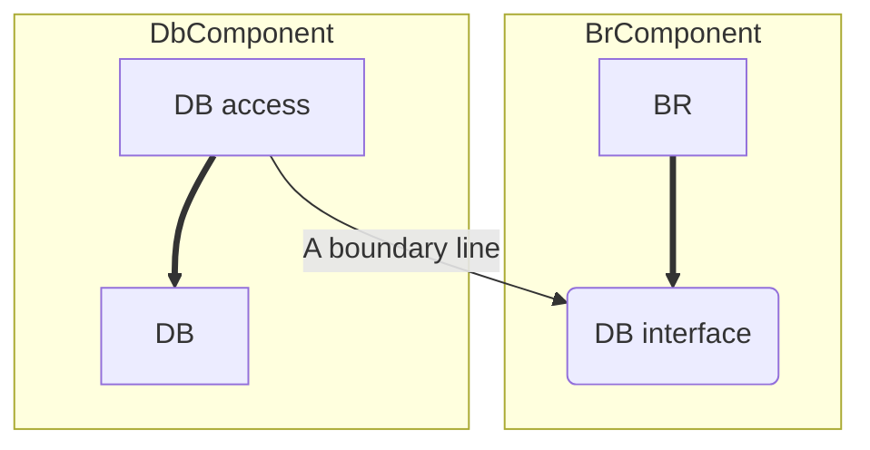

About the diagram:

- the structure in a real-world app may be more complex;
- the direction of the line is important;
- the DB knows about the BR;
- the BR do not know about the DB;
- the DB does not matter to the BR;
- the DB cannot exist without the BR.
- the _DB access_ contains code that translates the calls made by the _BrComponent_ into the QL of the DB;
- the _BrComponent_ **can use any kind** of DB;
- the _DbComponent_ **can be replaced** with another **implementation** (Oracle, MySQL, flat files) – the _BrComponent_ does not care;
- the DB **decision** can be **deferred** and you can **focus on** getting the **BR** written and tested first.

#### WHAT ABOUT INPUT AND OUTPUT?

What the system is? People often see the GUI and think that the GUI is the system. They define the a in terms of the GUI, so they believe that they should see the GUI start working immediately. They fail to realize a critically important principle: **the IO is irrelevant**.

We often see about the behavior of the system in terms of the behavior of the IO. Your experience is dominated by the interface: the screen, the mouse, the buttons and the sounds. But there is a model behind that interface – a sophisticated set of data structures and functions – driving it. More importantly, that model does not need the interface. It would happily execute its duties, modelling all the events in the game without the game ever being displayed on the screen. **The GUI does not matter to the model – the BR.**

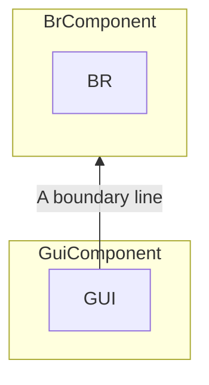

About the figure:

- the BR and the GUI are **separated by a boundary line**;
- the less relevant component **depends on** the more relevant one;
- the arrow shows **which component knows** about the other and, therefore, **which component cares** about the other; the GUI cares about the BR.
- the **GUI can be replaced** with any other kind of interface – and the **BR would not care**.

#### PLUGIN ARCHITECTURE

The discussed approach is kind of pattern. This pattern allows addition of other components, it allows third-party plugins.

> The core BR are kept separate from, and independend of, those components that are either optional or can be implemented in many different forms.

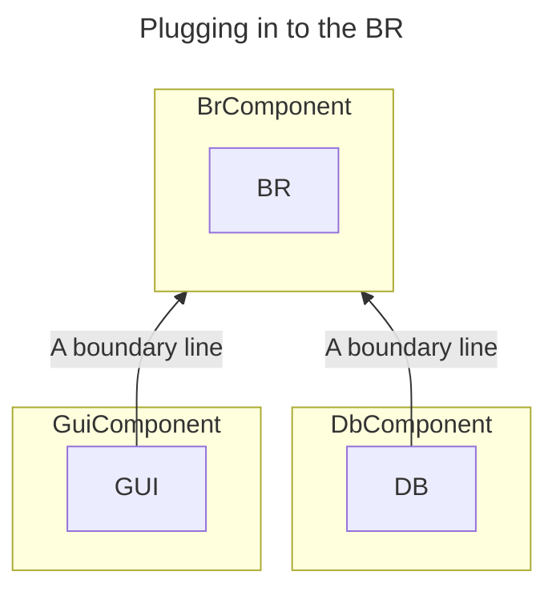

About the figure above:

- The GUI is considered to be a plugin. We have made it possible to plug in **different or multiple GUIs**: web, desktop, modile, console, etc.
- The DB is considered to be a plugin. We have made it possible to plug in **different or multiple DBs**: SQL, NoSQL, file-based DB, etc.
- We **do not know what implementations** of GUI or DB the business will **need in the future**.
- Implementations replacements might not be trivial. If the initial deployment of our system was web-based, then writing the plugin for a mobile app could be challenging. Some of the communications between the BR and the GUI may require reworking. Ideally, we should **write** these **communications** in a GUI-**agnostic** way.

#### THE PLUGIN ARGUMENT

It is **good** to have **deeply asymmetric relationship between the components**. We want certain modules to **immune** to others. We do not want the BR to break when the GUI or the DB schema changes (fragility).

Plugin architecture creates **firewalls** across which **changes cannot propagate**. If the GUI plugs in to the BR, then changes to the GUI cannot affect those BR.

Boundaries are drawn there where is an axis of change. The components on **one side** of the boundary change at **different rates, and for different reasons, than** the ones on **the other side**.

This is simply the **SRP** again. It tells us where to draw our boundaries.

#### CONCLUSION

First, **partition the system into components**. Then, **draw boundaries**. **Some** of those components **are core BR, others are plugins**. We arrange the code so that the dependencies are directed from the plugins from the core BR.

Recognize it as an applications of the **DIP** and the **SAP**. Dependency arrows are arranged to point **from lower-level details to higher-level abstractions**.

### CHAPTER 18. BOUNDARY ANATOMY

Boundaries, separating components come in different forms.

#### BOUNDARY CROSSING

At runtime, boundary crossing is just a function calling a function on the other side and passing along some data.
The trick to creating an appropriate boundary is to manage the source code deps.

#### THE DREADED MONOLITH

Monolith:

- it is simply a **disciplined segregation** of functions and data **within a single processor and a single address space**;
- the **most common** architecture;
- uses the **source-level decoupling mode**;
- has no strict physical representation;
- from a deployment point of view it is most commonly a single executable file, like `.jar` or `.exe`;
- almost always depend on some kind of dynamic polymorphism to manage their internal deps;
- **the simplest boundary crossing is** a function call from a low-level client to higher-level service;
- **when a high-level client needs to call a lower-level service**, dynamic polymorphism is used to invert the dependency against the flow of control; the runtime dep opposes the compile-time dep;
- high-level components **remain independent** of lower-level details;
- **communitactions** between components are very **fast and cheap**; they are typically **just functions calls**;

#### DEPLOYMENT COMPONENTS

DC are almost the same as monoliths. The functions generally all exist **in the same processor and address space**. The strategies for segregating the components and managing their deps are the same.

As with monoliths, **communications across DC boundaries** are just function calls and, therefore, **are cheap**.

#### THREADS

Both monoliths and deployment component can use threads. Threads **are not architectural boundaries** or units of deployment, but rather **a way to organize the schedule and order of execution**.

#### LOCAL PROCESSES

- is a much **stronger physical architectural boundary**;
- typically created from the command line or an equivalent system call;
- run in the **same processor**, **or** in the **same set of processes** within a multicore, **but** run in **separate address spaces**;
- **communicate with each other** using OS communications like sockets, mailboxes or message queues;
- each LP may be a statically linked monolith, or a set of dynamically linked deployment components;
- think of an LP as a kind of **uber-component**: the LP consists of lower-level components that manage their dependencies through dynamic polymorphism;
- the segregation strategy between LPs is the same as for monoliths and binary components; source code **deps point** in the same direction across the boundary, and always toward the higher-level component;
- the higher-level LP source code must not contain the names or physical addresses of lower-level LPs; the **architectural goal** is for lower-level LPs to be plugins to higher-level processes;

#### SERVICES

- the **strongest boundary**;
- typically created from the command line or an equivalent system call;
- do **not depend on their physical location**;
- two communicating services may, or may not operate in the same physical processor or multicore;
- **communicate over the network**;
- communications across service boundaries are very slow compared to function calls; latency is acceptable;
- lower-level services should "**plug in**" to higher-level services;
- **higher-level** services should **contain no** specific physical **knowledge** (URI, etc) **about** any **lower-level** service;

#### CONCLUSION

Most systems, other than monoliths, use **more than one boundary strategy**. A system using service boundaries may also have some local process boundaries. Indeed, as service is just a facade for a set of interacting local processes. A service or a local process will almost certainly be either a monolith composed of source code components or a set of dynamically linked deployment compoents.

This means that the boundaries in a system will often be **a mixture** of local chatty boundaries and boundaries that work with latency.

#### CHAPTER 19. POLICY AND LEVEL

A program is a detailed description of the policy by which inputs are transformed into outputs.

The policy is broken into many smaller statements of policy (SoP).

Each of the SoPs can:

- describe particular BR;
- define certain reports formatting;
- validations some input;
- etc.

We should separate these SoPs from one another, and regroup them based on the ways they change. SoPs that change at the same time, for the same reasons, and at the same level, belong to the same component.

The art of architecture often involves forming the regrouped components into a **directed acyclic graph**. The nodes of the graph are the components that contain policies at the same level. The directed edges are the deps between these components.
