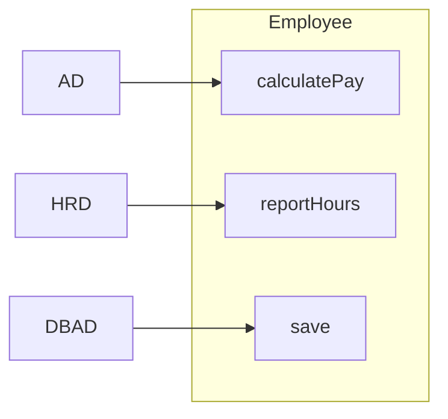
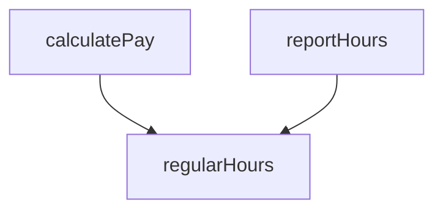
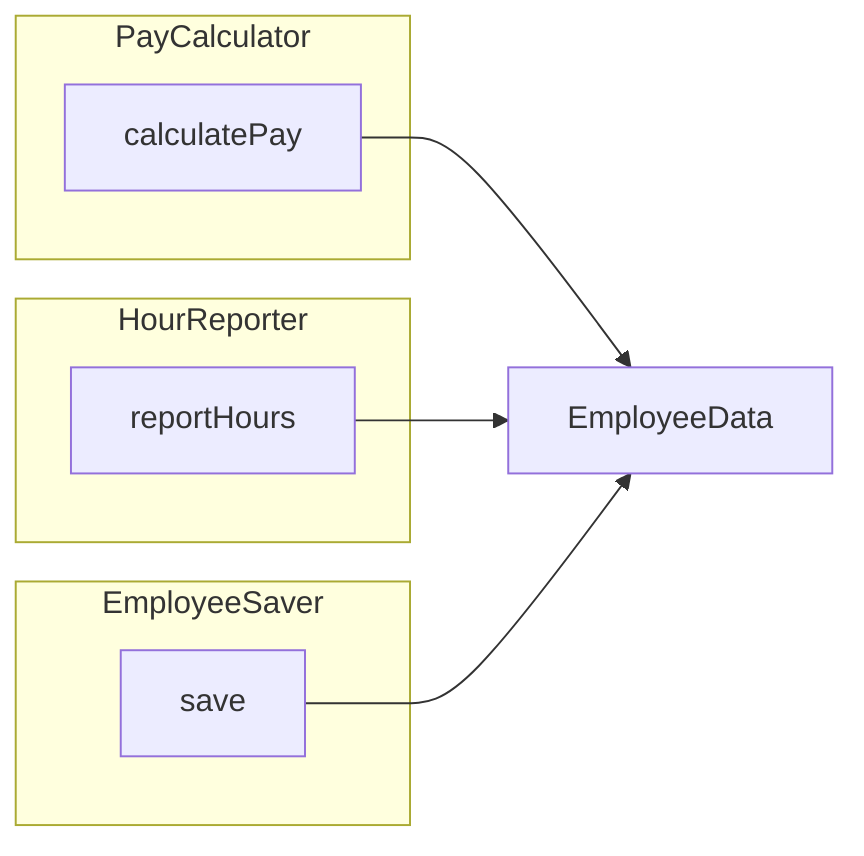
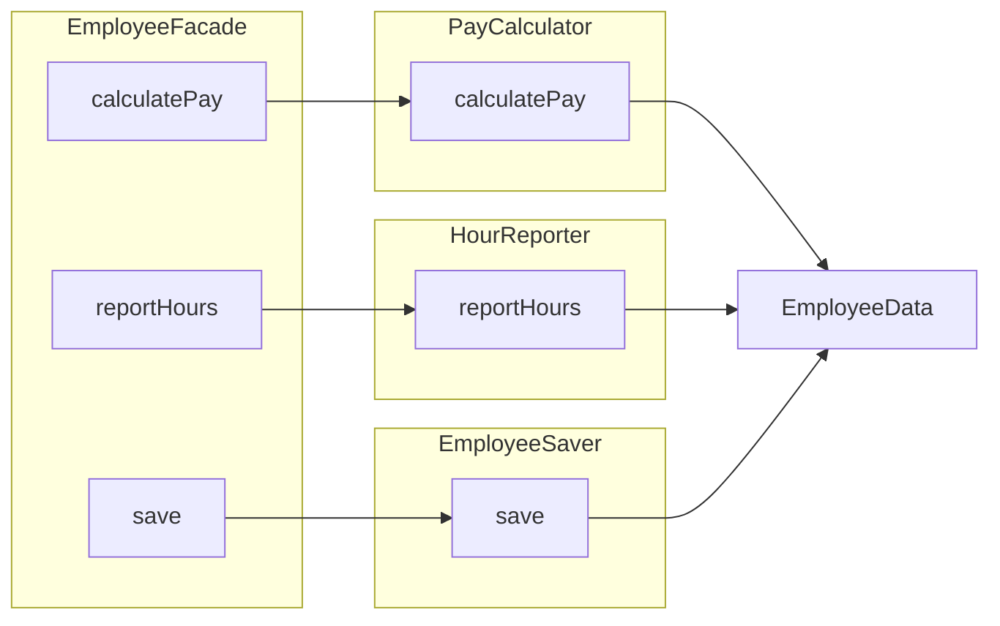
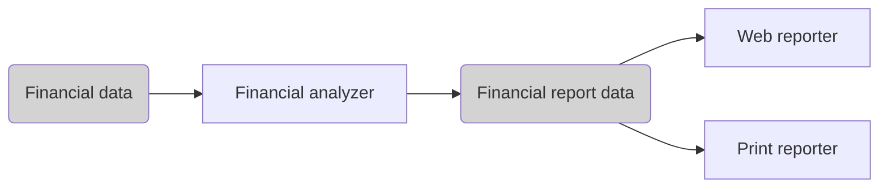
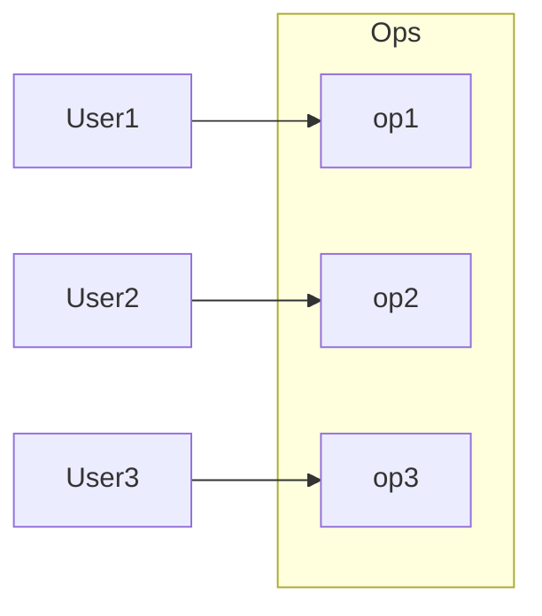
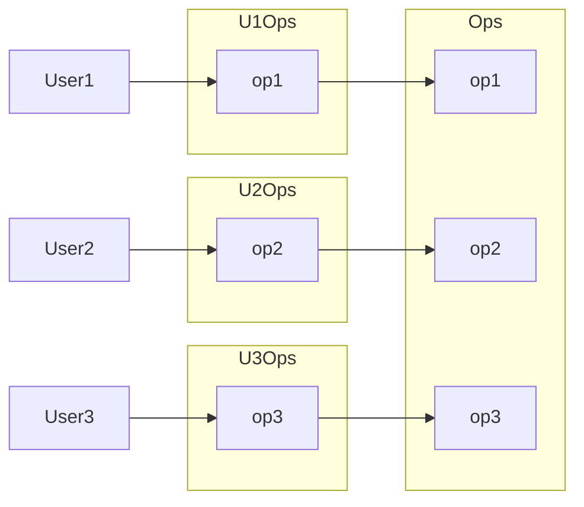
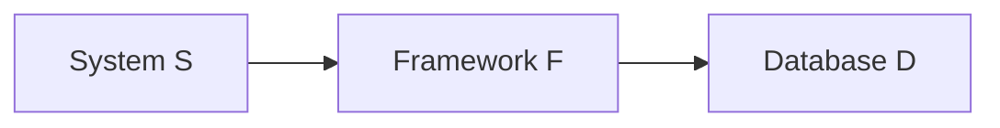

# SUMMARY: CLEAN ARCHITECTURE BY ROBERT C. MARTIN

## FOREWORD

> Architecture represents the significant design decisions that shape a system, where significant is measured by cost of change.

System's development changes should be:

- ~~💸 costly~~;
- ~~🤯 hard to make~~;
- ~~🏭 managed projects of their own~~;
- 🧘 folded into the daily workflow.

There are a lot of paths to build the architecture:

- 🗿 Architecture can be too strong and stable, born from authority and rigidity.  
  If change is expensive, change is eliminated, which causes subdued or headed of into a bureacratic ditch.  
  Totalitarism in architecture becomes a dystrophia for developers and a constant source of developers for all.
- 🤡 Architecture can have a strong smell of speculative generality.  
  Your project becomes filled with hard-coded guesswork, countless parameters, tombs of dead code, and more complexity than your maintanance budget can allow.
- 😊 Architecture can be maintanable and flourishing.
  - software softness is preserved as a first-class property of the system;
  - new things are discovered and created;
  - questions are asked;
  - experiments are ran.

A good architecture is ~~a destination or a frozen artifact~~ an ongoing process like a jorney or enquiry.

## PREFACE

Software systems are created for different domains and using various technologies.  
But they share similar rules of architecture.  
These rules are about ordering and assembling the building blocks of programs.  
They are universal regardless time and system types.

## PART I. INTRODUCTION

Getting software working is easy.  
Kids produce working code. Students start businesses based on a few lines of PHP code. Juniors make their tasks done.  
The code they produce may not be pretty; but it works.  
It works because getting something to work – once – is easy.

Gettings software right is hard.  
It requires knowledge, skills that most programmers don't take time to develop.  
It requires high level of and discipline and didication that most programmers never dreamed they'd need.  
It takes a passion for the craft and the desire to be a professional.

When your software is done right:

- ~~you need hords of programmers to keep it working~~;
- ~~you need massive requirements documents and huge issue tracking systems~~;
- ~~you need 24/7 programming~~;
- ~~bad code and rotten design~~;
- ~~exhausted patience of the managers~~;
- ~~trivial changes require two-week digging and involve high risks~~;
- you need only a fraction of human resources to to create and maintain;
- changes are simple and rapid;
- defects are few and far between;
- effort is minimized;
- functionality and flexibility are maximized;
- customers are happy, managers trust you;

### CHAPTER 1. WHAT IS DESIGN AND ARCHITECTURE

Design and architecture are the same.  
The word «architecture» is often used to describe high-level concepts that are divorced from low-level details.  
The word «design», conversely, more often implies structures and decisions at a low level.  
But this separation is nonsensical when you look what a real architect does.  
Low-level details and high-level decision are all part of the same whole. There is no clear dividing line between them.  
There is simply a continuum of decisions from the highest to the lowest levels.

#### THE GOAL

> The goal of software architecure is to minimize the human resources required to build and maintain the required system.

The measure of design quality is the measure of the effort required to meet the customer's needs.  
The effort is low, and stays low throughout the lifetime of the system? The design is good.  
The effort grows with each release? The design is bad.

#### CASE STUDY

You can measure how some interesting measures change during the system lifetime.

- engineering staff amount;
- time per codeline;
- codeline cost;
- company's monthly development payroll;
- other productivity indices.

#### THE SIGNATURE OF A MESS

When a system is messy, the developers' job becomes «moving the mess from one place to the next, and the next», so that they can add one more inadequately little feature.  
Company earnings fall down, developers frustrate, managers are in rage.

#### WHAT WENT WRONG

The morals of the «Tortoise and the Hare» story:

- Slow and steady wins the race.
- The race is not to the swift, nor the battle to the strong.
- The more haste, the less speed.

Most developers work hard, but a part of their brain sleeps – the part that knows that clean, well-designed code matters.

Another mistake: «We can clean it up later, we just have to get to market first!» – the Hare's mistake.  
Why later? Do you think you won't have to get new features done? Or maybe the «Pause the market» button will suddenly appear?  
These developers are overconfident in their ability to remain productive.  
Writing messy code makes them go fast in the short term and slows them down in the long term.

> The only way to go fast, is to go well.

Stop be overconfident.  
Start taking the responsibility for the mess you've made.

The solution is ~~to start over from scratch and redesign the whole system~~. It's just another manifestation of the same overconfidence that led to the mess.  
Their overconfidence will drive the redesign into the same mess as the original project.

#### CONCLUSION

- Recognize and avoid you overconfidence.
- Start taking the quality of your software seriously.
- You need to know what good software architecture is, what its attributes are.

### CHAPTER 2. A TALE OF TWO VALUES

Every software system provides two different values to the stakeholders: behavior and structure.  
Developers are responsible for ensuring that both of them remain high.  
Unfortunetely, developers often focus of one of them, leaving the software system eventually valueless.

#### BEHAVIOR

Developers are hired to make machines to behave in a way that makes or saves money for the stakeholders.  
We do this by helping the stakeholders to develop a functional specification, or requirements document.  
Many programmers think that is the entirely of their job. They are sadly mistaken.

#### ARCHITECTURE

The second value of software relates to the softness of software.  
Software is intended to be a way to easily change the behavior of machines.

To fulfill its purpose, software must be soft.  
When the stakeholders change their minds about a feature, that change should be simple and easy to make.  
The difficulty in making such a change should be proportional only to the scope of the change, and not to the shape of the change.

#### THE GREATER VALUE

What is more important for the software system – to work, or to be easy to change?

Business managers likely say it's more important for the software system to work. Developers, in turn, often go alogn with this attitude. But it's a wrong attitude.  
Let's examine the extremes:

- Extreme 1:
  - a program works perfectly;
  - it's impossible to make changes when the requirements change;
  - therefore the program will become useless.
- Extreme 2:
  - a program doesn't work;
  - it is easy to make it work;
  - it is easy to keep it working as requirements change.
  - therefore the program will remain continually useful.

Yes, these are theoretical extremes and there are no programs that are unable to be changed.  
But there are changes-unfriendly systems, when the cost of change exceeds the benefit of change.  
Many systems reach that point in some of their features or configurations.

- 🧑‍💻 Do you want to be able to make changes in the future?
- 🧑‍💼 Of course, but the current functionality is more important than any later flexibility.
- ⏱️ A couple of months later ...
- 🧑‍💼 We need to make changes accordint to this requirements list.
- 🧑‍💻 Estimated cost of these changes will unaffordably high.
- 🧑‍💼 How did you let the system get to this point?

#### EISENHOWER'S MATRIX

|                      |                          |
| -------------------- | ------------------------ |
| Important + urgent   | Important + not urgent   |
| Unimportant + urgent | Unimportant + not urgent |

The first value of software – behavior – is urgent but never particulary important.  
The second value of software – architecture – is important but never particulary urgent.

Of course, some things are both important and urgent, and some – both unimportant and not urgent.

The dilemma for developers is that managers are not equipped to evaluate the importance of architecture.  
That's what developers were hired to do.  
It's the responsibility of the software development team to assert the importance of architecture over the urgency of features.

#### FIGHT FOR THE ARCHITECTURE

Fulfilling this responsibility means wading into a fight.  
The development team has to struggle for what they believe to be best for the company.  
And so do the management team, and the marketing team, and the sales team.

Effective software developers uabashedly squabble with all the other stakeholders as equals.  
Remember, as a software developer, you are a stakeholder. You have a stake in the software that you need to safeguard.  
It's a part of you role, of your duty. It's a big part of why you were hired.

This challenge is doubly important if you're a software architect.  
Architects are focused on creating an architecture that allows features to be easily developed, modified and extended.

If architecture comes last, then the system will become ever more costly to develop.  
This means that the software development team did not fight hard enough.

## PART II. STARTING WITH THE BRICKS: PROGRAMMING PARADIGMS

### CHAPTER 3. PARADIGM OVERVIEW

No content.

#### STRUCTURED PROGRAMMING

Imposes discipline on direct transfer of control.

#### OBJECT-ORIENTED PROGRAMMING

Imposes discipline on indirect transfer of control.

#### FUNCTIONAL PROGRAMMING

Imposes discipline on variable assignment.

#### FOOD FOR THOUGHT

Each of the paradigms removes capabilities from the programmer.  
None of them adds new capabilities.  
Each imposes extra discipline.  
The paradigms tell us what not to do, more than what to do.

#### CONCLUSION

No content.

### CHAPTER 4. STRUCTURE PROGRAMMING

It was invented by Edsger Wybe Dijkstra.

#### PROOF

- 🧩 programming was hard before SP was invented;
- 😓 programmers didn't do it very well because a program contains too many details for a human brain to manage;
- 👾 a program may seem to work but fails in surprising ways;
- ∑ the idea behind it is applying the mathematical discipline of proof;
- ☝️ it turned out that the construction of a Euclidian hierarchy of postulates, theorems and lemmas are useful in programming
- 🧐 programmers can use these proven structures the way mathematicians do;
- 🙅 certain uses of the `goto` statement prevented code from being decomposed into smaller modules, thereby prevented use of the divide-and-conquer approach necessary for reasonable proofs;
- 👌 other uses of the `goto` statement are «good» (these have evoleved to `if`, `while`, etc);
- ✅ the created technique mathematically traced the input of the sequence to the output of the sequence, which has no difference from any normal mathematical proof;

#### A HARMFUL PROCLAMATION

As the result of a 10-years discussion, Dijkstra proved harmfulness of the `goto` statement. `goto` is no longer a part of any modern language.

Nowadays, we are all structured programmers, though not by necessary by choice.  
It's just that our languages don't give us the opinion to use undisciplined direct transfer of control.  
Yes, there are some `goto` analogs in modern languages, but they are very strict, or at least scoped within the current function.

#### FUNCTIONAL DECOMPOSITION

SP allows you to decompose a large-scale problem statement into high-level functions.  
Each of those functions can then be decomposed into lower-level functions, ad infinitum.  
Moreover, each of those functions can be represented using the restricted control structures of SP.

#### NO FORMAL PROOFS

Mathematics is not applicable to prove correctness of our provable functions.

#### SCIENCE TO THE RESQUE

Science is fundamentally different from mathematics.  
In the context of proving of functions correctness, programming closer to science, than to mathematics.  
I can demonstrate my function works, I can show that it's correct in many different cases, but I can't prove it in the sense of a mathematical proof.  
No matter how many experiments I conduct, or how much empirical evidence I gather, there is always the chance that another experiment will fail with certain conditions.

Science doesn't work by proving statements true, but rather by proving statements false.  
Those statements that we can't prove false, after much effort, we deem to be true enough for our purposes.

#### TESTS

Testing shows the presence, not the absence, of bugs.

SP forces us to recursively decompose a program into a set of small provable functions. We can then use tests to try to prove those small provable functions are incorrect. If such tests fail to prove incorrectness, then we consider the functions to be correct enough for our purposes.

#### CONCLUSION

SP is valuable for it's ability to create testable units. This is the reason why modern languages don't typically support unrestrained `goto` statements. At the architectural level, this is why we consider functional decomposition to be a best practice.

At every level, software is like a science and, therefore, is driven by testability.  
Architects strive to define modules, components and services to that are easily testable. To do so, they employ restrictive disciplines similar to structured programming.

### CHAPTER 5. OBJECT-ORIENTED PROGRAMMING

The basis of a good architecture is the understanding and application of OO design.

What is OO?

- The combination of data and function?
  - is unsatisfying, because it implies that `o.f()` is somehow different from `f(0)`, which is absurd;
  - programmers were passing data into functions long before 1966, when Dahl and Nygaard moved the function call stack frame to the heap and invented OO.
- A way to modal the real world?

  - an evasive answer at best;
  - what does «modeling the real world» actually mean?
  - why do we want to model the real world?
  - is intended to imply that OO makes software easier to understand because it has closer relationship to the real world;
  - the statement is still loosely defined and doesn't tell us what OO is.

OO is the proper admixture of encapsulation, inheritance and polymorphism.

#### ENCAPSULATION

OO languages provide easy and effective encapsulation of data and function. As a result, a line can be drawn around a cohesive set of data and functions. Outline of that line, the data is hidden and only some of the functions are known.

Clients of the code don't have direct access to either the data or the internal implementation. They call methods that return the data in a reasonable format.

- Incapsulation is available in non-OO languages (like C), but OO languages (like C++) are a lot more frendly for it.
- Some OO languages provide useful keywords like `public`, `private` and `protected`, encouragin encapsulation.
- Some OO languages like Java and C# abolished the header / implementation split altogether, thereby weaking encapsulation. In these languages it's impossible to separate the declaration and definition of a class.

For these reasons, it's difficult to accept that OO depends on strong encapsulation. Indeed, many OO languages have little or no enforced encapsulation.

#### INHERITANCE

Technically, inheritance is a redeclaration of a group of variables and functions within an enclosing scope.

In the context of inheritance, OO languages haven't given us anything completely new. Long before OO languages were invented, we had tricks to implement inheritance. OOP introduced a more convenient way to implement inheritance, and multiple inheritance in particular.

#### POLYMORPHISM

- is the ability of any data to be processed in more than one form;
- _poly_ means _many_, _morphism_ means _types_;
- allows to represent a function in many types and many forms;
- lets the system choose which function to call based on type and parameter signatures.

Here, OOP still invents nothing completely new, but provides a way to implement polymorphism much safer, convenient and even trivial.

The `+` operator in JS is polymorphic, as it can either sum or concatenate, depending on the data type of its operands.

OO imposes discipline on indirect transfer of control.

##### THE POWER OF POLYMORPTHISM

No content.

##### DEPENDENCY INVERSION

A typical dependencies tree:

- 😐 _main functions_ call _high-level functions_, that call _mid-level functions_, that call _low-level functions_;
- 😖 _system behavior_ dictates _control flow_, _control flow_ dictates _source code dependencies_;

Dependencies tree enabled by depency inversion:

- 😊 decouples modules;
- 👯 high level modules should not depend on low level modules – both should depend on abstractions;
- 🙅 abstractions shouldn't depend on concrete implementation;
- 🤗 concrete implementations should depend upon abstractions;

What power does it provide?

- 😎 Which module does the calling? Which module is called? No matter. The software architect can point the source code dependency in either direction.
- 💪 The DB and the UI will depend on the BLL, rather than the other way around.
- 👍 The DB and UI can be plugins to the BLL. It means that the source code of the BLL never mentions the DB or UI.
- 🪚 BLL, UI and DB are developed and deployed separately. Changes to the UI or DB don't have any effect to the BLL. Changes to the DB or the UI don't have any effect on the business rules. Those components can be deployed and developed independently and separately.

#### CONCLUSION

OO is the ability, through the use of polymorphism, to gain absolute control over every source code dependency in the system.

### CHAPTER 6. FUNCTIONAL PROGRAMMING

No content.

#### SQUARES OF INTEGERS

- 🧼 purity;
- 🐢 immutability;
- 🐚 disciplined state;
- 𝑓 first-class functions and higher-order functions;
- 👥 referential transparency (we can replace a function call with its invocation result and the final result will be the same);

#### IMMUTABILITY AND ARCHITECTURE

Mutable variables is the source of problems for concurrent programs. They cause race conditions, deadlock conditions and concurrent update problems.

Immutability solves these problems.  
But it's not really to make everything immutable, because immutability requires a lot of storage and processor speed.

#### SEGREGATION OF MUTABILITY

🤔 One of the compromises is to segregate the app into mutable and immutable parts.  
🧼 The immutable components perform their tasks in a purely functional way.  
🤝 The immutable components communicate with components that are not purely immutable, that allow mutable variables etc.


🛡️ Since mutating state exposes the immutable components to the concurrency problems, it's common practice to use some kind of transactional memory to protect the mutable variables from concurrent updates and race conditions.

So what?

- 👍 it's wise to push as much processing as possible into the immutable components;
- 👋 we should drive as much code as possible from those components that allow mutation;

#### EVENT SOURCING

📱 The faster modern processors, the less actual memory issues, the less mutable state we need.

An example:

- 🏦 we have a banking app that maintains the account balances of its customers;
- 😩 it mutates balances when deposit and withdrawal transactions are executed;
- 🤔 imagine that instead of storing the account balances, we store only the transactions;
- ∑ whenewer anyone wants to know their account balance, we simply add up all the transactions for that account, from the beginning of time;
- 🤩 this scheme requires no mutable variables;
- 😔 but this approach is absurd because the number of transactions grow without bound, so to make this scheme work forever we need infinite storage and infinite processing power;
- 🤔 but perhaps we don't have to make the scheme work forever, perhaps we have enough storage and processing power to make the scheme work for the reasonable lifetime;
- 👆 this is the idea behind event sourcing;
- ∑ event sourcing is a strategy wherein we store the transactions, but not the state; when the state required, we simply apply all the transactions from the beginning of time;
- 💡 we can optimize the process by computing and saving the state every midnight; so, during the day, we will make calculations based on this saved state and transactions executed from midnight.

If we have enough storage and enough processor power, we can make our apps entirely immutable – and, therefore, entirely functional.  
For example, source code control systems work in this way.

#### CONCLUSION

🚨 Each of the paradighms take something away from us. None of them has added to our power or out capabilities.  
🙅 What we have learned over the last half-of-century is what not to do.  
📖 The rules of software are the same today as they were in 1946.  
👉 Software is composed of sequence, selection, iteration, and indirection.

## PART III. DESIGN PRINCIPLES

🧼 Good software systems begin with clean code.  
🫲 On the one hand, if the bricks aren't well made, the architecture of the building doesn't matter much.  
🫱 On the other hand, you can made a substantial mess with well-made bricks.

🤲 SOLID tells us how to arrange our functions and data structures into classes (or other function and data groupings) and how those groupings should be interconnected.

The goal of SOLID is creation of mid-level software structures that:

- tolerate change;
- are easy to understand;
- are the basis of components that can be used in different software system.

«Mid-level» means that SOLID is applied by programmers working at the module level.

SOLID:

- **SRP**: the single responsibility principle.  
  The best structure for a software system is heavily influenced by the social structure of the organization that uses it.  
  So that each software module has one, and only one, reason to change.
- **OCP**: the open-closed principle.  
  For software systems to be easy to change, they must be designed to allow the behavior of those systems to be changed by adding new code, rather than changing existing code.
- **LSP**: the Liskov substitution principle.  
  To build software system from interchangeable parts, these parts must adhere to a contract that allows those parts to be substituted one for another.
- **ISP**: the interface segregation principle.  
  Avoid depending on things that you don't use.
- **DIP**: the dependency inversion principle.  
  High-level policy code shouldn't depend on the code that implements low-level details. Rather, details should depend on policies.

The following chapters focus on their architectural implications.

### CHAPTER 7. THE SINGLE RESPONSIBILITY PRINCIPLE

No, it doesn't mean that each module should do just one thing. The principle has a particulary inappropriate name.

Make no mistake, there is a principle like that. A function should do one, and only one, thing. We use that principle when we're refactoring large function into smaller ones; we use it at the lowest levels. But it is not SRP.

Historically, the SRP has been described this way:

> A module should have one, and only one, reason to change, meaning that a class should have only one job.

Software systems are changed to satisfy users and stakeholders; those users and stakeholders are the «reason to change» that the SRP is talking about. Let's rephase the principle:

> A module should be responsible to one, and only one, user or stakeholder.

Unfortunately, the words «user» and «stakeholder» aren't really the right words to use here. There will likely be more than one user or stakeholder who wants the system changed in the same way. We're referring to a group – one or more people who require that change. We'll refer to that group as an actor.

The final version of SRP is:

> A module should be responsible to one, and only one, actor.

«Module» here is a cohesive set of functions and data structures. Most of the time, it's just a source file.  
The word «cohesive» implies the SRP. Cohesion is the force that binds together the code responsible to a single actor.

Perhaps the best way to understand the SRP is by looking at the symptoms of violating it.

#### SYMPTOM 1: ACCIDENTAL DUPLICATION

Let's say we're working on a payroll app.  
We have the `Employee` class with the following methods: `calculatePay`, `reportHours` and `save`.



This class violates the SRP because those three methods are responsible to three very different actors.

- `calculatePay` – specified by the AD;
- `reportHours` – specified by the HRD;
- `save` – specified by the DBAD;

By putting the source code of these three methods into a single `Employee` class, the developers have coupled each of these actors to the others. This coupling can cause the actions of AD to affect something that HRD depends on.

Suppose, `calculatePay` and `reportHours` share the same algorithm for calculating non-overtime hours. Suppose that it's extracted to the `regularHours` to eliminate duplicated code.



Suppose, AD decides to tweak the way non-overtime hours for `calculatePay` are calculated.  
HRD don't need this particular tweak because they use non-overtime hours for a different purpose.  
A developer is tasket to change the `regularHours` method.  
Unfortunately, the developer doesn't notice that the `regularHours` is also called by `reportHours` for HRD purposes.  
Of course, HRD doesn't know that this is happening. HRD will receive incorrect report hours, possibly losing money every day.

These problems occurs because we put code that different actors depend on into close proximity.  
The SRP says to separate the code that different actors depend on.

#### SYMPTOM 2: MERGES

If a module is responsible to one, and only one, actor, it's less likely for merge conflits to occur.  
If a developer makes a task related to `someMethod`, it's unlikely that other developers have reasons to edit this file at the same time.

#### SOLUTIONS

One of the solutions:

- separate the data from the functions;
- the three classes share access to `EmployeeData` which is a simple data structure with no methods;
- each class holds only the source code necessary for its particular function;
- the three classes aren't allowed to know about each other;
- thus any accidental duplication is avoided;



The downside of this solution is that the developers now have three classes that they have to instantiate and track. A common solution to this dilemma is to use the Facade pattern.



The `EmployeeFacade` contains very little code. It's responsible for instantiating and delegating to the three classes with the functions.

#### CONCLUSION

The SRP is about functions and classes – but it reappears in a different form at two more levels:

- at the level of components, it becomes the _Common closure principle_;
- at the architectural level, it becomes the _Axis of change_ responsible for _Architectural boudaries_.

### CHAPTER 8. THE OPEN-CLOSED PRINCIPLE

> A software artifact should be open for extension but closed for modification.

In other words, the behavior of a software artifact ought to be extensible without having to modify that artifact.

If simple extensions to the requirements force massive changes to the software, it's the architect's failure.

The OCP is significant at the levels:

- of modules;
- of architectural components.

#### A THOUGH EXPERIMENT

Suppose, we have a system that displays a financial summary on a web page. The data is scrollable, negative numbers are rendered in red.

The stakeholders ask to make it printable as a report on a black-and-white printer. It should have pagination, page header, footer and labels. Negative numbers should be surrounded with parentheses.

Clearly, some new code must be written. But how much old code will have to change?

A good software architecture reduces the amount of changed code to the barest minimum. Ideally, zero.

How?

- by properly separating the things that change for different reasons (SRP);
- and then organizing the dependencies between those things properly (DIP);

First, apply the SRP:



The general insight here is that generating the report involves two separate responsibilities:

- report data calculation;
- presentation of the data into a web- and printer-friendly form.

Having made this separation, we need to organize the source code dependencies to ensure that changes to one of those responsibilities don't cause changes in the other.


Legend:

- separate components are indicated by a double-line border;
- `<I>` – interfaces;
- `<DS>` – data structures;
- open arrowheads – _using_ relationships;
- closed arrowheader – _implements_ or _inheritance_ relationships;

Some things to notice:

1.  All the dependencies are the source code dependencies.  
    `class A --> class B` means that the source code of `A` mentions the name of `B`, but `B` mentions nothing about `A`.  
    For example, `FinancialDataMapper` knows about `FinancialDataGateway` through an _implements_ relationship, but `FinancialDataGateway` knows nothing at all about `FinancialDataMapper`.
2.  Each double line is crossed in one direction only.  
    These arrow point toward the components that we want to protect from change.

> If a component A should be protected from changes in component B, then component B should depend on component A.

In our scheme we want to:

- protect the Presenters from changes in the Views;
- protect the Controller from changes in the Presenters;
- protect the Interactor from changes from anything.

The Interactor is in the position that best comforms to the OCP.  
Changes to the Database, or the Controller, or the Presenters, or the Views will have no impact on the Interactor.

Why should the Interactor hold such a priveleged position?

- the Interactor contains the business rules;
- the Interactor contains the highest-level policies of the app;
- all the other components deal with peripheral concerns;
- the Interactor deals with the central concern;

More about the scheme:

- the Controller is peripheral to the Interactor, but it's central to the Presenters and Views;
- the Presenters are peripheral to the Controller, but they're central to the Views;

There is a hierarchy of protection:

- Interactors are the highest-level concepts, so they're most protected;
- Views are the lowest-level concepts, so they're the least protected;
- protection of components gradualy reduces from Interactors to Views.

This is how the OCP works at the architectural level:

- architects separate functionality based on how, why, and when it changes;
- then they organize that separated functionality into a hierarchy of components;
- higher-level components in that hierarcy are protected from changes made to lower-level components.

#### DIRECTIONAL CONTROL

Much of the complexity in the diagram is intended to point the dependencies between the components in the correct direction.

For example, the `FinancialDataGateway` interface between the `FinancialReportGenerator` and the `FinancialDataMapper` exists to invert the dependency that would otherwise have pointed from the Interactor component to the Database component.  
The same is true for the `FinancialReportPresenter` and the two View interfaces.

#### INFORMATION HIDING

The `FinancialReportRequester` interface serves a different purpose. It protects the `FinancialReportController` from knowing too much about the internals of the Interactor. Without `FinancialReportRequester`, the Controller would have transitive dependencies on the `FinancialEntities`.

Transitive dependencies are a violation of the general principle that software entities shouldn't depend on things that they don't directly use.

Our first priority is to protect the Interactor from changes to the Controller.  
We also want to protect the Controller from changes to the Interactor by hiding the internal of the interactor.

#### CONCLUSION

The goal of the OCP is to make the system easy to extend without incurring a high impact of change.  
This goal is accomplished by partitioning the system into components and arranging those components into a dependency hierarchy that protects higher-level components from changes in lower-level components.

### CHAPTER 9. THE LISKOV SUBSTITUTION PRINCIPLE

> What is wanted here is something like the following substitution property:  
> If for each object `o1` of type `S` here is an object `o2` of type `T` such that for all programs `P` defined in terms of `T`, the behavior of `P` is unchanged when `o1` is substituted for `o2` then `S` is a subtype of `T`.

#### GUIDING THE USE OF INHERITANCE

Imagine that we have a `License` class.  
This class has a method `calcFee`, which is called by the `Billing` app.  
There are two «subtypes» of `License`: `PersonalLicense` and `BusinessLicense`. They use different algorithms to calculate the license fee.


The design conforms to the LSP because the behavior of the `Billing` app doesn't depend, in any way, on which of the two subtypes it uses. Both of the subtypes are substitutable for the `License` type.

#### THE SQUARE / RECTANGLE PROBLEM


In this example, `Square` is no a proper subtype of `Rectangle`, because the height and width of the `Rectangle` are independently mutable; in contrast, the height and width of the square must change together.  
The LSP is violated.

#### LSP AND ARCHITECTURE

The LSP concerns not only how to use **inheritance**.  
The LSP has morphed into a **broader principle** that pertains to **interfaces** and **implementations**.

The LSP is applicable when users depend on **well-defined interfaces**, and on the **substitability of the implementations** of those interfaces.

#### EXAMPLE LSP VIOLATION

Suppose we have a RESTful system that serves for a taxi aggregator.

An order endpoint example:

```
purplecab.com/driver/Bob
  /pickupAddress/24 Maple St.
  /pickupTime/153
  /destination/ORD
```

A new taxi vendor «Acme» has been joined to our aggregator.  
Their developers didn't read the aggregator API docs very carefully and used `dest` instead of `destination` in URL.  
Suppose, there is no way to fix this on their side.

What would happen to our architecture? Obviously, we'd need to add a special case. Requests from «Acme» drivers should be processed using a different set of rules.

The simplest way to accomplish this goal is:

```
if (driver.getDispatchUri().startsWith("acme.com")) { ... }
```

No sane architect would add such a construct to the system that mentions `"acme.com"`. We don't want to have mysterious errors and other consequenses. If there will be another case for the «PurpleTaxi» vendor, will we add one more `if`?

More clean and scalable solution would be to add a configuration file like this:

```
{
  "Acme.com": "/pickupAddress/%s/pickupTime/%s/dest/%s",
  "*.*": "/pickupAddress/%s/pickupTime/%s/destination/%s",
}
```

#### CONCLUSION

The LSP can, and should, be extended to the level of architecture.  
A simple violation of substitutability can cause a system's architecture to be polluted with a significant amount of extra mechanisms.

### CHAPTER 10. THE INTERFACE SEGREGATION PRINCIPLE



There are several users who use the operations of the `Ops` class.  
Let's assume that:

- `User1` uses only `op1`;
- `User2` uses only `op2`;
- `User3` uses only `op3`;

In that case, the source code of `User1` depends on `op2` and `op3`, even though it doesn't call them. This dependence means that a change to the source code of `op2` of `Ops` will force `User1` to be recombiled and redeployed (in Java), even though nothing that it cared about has actually changed.

This problem can be resolved by segregating the operations into interfaces:



Again, if we imagine it is implementd in a statically typed language like Java, then the source code of `User1` will depend on `U1Ops` and `op1`, but will not depend on `Ops`. Thus a change to `Ops` that `User1` doesn't care about will not cause `User1` to be recompiled and redeployed.

#### ISP AND LANGUAGE

No content.

#### ISP AND ARCHITECTURE

It's harmful to depend on modules that contain more than you need.



Suppose that D contains features that `F` doesn't use, and therefore `S` doesn't care about.  
Changes to those features within `D` may force the redeployment of `F`, and, therefore, the redeployment of `S`.  
Even worse, a failure of one of those features within `D` may cause failures in `F` and `S`.

#### CONCLUSION

Depending on something that carries baggage that you don't need can cause you troubles that you didn't expect.

### CHAPTER 11. THE DEPENDENCY INVERSION PRINCIPLE

> The most flexible systems are those in which source code dependencies refer only to abstractions, not to concretions.

In a statically typed language, like Java, this means that the use, import and include statements should refer only to source modules containing interfaces, abstract classes, or some other kind of abstract declaration. Noting concrete should be depended on.

The same rule applies for dynamically typed languages like Python. Source code dependencies shouldn't refer to concrete modules. In these languages it's harder to defined what a concrete module is. In particular, it's any module in which the functions being called are implemented.

Clearly, treating this idea as a rule is unrealistic, because software systems must depend on many concrete facilities. For example, the `String` class in Java is concrete, and we must import and use it.  
By comparison, the `String` class is very stable and we don't worry about capricius changes to it.

So, we tolerate some concrete dependencies because we can rely on them not to change.

Our system shouldn't depend on volatile concrete modules – those that we're actively developing, and that are undegoing frequent change.

#### STABLE ABSTRACTIONS

Every change to an abstract interface corresponds to a change to its concrete implementations.  
Conversively, changes to concrete implementations usually don't require changes to the interfaces that they implement.  
Therefore **interfaces are less volatile than implementations**.

Good architects work hard to **reduce the volatility of interfaces**. They try to find ways to **add functionality to implementations without making changes to the interfaces**.

Stable architectures are those that avoid depending on volatile cocretions, and that favor the use of stable abstract interfaces. This implications boils down to a set of very specific coding practices:

- **Don't refer to volatile concrete classes. Refer to abstract interfaces instead.** This rule is applied in all languages, whether statically or dynamically typed.
- **Don't derive from volatile concrete classes.**
- **Don't override concrete functions.** Instead, make the function abstract and create multiple implementations.
- **Never mention the name of anything concrete and volatile.** Actually, it's just a restatement of the principle itself.

#### FACTORIES

Creation of volatile concrete objects requires special handling.  
In most OO languages we'd use an Abstract Factory to manage this undesirable dependency.


The `Application` uses the `ConcreteImpl` through the `Service` interface. However, the `Application` must somehow create instances of the `ConcreteImpl`. To achieve this without creating a source code dependency on the `ConcreteImpl`, the `Application` calls the `makeSvc` method of the `ServiceFactory` interface. This method is implemented by the `ServiceFactoryImpl` class, which derives from `ServiceFactory`. That implementation instantiates the concrete `ConcreteImpl` and returns it as a `Service`.

The curved line is an architectural boundary. It separates the abstract component from the concrete component. All source code dependencies cross that curved line pointing in the same direction, toward the abstract side.  
The abstract component contains all the high-level business rules. The concrete component contains all the implementation details of those business rules.

The flow of control crosses the curved line in the opposite direction of the source code dependencies – which is why we refer to this principle as Dependency Inversion.
