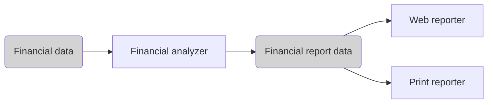

# SUMMARY: CLEAN ARCHITECTURE BY ROBERT C. MARTIN

## FOREWORD

> **Architecture** represents the **significant design decisions that shape a system**, where significant is measured by cost of change.

System's development changes should be:

- ~~💸 costly~~;
- ~~🤯 hard to make~~;
- ~~🏭 managed projects of their own~~;
- 🥱 easy to implement;
- 🧘 folded into the daily workflow.

There are a lot of paths to build the architecture:

- 🗿 Architecture can be too strong and stable, born from **authority and rigidity**.  
  If change is expensive, change is eliminated, which causes subdued or headed off into a bureacratic ditch.  
  Totalitarism in architecture becomes a dystrophia for developers and a constant source of frustration for all.
- 🤡 Architecture can have a strong smell of **speculative generality**.  
  Your project becomes filled with hard-coded guesswork, countless parameters, tombs of dead code, and more complexity than your maintanance budget can allow.
- 😊 Architecture can be **maintanable and flourishing**.
  - software softness is preserved as a first-class property of the system;
  - new things are discovered and created;
  - questions are asked;
  - experiments are ran.

A good architecture is ~~a destination or a frozen artifact~~ an ongoing process like a jorney or enquiry.

## PREFACE

Software systems are created for different domains and using various technologies. But they share similar rules of architecture: rules are about ordering and assembling the building blocks of programs.

## PART I. INTRODUCTION

Getting software working is easy. Kids, students and juniors create programs. The code they produce may not be pretty, but it works because getting something to work – once – is easy.

Gettings software right is hard. It requires knowledge, skills that most programmers don't take time to develop. It requires high level of and discipline and didication that most programmers never dreamed they'd need. It takes a passion for the craft and the desire to be a professional.

When your software is done right:

- ~~you need hords of programmers to keep it working~~;
- ~~you need massive requirements documents and huge issue tracking systems~~;
- ~~you need 24/7 programming~~;
- ~~bad code and rotten design~~;
- ~~exhausted patience of the managers~~;
- ~~trivial changes require two-week digging and involve high risks~~;
- the system structure is intuitive;
- you need only a fraction of human resources to create and maintain;
- changes are simple and rapid;
- defects are few and far between;
- effort is minimized;
- functionality and flexibility are maximized;
- customers are happy, managers trust you.

### CHAPTER 1. WHAT IS DESIGN AND ARCHITECTURE

Design and architecture are the same. The word «architecture» is often used to describe high-level concepts that are divorced from low-level details. The word «design», conversely, more often implies structures and decisions at a low level.  
But this separation is nonsensical when you look what a real architect does.  
Low-level details and high-level decision are all part of the same whole. There is no clear dividing line between them. There is simply a continuum of decisions from the highest to the lowest levels.

#### THE GOAL

> The **goal** of software architecure is to **minimize the human resources required** to build and maintain the required system.

The **measure of design quality** is the measure of the **effort required** to meet the customer's needs.  
The effort is low, and stays low throughout the lifetime of the system? The design is good.  
The effort grows with each release? The design is bad.

#### CASE STUDY

You can measure how some interesting measures change during the system lifetime.

- engineering staff amount;
- time per codeline;
- codeline cost;
- company's monthly development payroll;
- other productivity indices.

#### THE SIGNATURE OF A MESS

When a system is messy, the developers' job becomes «moving the mess from one place to the next, and the next», so that they can add one more inadequately little feature. The company's earnings fall down, developers frustrate, managers are in rage.

#### WHAT WENT WRONG

The morals of the «Tortoise and the Hare» story:

- slow and steady wins the race;
- the race is not to the swift, nor the battle to the strong;
- the more haste, the less speed.

Most developers work hard, but a part of their brain sleeps – the part that knows that clean, well-designed code matters.

Another mistake: «We can clean it up later, we just have to get to market first!» – the Hare's mistake.  
Why later? Do you think you won't have to get new features done? Or maybe the «Pause the market» button will suddenly appear?  
These developers are overconfident in their ability to remain productive.  
Writing messy code makes them go fast in the short term and slows them down in the long term.

> The only way to go fast, is to go well.

Stop be overconfident.  
Start taking the responsibility for the mess you've made.

The solution is ~~to start over from scratch and redesign the whole system~~. No, it will be just another manifestation of the same overconfidence that led to the mess.  
Their overconfidence will drive the redesign into the same mess as the original project.

#### CONCLUSION

- Recognize and **avoid your overconfidence**.
- Start taking the quality of your software **seriously**.
- You need to **know what good architecture is**, what **its attributes** are.

### CHAPTER 2. A TALE OF TWO VALUES

Every software system provides two different values to the stakeholders: behavior and structure.  
Developers are responsible for ensuring that both of them remain high.  
Unfortunetely, developers often focus of one of them, leaving the software system eventually valueless.

#### BEHAVIOR

Developers are hired to make machines to behave in a way that makes or saves money for the stakeholders.  
We do this by helping the stakeholders to develop a functional specification, or requirements document.  
Many programmers think that is the entirely of their job. They are sadly mistaken.

#### ARCHITECTURE

The second value of software relates to the softness of software. Software is intended to be a way to easily change the behavior of machines.

To fulfill its purpose, software must be soft.  
**When the stakeholders change their minds about a feature**, that change should be **easy to make**.  
The difficulty in making such a change should be proportional only to the scope of the change, and not to the shape of the change.

#### THE GREATER VALUE

What is more important for the software system – to work, or to be easy to change?

Business managers likely say it's more important for the software system to work. Developers, in turn, often go alogn with this attitude. But it's a wrong attitude.  
Let's examine the extremes:

- Extreme 1:
  - a program works perfectly;
  - it's impossible to make changes when the requirements change;
  - therefore the program will become useless.
- Extreme 2:
  - a program doesn't work;
  - it is easy to make it work;
  - it is easy to keep it working as requirements change;
  - therefore the program will remain continually useful.

Yes, these are theoretical extremes and there are no programs that are unable to be changed.  
But there are changes-unfriendly systems, when the cost of change exceeds the benefit of change.  
Many systems reach that point in some of their features or configurations.

- 🧑‍💻 Do you want to be able to make changes in the future?
- 🧑‍💼 Of course, but the current functionality is more important than any later flexibility.
- ⏱️ A couple of months later ...
- 🧑‍💼 We need to make changes accordint to this requirements list.
- 🧑‍💻 Estimated cost of these changes will unaffordably high.
- 🧑‍💼 How did you let the system get to this point?

#### EISENHOWER'S MATRIX

|                      |                          |
| -------------------- | ------------------------ |
| Important + urgent   | Important + not urgent   |
| Unimportant + urgent | Unimportant + not urgent |

The first value of software – behavior – is urgent but never particulary important.  
The second value of software – architecture – is important but never particulary urgent.

Of course, some things are both important and urgent, and some – both unimportant and not urgent.

The dilemma for developers is that managers are not equipped to evaluate the importance of architecture. That's what developers were hired to do.  
It's the **responsibility of the software development team to assert the importance of the architecture** over the urgency of features.

#### FIGHT FOR THE ARCHITECTURE

Fulfilling this responsibility means wading into a fight.  
The development team has to **struggle for** what they believe to be **best for the company**.  
And so do the management team, and the marketing team, and the sales team.

Effective software developers uabashedly squabble with all the other stakeholders as equals.  
Remember, as a software **developer**, you are a **stakeholder**. You have a **stake** in the software that you need to **safeguard**.  
It's a part of you **role**, of your **duty**. It's a big part of **why you were hired**.

This challenge is doubly important if you're a software architect. Architects are focused on creating an architecture that allows features to be easily developed, modified and extended.

If architecture comes last, then the system will become ever more costly to develop. This means that the software development team did not fight hard enough.

## PART II. STARTING WITH THE BRICKS: PROGRAMMING PARADIGMS

### CHAPTER 3. PARADIGM OVERVIEW

No content.

#### STRUCTURED PROGRAMMING

Imposes discipline on direct transfer of control.

#### OBJECT-ORIENTED PROGRAMMING

Imposes discipline on indirect transfer of control.

#### FUNCTIONAL PROGRAMMING

Imposes discipline on variable assignment.

#### FOOD FOR THOUGHT

Each of the paradigms **removes capabilities** from the programmer. None of them adds new capabilities. Each imposes extra **discipline**. The paradigms tell us **what not to do**, more than what to do.

#### CONCLUSION

No content.

### CHAPTER 4. STRUCTURE PROGRAMMING

No content.

#### PROOF

No content.

#### A HARMFUL PROCLAMATION

No content.

#### FUNCTIONAL DECOMPOSITION

No content.

#### NO FORMAL PROOFS

No content.

#### SCIENCE TO THE RESQUE

No content.

#### TESTS

No content.

#### CONCLUSION

No content.

### CHAPTER 5. OBJECT-ORIENTED PROGRAMMING

> OOP is a programming paradighm that relies on the **concept of classes and objects**.

OO is the proper **admixture** of encapsulation, inheritance and polymorphism.

#### ENCAPSULATION

No content.

#### INHERITANCE

No content.

#### POLYMORPHISM

No content.

##### THE POWER OF POLYMORPHISM

No content.

##### DEPENDENCY INVERSION

No content.

#### CONCLUSION

OOP is the ability, through the use of polymorphism, to gain absolute control over every source code dependency in the system.

### CHAPTER 6. FUNCTIONAL PROGRAMMING

No content.

#### SQUARES OF INTEGERS

No content.

#### IMMUTABILITY AND ARCHITECTURE

No content.

#### SEGREGATION OF MUTABILITY

No content.

#### EVENT SOURCING

No content.

#### CONCLUSION

🚨 Each of the paradighms take something away from us. None of them has added to our power or out capabilities.  
🙅 What we have learned over the last half-of-century is what not to do.  
📖 The rules of software are the same today as they were in 1946.  
👉 Software is composed of sequence, selection, iteration, and indirection.

## PART III. DESIGN PRINCIPLES

No content.

### CHAPTER 7. THE SINGLE RESPONSIBILITY PRINCIPLE

No content.

#### SYMPTOM 1: ACCIDENTAL DUPLICATION

No content.

#### SYMPTOM 2: MERGES

No content.

#### SOLUTIONS

No content.

#### CONCLUSION

No content.

### CHAPTER 8. THE OPEN-CLOSED PRINCIPLE

No content.

#### A THOUGH EXPERIMENT

Suppose, we have a system that displays a financial summary on a web page. The data is scrollable, negative numbers are rendered in red.

The stakeholders ask to make it printable as a report on a black-and-white printer. It should have pagination, page header, footer and labels. Negative numbers should be surrounded with parentheses.

Clearly, some new code must be written. But how much old code will have to change?

A good software architecture reduces the amount of changed code to the barest minimum. Ideally, zero.

How?

- by properly separating the things that change for different reasons (SRP);
- and then organizing the dependencies between those things properly (DIP);

First, apply the SRP:



The general insight here is that generating the report involves two separate responsibilities:

- report data calculation;
- presentation of the data into a web- and printer-friendly form.

Having made this separation, we need to organize the source code dependencies to ensure that changes to one of those responsibilities don't cause changes in the other.


Legend:

- separate components are indicated by a double-line border;
- `<I>` – interfaces;
- `<DS>` – data structures;
- open arrowheads – _using_ relationships;
- closed arrowheader – _implements_ or _inheritance_ relationships;

Some things to notice:

1. All the dependencies are the source code dependencies.  
   `class A --> class B` means that the source code of `A` mentions the name of `B`, but `B` mentions nothing about `A`.  
   For example, `FinancialDataMapper` knows about `FinancialDataGateway` through an _implements_ relationship, but `FinancialDataGateway` knows nothing at all about `FinancialDataMapper`.
2. Each double line is crossed in one direction only.  
   These arrow point toward the components that we want to protect from change.

> If a component A should be protected from changes in component B, then component B should depend on component A.

In our scheme we want to:

- protect the Presenters from changes in the Views;
- protect the Controller from changes in the Presenters;
- protect the Interactor from changes from anything.

The Interactor is in the position that best comforms to the OCP.  
Changes to the Database, or the Controller, or the Presenters, or the Views will have no impact on the Interactor.

Why should the Interactor hold such a priveleged position?

- the Interactor contains the business rules;
- the Interactor contains the highest-level policies of the app;
- all the other components deal with peripheral concerns;
- the Interactor deals with the central concern;

More about the scheme:

- the Controller is peripheral to the Interactor, but it's central to the Presenters and Views;
- the Presenters are peripheral to the Controller, but they're central to the Views;

There is a hierarchy of protection:

- Interactors are the highest-level concepts, so they're most protected;
- Views are the lowest-level concepts, so they're the least protected;
- protection of components gradualy reduces from Interactors to Views.

This is how the OCP works at the architectural level:

- architects separate functionality based on how, why, and when it changes;
- then they organize that separated functionality into a hierarchy of components;
- higher-level components in that hierarcy are protected from changes made to lower-level components.

#### DIRECTIONAL CONTROL

Much of the complexity in the diagram is intended to point the dependencies between the components in the correct direction.

For example, the `FinancialDataGateway` interface between the `FinancialReportGenerator` and the `FinancialDataMapper` exists to invert the dependency that would otherwise have pointed from the Interactor component to the Database component.  
The same is true for the `FinancialReportPresenter` and the two View interfaces.

#### INFORMATION HIDING

The `FinancialReportRequester` interface serves a different purpose. It protects the `FinancialReportController` from knowing too much about the internals of the Interactor. Without `FinancialReportRequester`, the Controller would have transitive dependencies on the `FinancialEntities`.

Transitive dependencies are a violation of the general principle that software entities shouldn't depend on things that they don't directly use.

Our first priority is to protect the Interactor from changes to the Controller.  
We also want to protect the Controller from changes to the Interactor by hiding the internal of the interactor.

#### CONCLUSION

No content.

### CHAPTER 9. THE LISKOV SUBSTITUTION PRINCIPLE

No content.

#### GUIDING THE USE OF INHERITANCE

Imagine that we have a `License` class.  
This class has a method `calcFee`, which is called by the `Billing` app.  
There are two «subtypes» of `License`: `PersonalLicense` and `BusinessLicense`. They use different algorithms to calculate the license fee.


The design conforms to the LSP because the behavior of the `Billing` app doesn't depend, in any way, on which of the two subtypes it uses. Both of the subtypes are substitutable for the `License` type.

#### THE SQUARE / RECTANGLE PROBLEM


In this example, `Square` isn't a proper subtype of `Rectangle`, because the height and width of the `Rectangle` are independently mutable; in contrast, the height and width of the square must change together.  
The LSP is violated.

#### LSP AND ARCHITECTURE

The LSP concerns not only how to use **inheritance**.  
The LSP has morphed into a **broader principle** that pertains to **interfaces** and **implementations**.

The LSP is applicable when users depend on **well-defined interfaces**, and on the **substitability of the implementations** of those interfaces.

#### EXAMPLE LSP VIOLATION

Suppose we have a RESTful system that serves for a taxi aggregator.

An order endpoint example:

```
purplecab.com/driver/Bob
  /pickupAddress/24 Maple St.
  /pickupTime/153
  /destination/ORD
```

A new taxi vendor «Acme» has been joined to our aggregator.  
Their developers didn't read the aggregator API docs very carefully and used `dest` instead of `destination` in URL.  
Suppose, there is no way to fix this on their side.

What would happen to our architecture? Obviously, we'd need to add a special case. Requests from «Acme» drivers should be processed using a different set of rules.

The simplest way to accomplish this goal is:

```
if (driver.getDispatchUri().startsWith("acme.com")) { ... }
```

No sane architect would add such a construct to the system that mentions `"acme.com"`. We don't want to have mysterious errors and other consequenses. If there will be another case for the «PurpleTaxi» vendor, will we add one more `if`?

More clean and scalable solution would be to add a configuration file like this:

```
{
  "Acme.com": "/pickupAddress/%s/pickupTime/%s/dest/%s",
  "*.*": "/pickupAddress/%s/pickupTime/%s/destination/%s",
}
```

#### CONCLUSION

The LSP can, and should, be extended to the level of architecture. A simple violation of substitutability can cause a system's architecture to be polluted with a significant amount of extra mechanisms.

### CHAPTER 10. THE INTERFACE SEGREGATION PRINCIPLE

No content.

#### ISP AND LANGUAGE

No content.

#### ISP AND ARCHITECTURE

No content.

#### CONCLUSION

No content.

### CHAPTER 11. THE DEPENDENCY INVERSION PRINCIPLE

No content

#### MORE ABOUT DEPENDENCY INVERSION

No content.

#### STABLE ABSTRACTIONS

No content.

#### FACTORIES

Creation of volatile concrete objects requires special handling.  
In most OO languages we'd use an Abstract Factory to manage this undesirable dependency.


The `Application` uses the `ConcreteImpl` through the `Service` interface. However, the `Application` must somehow create instances of the `ConcreteImpl`. To achieve this without creating a source code dependency on the `ConcreteImpl`, the `Application` calls the `makeSvc` method of the `ServiceFactory` interface. This method is implemented by the `ServiceFactoryImpl` class, which derives from `ServiceFactory`. That implementation instantiates the concrete `ConcreteImpl` and returns it as a `Service`.

The curved line is an architectural boundary. It separates the abstract component from the concrete component. All source code dependencies cross that curved line pointing in the same direction, toward the abstract side.  
The abstract component contains all the high-level business rules. The concrete component contains all the implementation details of those business rules.

The flow of control crosses the curved line in the opposite direction of the source code dependencies – which is why we refer to this principle as Dependency Inversion.

#### CONCRETE COMPONENTS

The concrete component in figure 11.1 contains a single dependency, so it violates the DIP. This is typical. DIP violations cannot be entirely removed but they can be gathered into a small number of concrete components and kept separate from the rest of the system.

#### CONCLUSION

As we cover higher-level architectural principles, the DIP will show up again and again.  
The DIP will be the most visible organizing principle in our architecture diagrams.  
The curved line in figure 11.1 will become the architectural boundaries in later chapters.  
The way the dependencies cross the curved line in one direction, and toward more abstract entities, will become a new rule called the Dependency Rule.

## PART IV. COMPONENT PRINCIPLES

SOLID tells us how to arrange bricks into walls and rooms.  
Component principles tells us how to arrage the rooms into buildings.

### CHAPTER 12. COMPONENTS

A component is an **independently developable and independently deployable unit**.

| Environment           | Component                      |
| --------------------- | ------------------------------ |
| Java                  | A `.jar` file                  |
| Ruby                  | A `.gem` file                  |
| .NET                  | A `.dll` file                  |
| Compile languages     | An aggregation of binary files |
| Interpreted languages | An aggregation of source files |

#### A BRIEF HISTORY OF COMPONENTS

No content.

#### RELOCATIBILITY

No content.

#### CONCLUSION

After 50 years, we has arrived to component plugin architecture to be the casual default.

### CHAPTER 13. COMPONENTS COHESION

Which modules belong to which components?

The three principles of component cohesion:

- **REP**: the reuse / release equivalence principle;
- **CCP**: the common closure principle;
- **CRP**: the common reuse principle.

#### THE REUSE / RELEASE EQUIVALENCE PRINCIPLE

> The granule of reuse it the granule of release.

People who want to reuse components cannot do so unless those components are tracked through a release process and are given release numbers. Having release numbers ensure components compatibility with each other. Release notes allows ease intregration of a new version.

The principle means that the **modules formed into a component** must belong to a **cohesive group**. A component cannot consist of a random mixture of modules. There must be a **common purpose all modules share**. It's quire **obvious**.

What is **not obvious**: modules grouped together into a **component** should be **releasable**. The same release number, release tracking and release docs should make sense both to the author and users.

#### THE COMMON CLOSURE PRINCIPLE

> Gather together into components those modules that change at the same times and for the same reasons. Separate those modules that change at different times and for different reasons.

This is the SRP restated for components.

For most apps, **maintainability is more important than reusability**. If an app code must change, you'd **prefer** the **changes** to be **concentrated in a single component**, rather than be distributed across many components. So, we deploy only the changed component. The others don't even know about the changes.

#### THE COMMON REUSE PRINCIPLE

> Don't force users of a component to depend on things they don't need.

CRP is another principle that helps us to decide which modules should be placed into a component. **Modules that tend to be reused together belong to the same component.**

The CRP tells us:

- which modules **to put together** in a component;
- which modules **not to put together** in a component;

CRP tells us that **modules that aren't tightly bound** to each other should be in **separate** components.

##### RELATION TO ISP

**CRP** is the **generic** version of **ISP**:

- ISP tells us not to depend on **modules** that have **methods** we do not use;
- CRP tells us not to depend on **components** that have **modules** we do not use.

In general: **don't depend on things you don't need**.

#### THE TENSION DIAGRAM FOR COMPONENT COHESION

The three component principles tend to fight each other:

- **REP** and **CCP** are **inclusive**: both tell to **make components larger**;
- **CRP** is **exclusive**: it tells to **make components smaller**.

This is the **tension** between these principles that good architects seek **to resolve**.

**Tension diagram** tells **how** the three **principles** of cohesion **interact** with each other.  
The edges of the diagram describe the **cost of abandoning** the principle on the opposite vertex.


Conclusions:

- **focusing** on just the **REP and CRP** causes that too many components are impacted when simple changes are made;
- **focusing** on just the **CCP and REP** causes too many unneedeed releases to be generated.

A good architect **finds a position** in that tension triangle **that meet the current concerns** of the development team.  
A good architect is also aware that those **concerns will change over time**. For example, early in the development of a project, the CCP is much more important than the REP, because develop-ability is more important than reuse.

Generally, projects **tend to start on the right** hand side of the triangle, where **the only sacrifice is reuse**. As the project **matures** and other projects begin to draw from it, the project will **slide over to the left**. This means that the **component structure** of a project can **vary with time and maturity**. It has more to do with the way the project is developed and used than with what the project actually does.

#### CONCLUSION

**Balancing** these forces with the needs of the app is **nontrivial**. Moreover, the **balance is** almost always **dynamic**.
