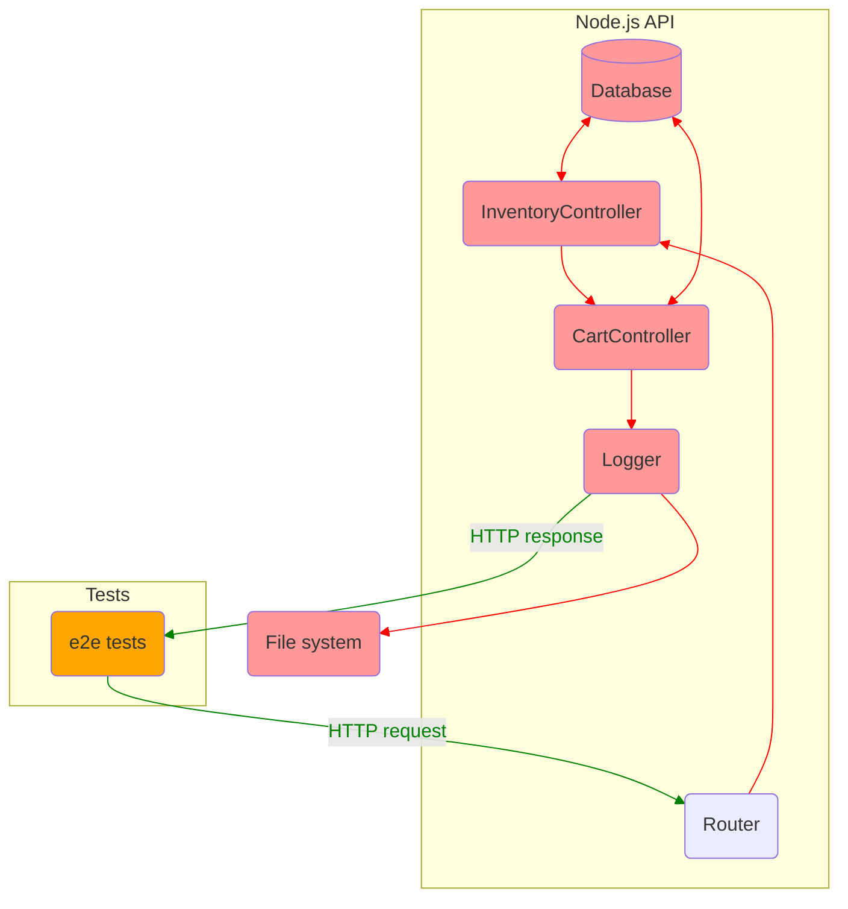
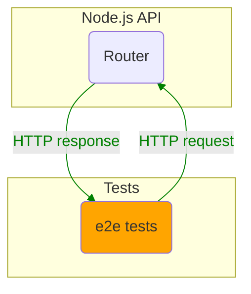
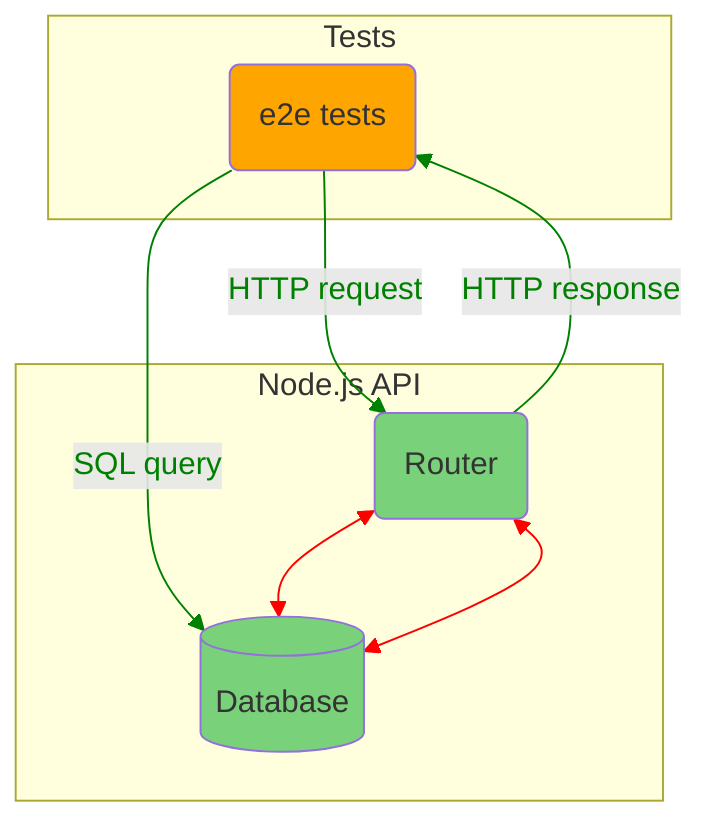

# Summary: Testing JavaScript applications by Lucas da Costa

## Part 1: Testing JavaScriptApplications

### Section 1. An introduction to automated testing

### Section 2. What to test and when?

## Part 2: Writing tests

### Section 3. Testing techniques

### Section 4. Testing backend applications

#### 4.1 Structuring a testing environment

Software should be designed with testing in mind.



Picture: What tests can access if an application is not designed with testing in mind.

In this situation the best you can do is send an HTTP request and check it response.  
Testable software is broken down in smaller accessible pieces, which you can test separately.

##### 4.1.1 End-to-end testing

Imagine an application that does not expose anything but its routes.  
You can interact with it only by sending HTTP requests.  
In other words, you can write only end-to-end tests.  
Such an app is an impenetrable black box of code.  
You can't set up elaborate scenarios.



Lets add a test:

```js
describe('add items to a cart', () => {
  test('adding available items', async () => {
    const response = await fetch(`http://localhost:3000/carts/test_user/items/cheesecake`, {
      method: 'POST',
    })
    expect(response.status).toEqual(200)
  })
})
```

For this test to pass we should make some preparations:

- Before all tests launch the app.
- Before each test set DB to initial state.
- After all tests stop the app.

If you provide direct access to the app DB you are able to make assertions against it:



- Access to the router allows to exercise the app.
- Access to the DB allows to set up an initial state and test whether the new state is valid.

##### 4.1.2 Integration testing

##### 4.1.3 Unit testing

#### 4.2 Testing HTTP endpoints

##### 4.2.1 Testing middleware

#### 4.3 Dealing with external dependencies

##### 4.3.1 Integrations with databases

##### 4.3.2 Integrations with outer APIs

#### Summary

### Section 5. Advanced backend testing techniques

### Section 6. Testing frontend applications

### Section 7. The React testing ecosystem

### Section 8. Testing React applications

### Section 9. Test-driven development

### Section 10. UI-based end-to-end testing

### Section 11. Writing UI-based end-to-end tests

## Part 3: Business impact

### Section 12. Continious integration and continious delivery

### Section 13. A culture of quality
