# Summary: Testing JavaScript applications by Lucas da Costa

## Part 1: Testing JavaScriptApplications

### Section 1. An introduction to automated testing

### Section 2. What to test and when?

## Part 2: Writing tests

### Section 3. Testing techniques

### Section 4. Testing backend applications

No content.

#### 4.1 Structuring a testing environment

Software should be designed with testing in mind.

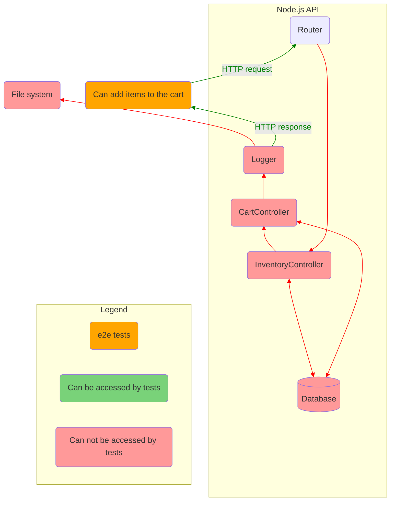

Figure: What tests can access if an application is not designed with testing in mind.

In this situation the best you can do is send an HTTP request and check it response.  
Testable software is broken down in smaller accessible pieces, which you can test separately.

##### 4.1.1 End-to-end testing

Imagine an application that does not expose anything but its routes.  
You can interact with it only by sending HTTP requests.  
In other words, you can write only end-to-end tests.  
Such an app is an impenetrable black box of code.  
You can't set up elaborate scenarios.

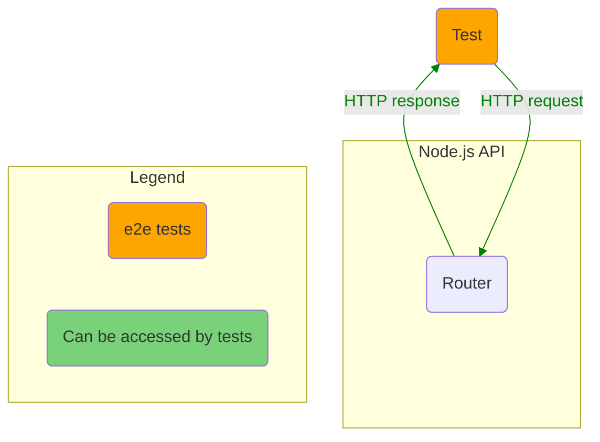

Lets add a test:

```js
describe("add items to a cart", () => {
  test("adding available items", async () => {
    const response = await fetch(`http://localhost:3000/carts/test_user/items/cheesecake`, {
      method: "POST",
    })
    expect(response.status).toEqual(200)
  })
})
```

For this test to pass we should make some preparations:

- Before all tests launch the app.
- Before each test set DB to initial state.
- After all tests stop the app.

If you provide direct access to the app DB you are able to make assertions against it:

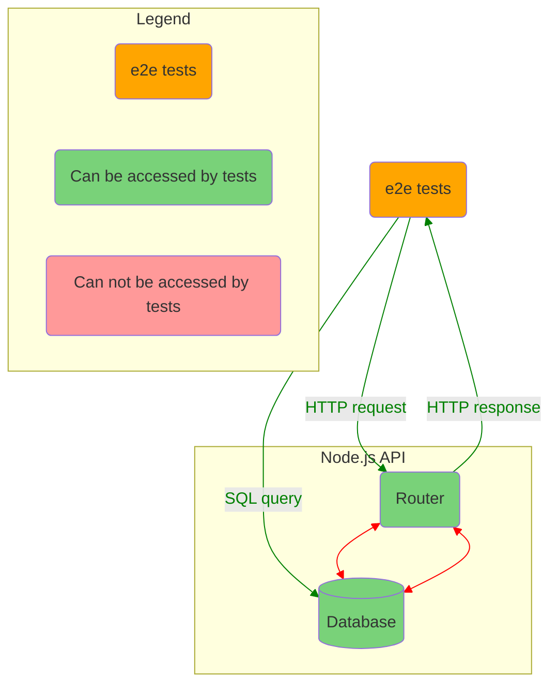

- Access to the router allows to exercise the app.
- Access to the DB allows to set up an initial state and test whether the new state is valid.

##### 4.1.2 Integration testing

We need to make integration testing possible.  
Code winthin routes should be moved to separate modules.  
These modules will expose their functions.  
So we can write tests for these functions individually.

Now can test if these modules interact correctly in more elaborate scenarios.

```javascript
// routes.js
import { addItemToCart } from "./addItemToCart" // Import the extracted function.

router.post("/carts/:username/items/:item", (ctx) => {
  const { username, item } = ctx.params
  const newItems = addItemToCart({ username, item })
  ctx.body = newItems
})

// addItemToCart.test.js
describe("addItemToCart", () => {
  test("adding unavailable items to cart", () => {
    carts.set("test_user", [])
    inventory.set("cheesecake", 0)
    try {
      addItemToCart({ username: "test_user", item: "cheesecake" })
    } catch (error) {
      const expectedError = new Error(`cheesecake is unavailable`)
      expectedError.code = 400
      expect(error).toEqual(expectedError)
    }
    expect(carts.get("test_user")).toEqual([])
  })
})
```

A test like this does not depend on the route to which to send requests. The router even might not exist at the moment of writing such a test.  
It also doen't rely on authentication, headers, URL parameters or a specific kind of body.  
It provides more granular feedback for every scenario.

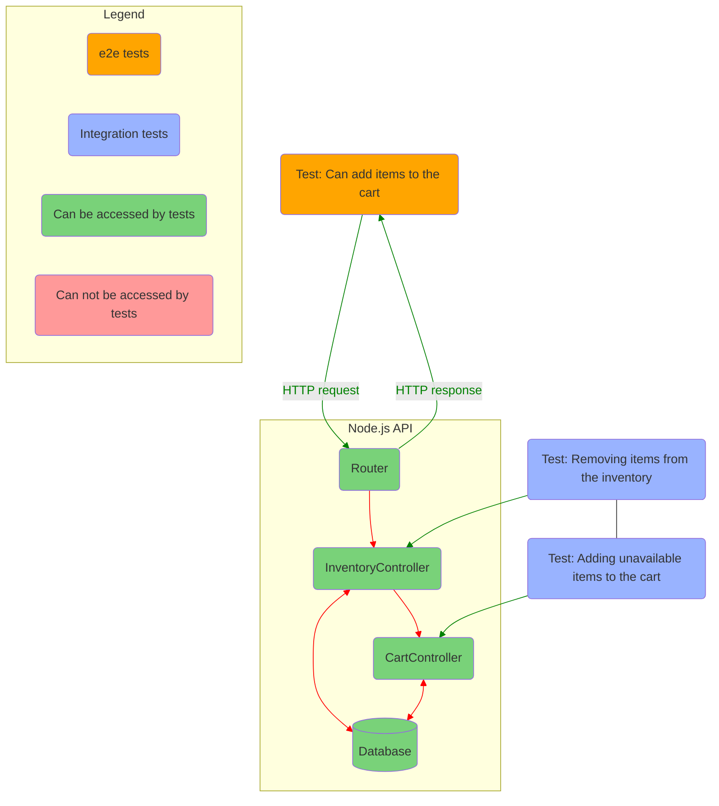

Figure: Which parts of the app e2e and integration tests have access to.

We can continue and add logging stage to out integration tests.  
With the logger module, `addItemToCart` writes to the `logs.out` file whenever a customer adds and item to the cart.

```javascript
// logger.js
const fs = require("fs")
const logger = {
  log: (msg) => fs.appendFileSync("/tmp/logs.out", msg + "\n"),
}
module.exports = logger

// addItemToCart.js
const logger = require("./logger")
const addItemToCart = ({ username, item }) => {
  removeFromInventory(item)
  const newItems = (carts.get(username) || []).concat(item)
  carts.set(username, newItems)
  logger.log(`${item} added to ${username}'s cart`)
  return newItems
}
```

The corresponding test:

```javascript
const fs = require("fs")
describe("addItemToCart", () => {
  beforeEach(() => fs.writeFileSync("/tmp/logs.out", ""))
  // ...
  test("logging added items", () => {
    carts.set("test_user", [])
    inventory.set("cheesecake", 1)
    addItemToCart({ username: "test_user", item: "cheesecake" })
    const logs = fs.readFileSync("/tmp/logs.out", "utf-8")
    expect(logs).toContain("cheesecake added to test_user's cart\n")
  })
})
```

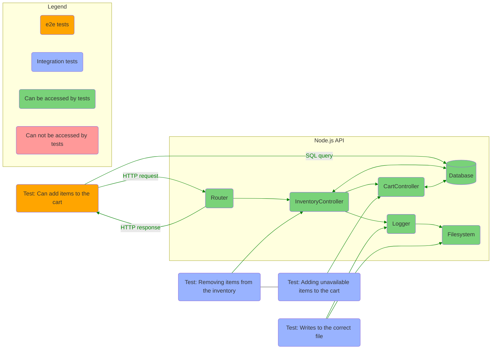

Figure: Integration tests will have access to all the dependencies with which you app interacts.

We should set up testing environment for integration tests to be able:

- cover interactions between multiple functions;
- check writing to DB and FS;
- use test doubles as few as possible;

##### 4.1.3 Unit testing

Unit tests are ideal for function that don't depend on external deps like a DB or the FS.  
Unit tests don't require complex environment. It's enough that their target are extracted to a separate function and exported.

A simple example of such function:

```javascript
const areItemsAmountsWithinTheLimit = (cart) => {
  return Object.values(cart).every((aCartItem) => aCartItem.quantity <= 3)
}
module.exports = { compliesToItemLimit }
```

The function is isolated.

A test for the function:

```javascript
const { areItemsAmountsWithinTheLimit } = require("./areItemsAmountsWithinTheLimit")
describe("areItemsAmountsWithinTheLimit", () => {
  test("returns true for carts with no more than 3 items of a kind", () => {
    const cart = [{ cheesecake: 1, "apple-pie": 3 }]
    expect(areItemsAmountsWithinTheLimit(cart)).toBe(true)
  })
  test("returns false for carts with more than 3 items of a kind", () => {
    const cart = [{ cheesecake: 5, "apple-pie": 2 }]
    expect(areItemsAmountsWithinTheLimit(cart)).toBe(false)
  })
})
```

We can test it:

- as soon as the function written;
- without having to set up complex scenarios;
- without having other parts of the module written and working;
- without having to think about the entire system: HTTP requests, DB, etc;

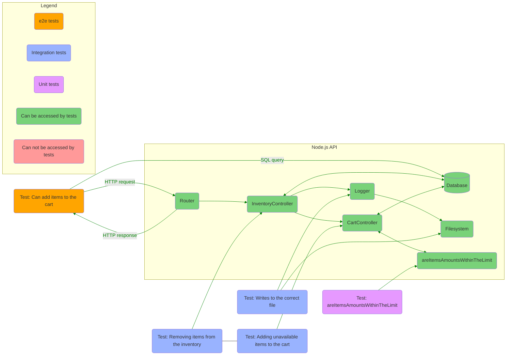

#### 4.2 Testing HTTP endpoints

When testing HTTP endpoints, we aren't directly interacting with the unit under test.  
Instead, we interact with the entire app through HTTP requests.  
In some sense the unit under test is an endpoint: because we hit a particular endpoint.  
And in some sense the unit under test is the entire app: because after hitting an endpoint there are a lot of interactions between modules, including authentication, DB queries, middleware, etc.

A simple HTTP endpoint test:

```javascript
// get-cart-items.test.js
describe("get cart items", () => {
  it("responds with all cart items list", async () => {
    const getCartItemsResponse = await fetch("http://localhost:3080/api/cart", {
      headers: { Authorization: "myAuthToken123" },
    })
    expect(getCartItemsResponse.status).toEqual(200)
    expect(await getCartItemsResponse.json()).toEqual([
      { name: "apple-pie", quantity: 3 },
      { name: "cheesecake", quantity: 5 },
    ])
  })
})
```

##### 4.2.1 Testing middleware

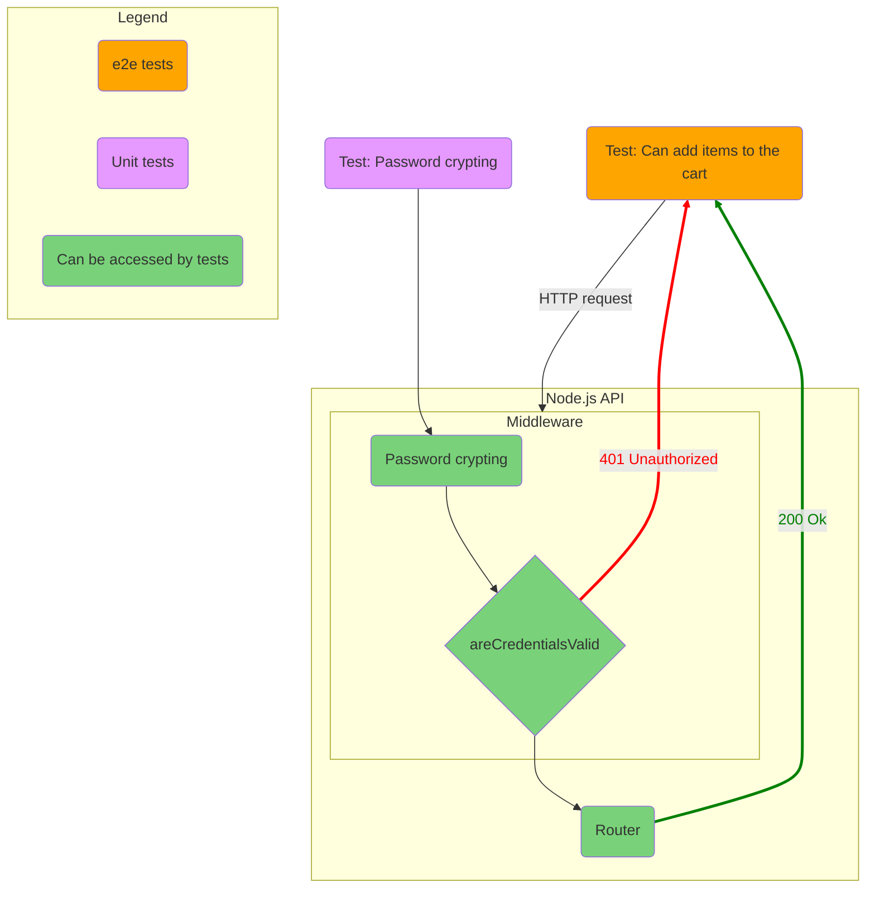

#### 4.3 Dealing with external dependencies

No content.

##### 4.3.1 Integrations with databases

It is possible to mock interactions with a DB,  
but this approach has cons:

- mocking DB separates tests from production environment;
- mocking DB is tricky;

But if we don't mock DB, there are also cons:

- having to config and set up testing DB instance;
- maintenance overhead caused supporting initial DB state;
- changes in DB schema require updating tests;

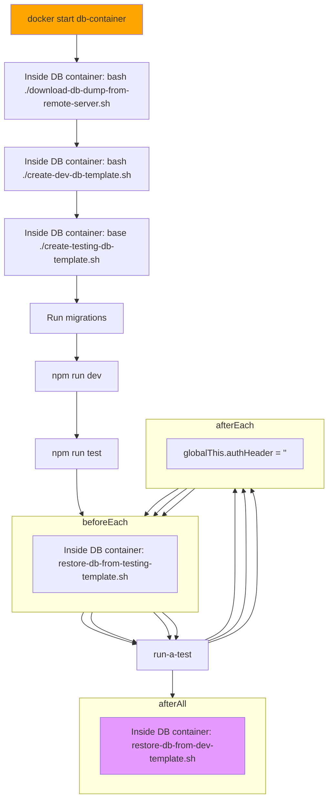

##### 4.3.2 Integrations with outer APIs

No content.

### Section 5. Advanced backend testing techniques

Our goals, in order of priority:

- Make test **reliable**.
- Make test **easy to maintain**.
- Make test **fast**.

Also, if you can't trust your tests, it doesn't matter how quickly they run or how easy it is to update them.

#### 5.1 Eliminating nondeterminism

**Deterministic tests** are the ones that, given the same input, always produce the same results.

If our tests are *non*deterministic, it will be hard for us to say whether there is a problem in your tests or in your app.  
Nondeterministic tests are useless.

Why it is important to have our test deterministic:

- They fall only when the app doesn't work.
- They increase our confidence.
- They make our progress faster, because they enable us to change bigger chunks of code at a time.
- Nondetermenistic tests are useless.

For example, a test gets nondeterministic, when it depends directly with third-party API.  
To provide consistent results, tests should not depend on internet connection or someone else's service being available.  
We must have full control over such dependencies in tests.

Common sources of nondeterminism:

- each time a test runs, it is given a different initial app state (DB, FS, etc);
- using third-party API;
- depending on internet connection;
- running tests in parallel;
- dealing with shared resources;
- running tests in different environments;
- random values generating;
- dealing with time-dependant code;
- tests interfere in each other's state;

Some situations:

- Your test depends on an IoT device being available?  
  Use a tests double to simulate a response those device would yield.
- Your unit-under-test uses a random number generator like `Math.random`?  
  Mock it so that you eliminate randomness.

  As a rule of thumb, we should **mock everything we can't control**.

##### 5.1.1 Parallelism and shared resources

No content.

##### 5.1.2 Dealing with time

No content.

#### 5.2 Reducing costs while preserving quality

No content.

##### 5.2.1 Reducing overlap between tests

Tests overlap when the run they run the same pieces of code and repeat each other's verifications.  
By eliminating this overlap you can often reduce the amount of code you have to maintain.

To test some functionality, you can either write 3 different tests (for example, 1 e2e and 2 integration), or you can put all 3 assertions into a single e2e test.  
Putting all 3 assertions into a single e2e test make it easier to reason about them, and easier to maintain.  
But this approach has its downsides: with a single e2e tests you can't test some complex scenarios.

##### 5.2.2 Creating transitive guarantees

Instead of repeating expensive checks when testing each function that requires `myAwesomeFunction`, you can:

- extract `myAwesomeFunction` to a separate module;
- add robust tests for `myAwesomeFunction` isolated within `myAwesomeFunction.test.js`;
- just test whether `myAwesomeFunction` is called with the correct arguments;

Doing this, you can say: _I already know that `myAwesomeFunction` works because I've tested it. Now, I just want to make sure it's invoked with the correct arguments._

##### 5.2.3 Turning assertions into preconditions

You don't always need a separate test to check a specific behaviour. If other tests depend on that behaviour to pass, you can already consider it covered.

### Section 6. Testing frontend applications

#### 6.1 Introducing JSDOM

Jest can't run in a browser, you should simulate browser environment within Node.js.  
You make assertions on functions return value and DOM elements interactions and contents.  
You simulate scrolling, clicking, typing and dragging.  
You should test if your code interfaces correctly with history and web storage APIs.

#### 6.2 Asserting on the DOM

```javascript
const data = { count: 0 }
const incrementCount = () => {
  data.cheesecakes++
  window.document.getElementById("count").innerHTML = data.cheesecakes
}
const incrementButton = window.document.getElementById("increment-button")
incrementButton.addEventListener("click", incrementCount)
```

Because this script runs in a browser, and thus it can manipulate the browser and the elements in the page.

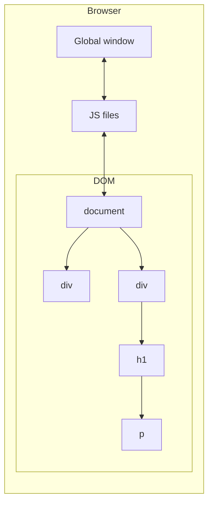

Figure: The JS environment within a browser.

Unlike the browser, Node.js can't run nor that script, neither tests for that script, because the script depends on DOM API.  
`node ./main.js` causes `ReferenceError` because `window is not defined`.

To be able to run your tests in Jest, instead of running them within the browser, you can bring browser APIs to Node.js by using JSDOM.  
JSDOM is an implementation of web standards written purely on JS that you can use in Node.js.

By passing the value `"jsdom"` to Jest's `testEnvironment` option, you can make it set up a global instance of JSDOM, which you can use when running your tests.

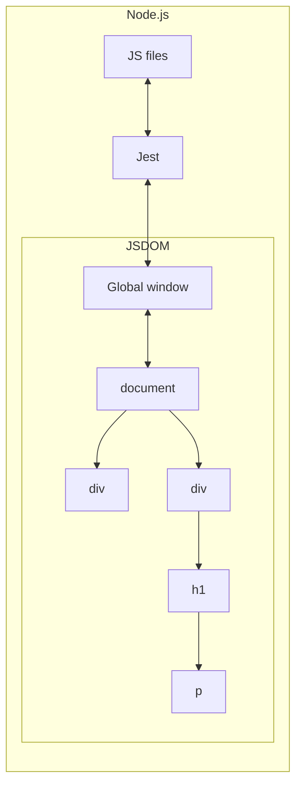

Figure: The JS environment within Node.js.

##### 6.2.1 Making it easier to find elements

You can find page elements by their ID's or by their position in the page hierarchial chain. But this approach tightly couples the tests to the markup and requires more complex maintenance. Tests may fail after minimal changes to the markup.  
To avoid maintenance overhead and to make tests more readable, use `dom-testing-library`. So you can find elements by their text, alt text, label, role, etc.

##### 6.2.2 Writing better assertions

You can assert, for example, that an element is exists, using the `toBeTruthy` assertion.  
But you can make your assertions more reliable and readable by using `jest-dom`. It extends basic Jest's assertions with new ones, designed specially for testing web pages.  
`.toHaveStyle()`, `.toBeDisabled()`, `.toBeEnabled`, `.toBeVisible()` and other assertions make it easier to write tests.

#### 6.3 Handling events

#### 6.4 Testing and browser APIs

##### 6.4.1 Testing a localStorage integration

##### 6.4.2 Testing a History API integration

#### 6.5 Dealing with WebSockets and HTTP requests

##### 6.5.1 Testing involving HTTP requests

##### 6.5.2 Testing involving WebSockets

### Section 7. The React testing ecosystem

#### 7.1 Setting up a test environment for React

##### 7.1.1 Setting up a React application

##### 7.1.2 Setting up a testing environment

#### 7.2 An overview of React testing libraries

##### 7.2.1 Rendering components and the DOM

Jest has already set up a JSDOM instance for you.  
You must wrap each of your interactions with a component into a React testing library called `act`., which is part of the `react-dom` package. The `act` function ensures that the updates associated to your interactions have been proceeded and applied to the DOM, which, in this case, is implemented by JSDOM.

```javascript
import React from "react"
import { App } from "./App.jsx"
import { render } from "react-dom"
import { act } from "react-dom/test-utils"

const root = document.createElement("div")
document.body.appendChild(root)

test("renders the appropriate heading", () => {
  act(() => {
    render(<App />, root)
  })
  const heading = document.querySelector("h1")
  expect(header.textContent).toEqual("Inventry contents")
})
```

In the test you have just written, you are accurately simulating how the `App` component gets rendered by a browser. `act` function ensures that the interactions have been proceeded and the necessary updates have been applied to the DOM.  
This test uses `react-dom/test-utils` to render `App` to a JSDOM instance. And then it uses web APIs to find and inspect an `h1` element so that you can assert on it.

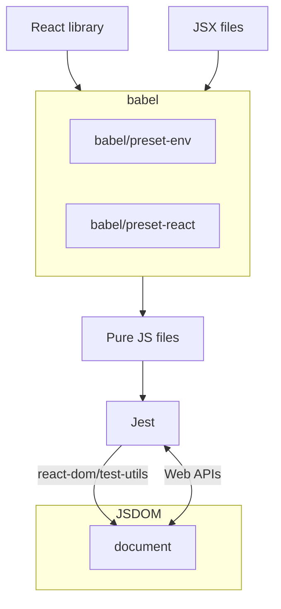

##### 7.2.2 React testing library

We can write tests using only `react-dom/test-utils`.  
Or we can use `react-testing-library`:

```javascript
import { render } from "@testing-library/react"

test("renders the appropriate heading", () => {
  const { getByText } = render(<App />, root)
  expect(getByText("Inventry contents")).toBeInTheDocument()
})
```

Using `react-testing-library` we have the following benefits:

- Your tests don't involve plenty of React-specific concerns, such as manyally attaching a `div` to a JSDOM instance and rendering components inside it using `react-dom`.
- `react-tesing-library` automatically sets up a cleanup hook, which removes the rendered nodes from the DOM.
- The interactions to your components are automatically wrapped into the `act` function to ensure that updates will be proceeded and applied to the DOM.
- `react-testing-library`'s `render` function returns an object containing queries, that are bound to run within the rendered component, not within the whole JSDOM instance.
- `react-testing-library`'s `fireEvent` utility already wraps interactions into `act` calls so that you can using `act` yourself.

To avoid having to use `waitFor` every time you need to wait for an element, you can use `findBy*` instead of `getBy*` queries.  
A `findBy*` query runs asynchronously. The promise returned by this kind of query either resolves with the found element or rejects after one second if it didn't find anything matching the passed criteria.  
You can use it, for example, to replace `waitFor`, which causes your tests to wait for the list to have three children.

##### 7.2.3 Enzyme

No content.

##### 7.2.4 The React test renderer

Unlike React testing library or Enzyme, it renders components to plain JS objects instead of rendering them to the DOM.  
It can be useful, for example, when you are not using JSDOM, or if you can't use it.  
You don't need any DOM implementation to render components and inspect their contents.  
I don't see the benefit of using React's test renderer.  
Setting up JSDOM is quick, and it makes your tests more reliable because it makes your code run just like it would in a browser.  
The main use case for `react-test-renderer` is when you are not rendering components to a DOM but would still like to inspect their contents. It can be applied in testing `react-native` applications, for example.

### Section 8. Testing React applications

No content.

#### 8.1 Testing component integration

Tests should provide reliable guarantees that your components work in integration. If your test covers some top-level component like `<App />` or `<Profile />` it will automatically cover its underlying component.

The only downside of having this test is that you will have one extra test to fix if you have one of the underlying components. It may generate significant overlap between your tests. Changes become more expensive.

`react-testing-library` recommendation is: you should write your test as high up in the component tree as you need to obtain reliable guarantees. Because your test resemble your application's run-time scenario more closely.

When you have too many tests that depend on a single point of failure, centralize that point of failure into a single piece that you will use throughout your tests. Create a transitive guarantee. Modularity can make both your application's code and tests more robust.

##### 8.1.1 Stubbing components

No content.

#### 8.2 Snapshot testing

##### 8.2.1 Snapshots beyoud components

##### 8.2.2 Serializers

#### 8.3 Testing styles

#### 8.4 Component-level acceptance tests and component stories

##### 8.4.1 Writing stories

##### 8.4.2 Writing documentation

### Section 9. Test-driven development

### Section 10. UI-based end-to-end testing

### Section 11. Writing UI-based end-to-end tests

## Part 3: Business impact

### Section 12. Continious integration and continious delivery

### Section 13. A culture of quality
