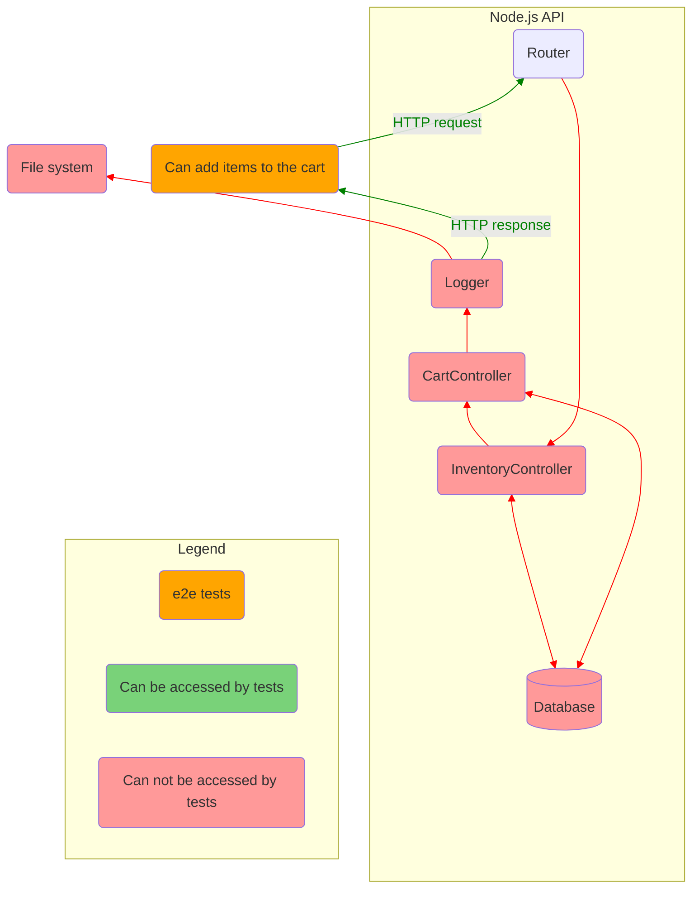
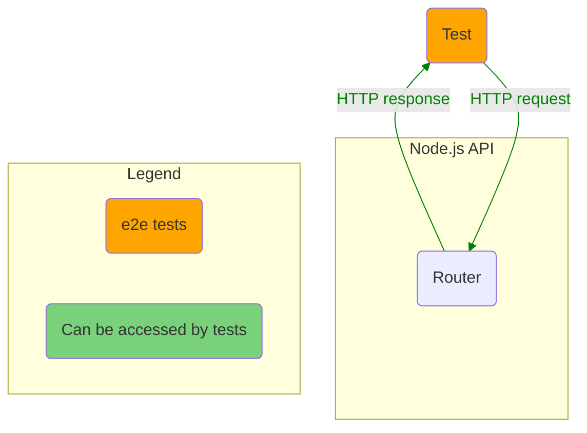
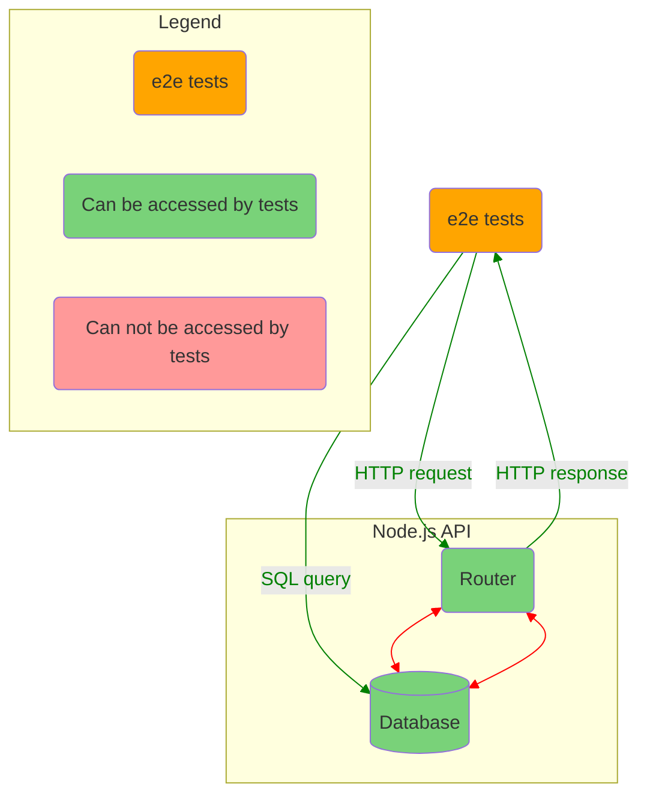
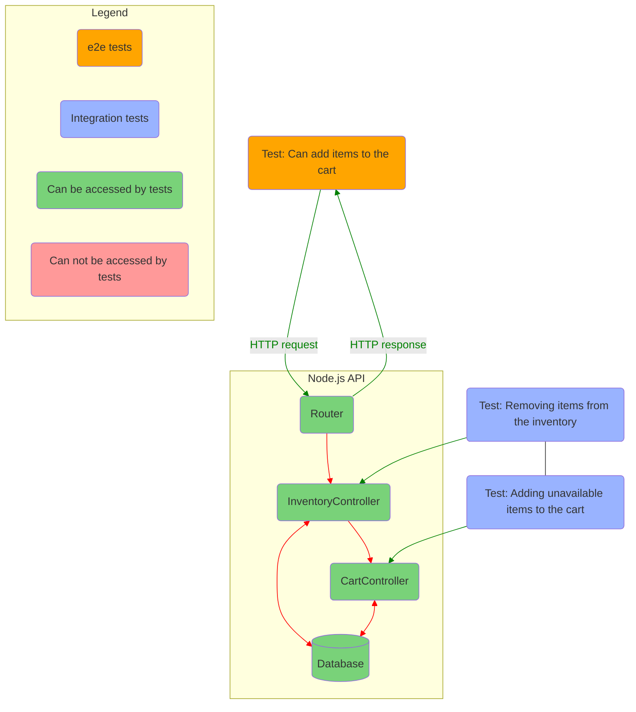
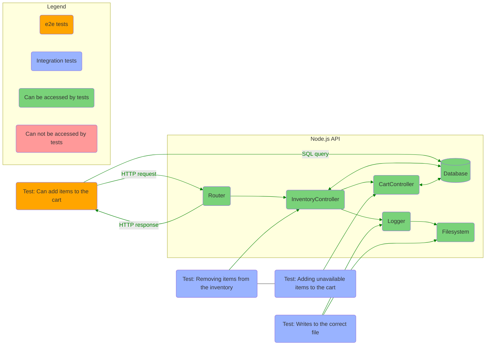
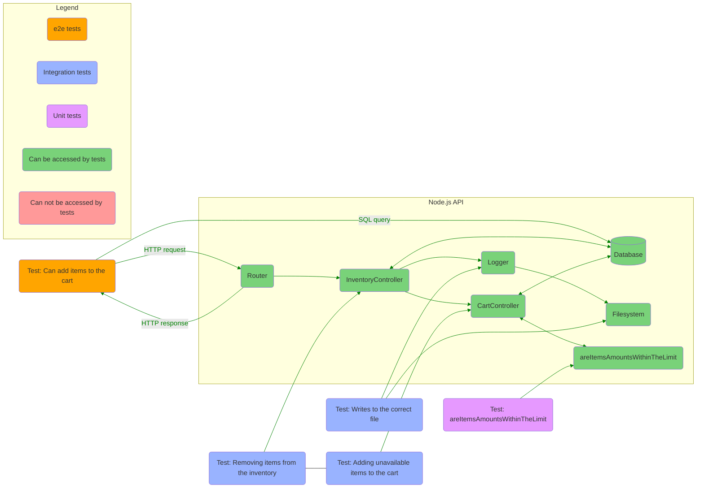
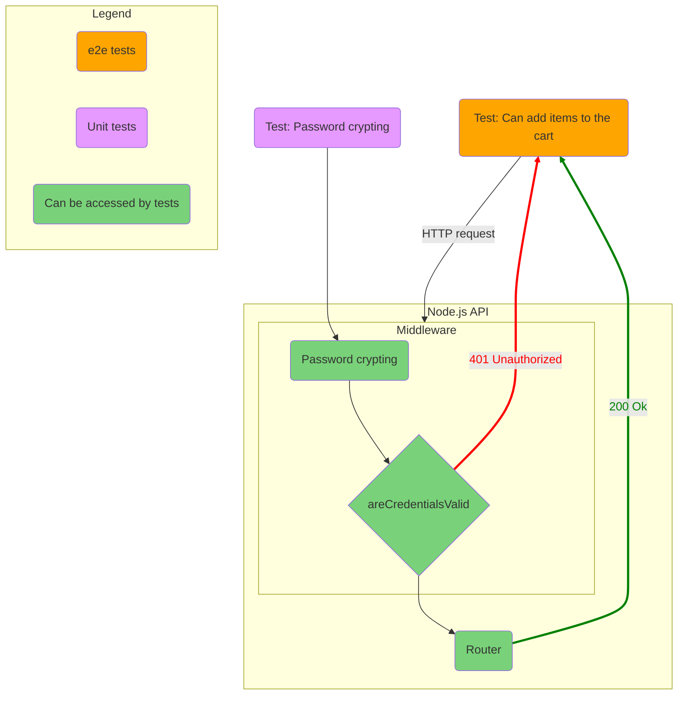

# Summary: Testing JavaScript applications by Lucas da Costa

## Part 1: Testing JavaScriptApplications

### Section 1. An introduction to automated testing

### Section 2. What to test and when?

## Part 2: Writing tests

### Section 3. Testing techniques

### Section 4. Testing backend applications

#### 4.1 Structuring a testing environment

Software should be designed with testing in mind.



Figure: What tests can access if an application is not designed with testing in mind.

In this situation the best you can do is send an HTTP request and check it response.  
Testable software is broken down in smaller accessible pieces, which you can test separately.

##### 4.1.1 End-to-end testing

Imagine an application that does not expose anything but its routes.  
You can interact with it only by sending HTTP requests.  
In other words, you can write only end-to-end tests.  
Such an app is an impenetrable black box of code.  
You can't set up elaborate scenarios.



Lets add a test:

```js
describe('add items to a cart', () => {
  test('adding available items', async () => {
    const response = await fetch(`http://localhost:3000/carts/test_user/items/cheesecake`, {
      method: 'POST',
    })
    expect(response.status).toEqual(200)
  })
})
```

For this test to pass we should make some preparations:

- Before all tests launch the app.
- Before each test set DB to initial state.
- After all tests stop the app.

If you provide direct access to the app DB you are able to make assertions against it:



- Access to the router allows to exercise the app.
- Access to the DB allows to set up an initial state and test whether the new state is valid.

##### 4.1.2 Integration testing

We need to make integration testing possible.  
Code winthin routes should be moved to separate modules.  
These modules will expose their functions.  
So we can write tests for these functions individually.

Now can test if these modules interact correctly in more elaborate scenarios.

```javascript
// routes.js
import { addItemToCart } from './addItemToCart' // Import the extracted function.

router.post('/carts/:username/items/:item', (ctx) => {
  const { username, item } = ctx.params
  const newItems = addItemToCart({ username, item })
  ctx.body = newItems
})

// addItemToCart.test.js
describe('addItemToCart', () => {
  test('adding unavailable items to cart', () => {
    carts.set('test_user', [])
    inventory.set('cheesecake', 0)
    try {
      addItemToCart({ username: 'test_user', item: 'cheesecake' })
    } catch (error) {
      const expectedError = new Error(`cheesecake is unavailable`)
      expectedError.code = 400
      expect(error).toEqual(expectedError)
    }
    expect(carts.get('test_user')).toEqual([])
  })
})
```

A test like this does not depend on the route to which to send requests. The router even might not exist at the moment of writing such a test.  
It also doen't rely on authentication, headers, URL parameters or a specific kind of body.  
It provides more granular feedback for every scenario.



Figure: Which parts of the app e2e and integration tests have access to.

We can continue and add logging stage to out integration tests.  
With the logger module, `addItemToCart` writes to the `logs.out` file whenever a customer adds and item to the cart.

```javascript
// logger.js
const fs = require('fs')
const logger = {
  log: (msg) => fs.appendFileSync('/tmp/logs.out', msg + '\n'),
}
module.exports = logger

// addItemToCart.js
const logger = require('./logger')
const addItemToCart = ({ username, item }) => {
  removeFromInventory(item)
  const newItems = (carts.get(username) || []).concat(item)
  carts.set(username, newItems)
  logger.log(`${item} added to ${username}'s cart`)
  return newItems
}
```

The corresponding test:

```javascript
const fs = require('fs')
describe('addItemToCart', () => {
  beforeEach(() => fs.writeFileSync('/tmp/logs.out', ''))
  // ...
  test('logging added items', () => {
    carts.set('test_user', [])
    inventory.set('cheesecake', 1)
    addItemToCart({ username: 'test_user', item: 'cheesecake' })
    const logs = fs.readFileSync('/tmp/logs.out', 'utf-8')
    expect(logs).toContain("cheesecake added to test_user's cart\n")
  })
})
```



Figure: Integration tests will have access to all the dependencies with which you app interacts.

We should set up testing environment for integration tests to be able:

- cover interactions between multiple functions;
- check writing to DB and FS;
- use test doubles as few as possible;

##### 4.1.3 Unit testing

Unit tests are ideal for function that don't depend on external deps like a DB or the FS.  
Unit tests don't require complex environment. It's enough that their target are extracted to a separate function and exported.

A simple example of such function:

```javascript
const areItemsAmountsWithinTheLimit = (cart) => {
  return Object.values(cart).every((aCartItem) => aCartItem.quantity <= 3)
}
module.exports = { compliesToItemLimit }
```

The function is isolated.

A test for the function:

```javascript
const { areItemsAmountsWithinTheLimit } = require('./areItemsAmountsWithinTheLimit')
describe('areItemsAmountsWithinTheLimit', () => {
  test('returns true for carts with no more than 3 items of a kind', () => {
    const cart = [{ cheesecake: 1, 'apple-pie': 3 }]
    expect(areItemsAmountsWithinTheLimit(cart)).toBe(true)
  })
  test('returns false for carts with more than 3 items of a kind', () => {
    const cart = [{ cheesecake: 5, 'apple-pie': 2 }]
    expect(areItemsAmountsWithinTheLimit(cart)).toBe(false)
  })
})
```

We can test it:

- as soon as the function written;
- without having to set up complex scenarios;
- without having other parts of the module written and working;
- without having to think about the entire system: HTTP requests, DB, etc;



#### 4.2 Testing HTTP endpoints

When testing HTTP endpoints, we aren't directly interacting with the unit under test.  
Instead, we interact with the entire app through HTTP requests.  
In some sense the unit under test is an endpoint: because we hit a particular endpoint.  
And in some sense the unit under test is the entire app: because after hitting an endpoint there are a lot of interactions between modules, including authentication, DB queries, middleware, etc.

A simple HTTP endpoint test:

```javascript
// get-cart-items.test.js
describe('get cart items', () => {
  it('responds with all cart items list', async () => {
    const getCartItemsResponse = await fetch('http://localhost:3080/api/cart', {
      headers: { Authorization: 'myAuthToken123' },
    })
    expect(getCartItemsResponse.status).toEqual(200)
    expect(await getCartItemsResponse.json()).toEqual([
      { name: 'apple-pie', quantity: 3 },
      { name: 'cheesecake', quantity: 5 },
    ])
  })
})
```

##### 4.2.1 Testing middleware



#### 4.3 Dealing with external dependencies

##### 4.3.1 Integrations with databases

It is possible to mock interactions with a DB,  
but this approach has cons:

- mocking DB separates tests from production environment;
- mocking DB is tricky;

But if we don't mock DB, there are also cons:

- having to config and set up testing DB instance;
- maintenance overhead caused supporting initial DB state;
- changes in DB schema require updating tests;

##### 4.3.2 Integrations with outer APIs

#### Summary

### Section 5. Advanced backend testing techniques

### Section 6. Testing frontend applications

### Section 7. The React testing ecosystem

### Section 8. Testing React applications

### Section 9. Test-driven development

### Section 10. UI-based end-to-end testing

### Section 11. Writing UI-based end-to-end tests

## Part 3: Business impact

### Section 12. Continious integration and continious delivery

### Section 13. A culture of quality
