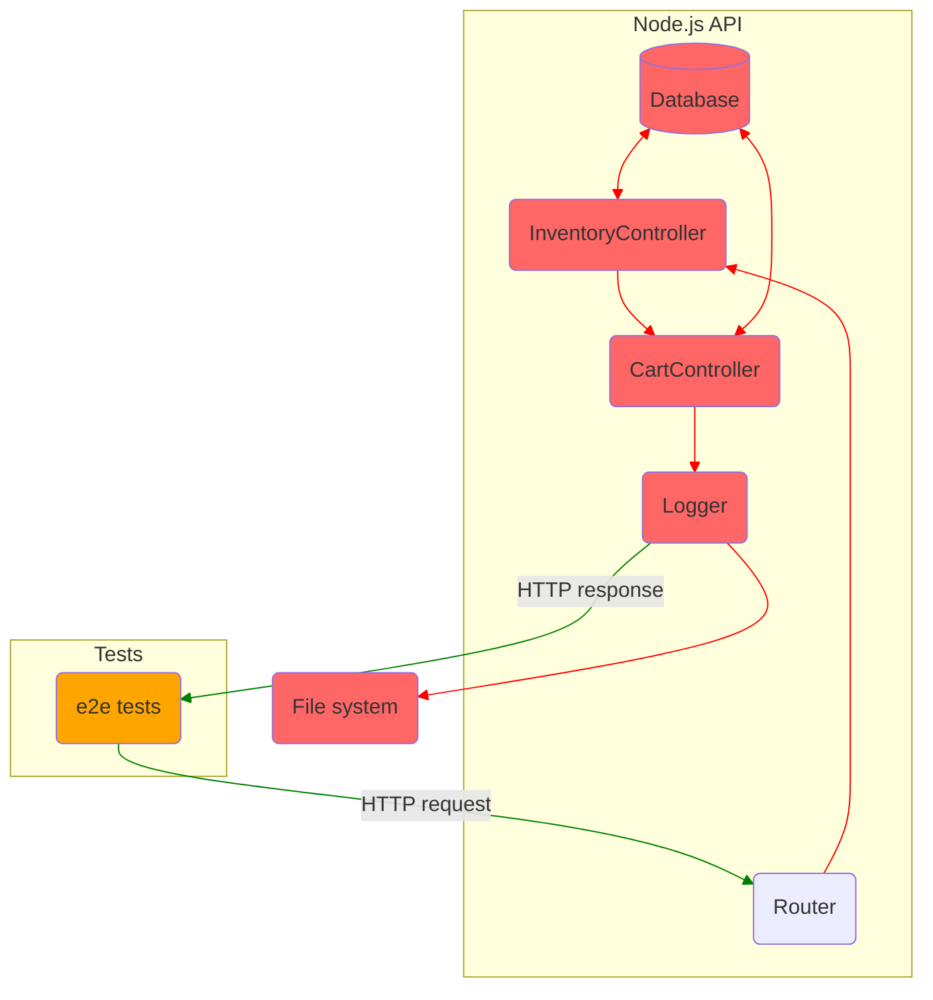

# Summary: Testing JavaScript applications by Lucas da Costa

## Part 1: Writing tests

### Section 1. An introduction to automated testing

### Section 2. What to test and when?

## Part 2: Writing tests

### Section 3. Testing techniques

### Section 4. Testing backend applications

#### 4.1 Structuring a testing environment

Software should be designed with testing in mind.

Picture: What tests can access if an application is not designed with testing in mind.

In this situation the best you can do is send an HTTP request and check it response.

Testable software is broken down in smaller accessible pieces, which you can test separately.

##### 4.1.1 End-to-end testing

##### 4.1.2 Integration testing

##### 4.1.3 Unit testing

#### 4.2 Testing HTTP endpoints

##### 4.2.1 Testing middleware

#### 4.3 Dealing with external dependencies

##### 4.3.1 Integrations with databases

##### 4.3.2 Integrations with outer APIs

#### Summary

### Section 5. Advanced backend testing techniques

### Section 6. Testing frontend applications

### Section 7. The React testing ecosystem

### Section 8. Testing React applications

### Section 9. Test-driven development

### Section 10. UI-based end-to-end testing

### Section 11. Writing UI-based end-to-end tests

## Part 3: Business impact

### Section 12. Continious integration and continious delivery

### Section 13. A culture of quality
