# SUMMARY: TESTING JAVASCRIPT APPLICATIONS BY LUCAS DA COSTA

## PART 1. TESTING JAVASCRIPT APPLICATIONS

### CHAPTER 1. AN INTRODUCTION TO AUTOMATED TESTING

### CHAPTER 2. WHAT TO TEST AND WHEN?

## PART 2. WRITING TESTS

### CHAPTER 3. TESTING TECHNIQUES

### CHAPTER 4. TESTING BACKEND APPLICATIONS

No content.

#### SECTION 4.1. STRUCTURING A TESTING ENVIRONMENT

Software should be designed with testing in mind.

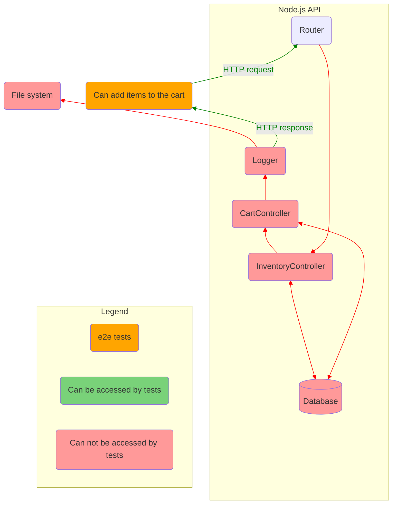

Figure: What tests can access if an application is not designed with testing in mind.

In this situation the best you can do is send an HTTP request and check it response.  
Testable software is broken down in smaller accessible pieces, which you can test separately.

##### 4.1.1. END-TO-END TESTING

Imagine an application that does not expose anything but its routes.  
You can interact with it only by sending HTTP requests.  
In other words, you can write only end-to-end tests.  
Such an app is an impenetrable black box of code.  
You can't set up elaborate scenarios.

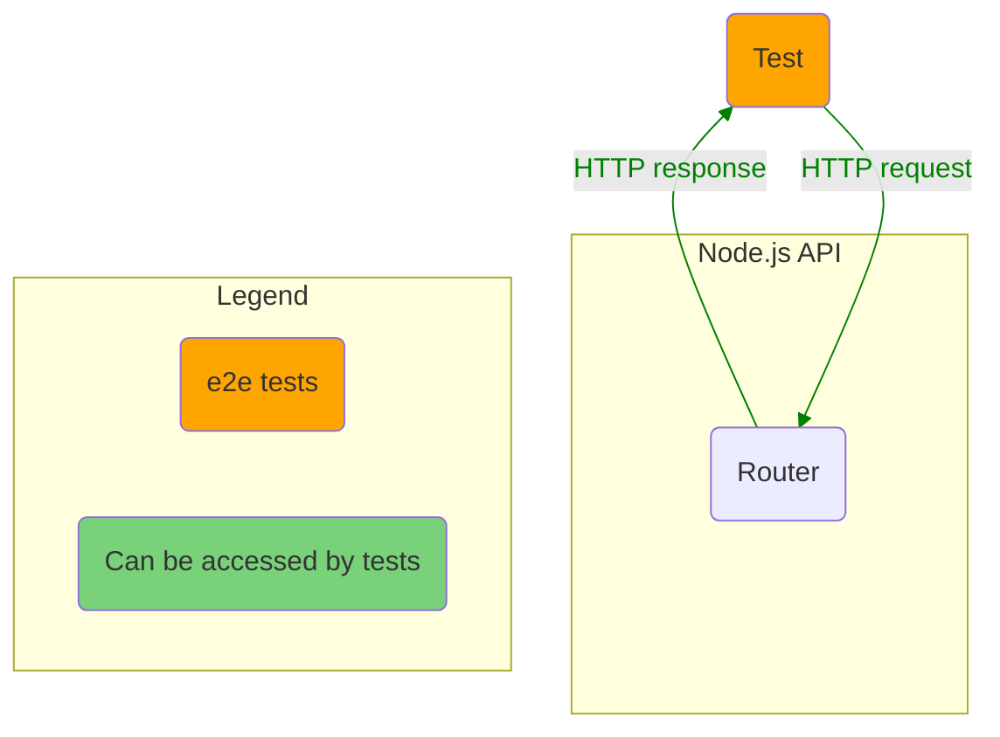

Lets add a test:

```js
describe("add items to a cart", () => {
  test("adding available items", async () => {
    const response = await fetch(`http://localhost:3000/carts/test_user/items/cheesecake`, {
      method: "POST",
    })
    expect(response.status).toEqual(200)
  })
})
```

For this test to pass we should make some preparations:

- Before all tests launch the app.
- Before each test set DB to initial state.
- After all tests stop the app.

If you provide direct access to the app DB you are able to make assertions against it:

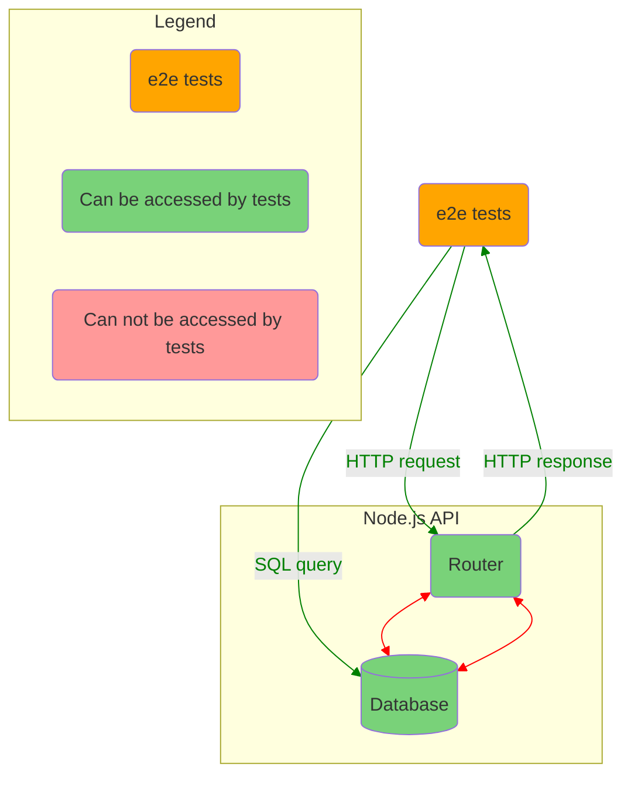

- Access to the router allows to exercise the app.
- Access to the DB allows to set up an initial state and test whether the new state is valid.

##### 4.1.2. INTEGRATION TESTING

We need to make integration testing possible.  
Code winthin routes should be moved to separate modules.  
These modules will expose their functions.  
So we can write tests for these functions individually.

Now can test if these modules interact correctly in more elaborate scenarios.

```javascript
// routes.js
import { addItemToCart } from "./addItemToCart" // Import the extracted function.

router.post("/carts/:username/items/:item", (ctx) => {
  const { username, item } = ctx.params
  const newItems = addItemToCart({ username, item })
  ctx.body = newItems
})

// addItemToCart.test.js
describe("addItemToCart", () => {
  test("adding unavailable items to cart", () => {
    carts.set("test_user", [])
    inventory.set("cheesecake", 0)
    try {
      addItemToCart({ username: "test_user", item: "cheesecake" })
    } catch (error) {
      const expectedError = new Error(`cheesecake is unavailable`)
      expectedError.code = 400
      expect(error).toEqual(expectedError)
    }
    expect(carts.get("test_user")).toEqual([])
  })
})
```

A test like this does not depend on the route to which to send requests. The router even might not exist at the moment of writing such a test.  
It also doen't rely on authentication, headers, URL parameters or a specific kind of body.  
It provides more granular feedback for every scenario.

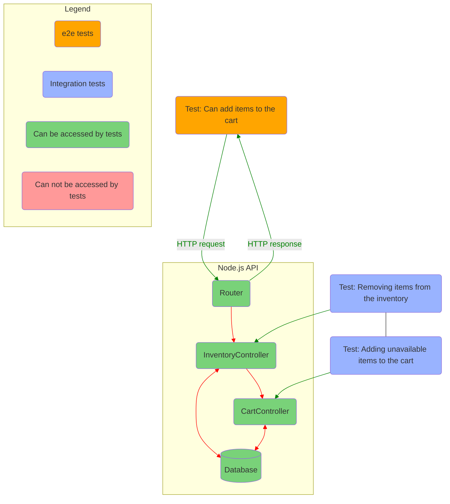

Figure: Which parts of the app e2e and integration tests have access to.

We can continue and add logging stage to out integration tests.  
With the logger module, `addItemToCart` writes to the `logs.out` file whenever a customer adds and item to the cart.

```javascript
// logger.js
const fs = require("fs")
const logger = {
  log: (msg) => fs.appendFileSync("/tmp/logs.out", msg + "\n"),
}
module.exports = logger

// addItemToCart.js
const logger = require("./logger")
const addItemToCart = ({ username, item }) => {
  removeFromInventory(item)
  const newItems = (carts.get(username) || []).concat(item)
  carts.set(username, newItems)
  logger.log(`${item} added to ${username}'s cart`)
  return newItems
}
```

The corresponding test:

```javascript
const fs = require("fs")
describe("addItemToCart", () => {
  beforeEach(() => fs.writeFileSync("/tmp/logs.out", ""))
  // ...
  test("logging added items", () => {
    carts.set("test_user", [])
    inventory.set("cheesecake", 1)
    addItemToCart({ username: "test_user", item: "cheesecake" })
    const logs = fs.readFileSync("/tmp/logs.out", "utf-8")
    expect(logs).toContain("cheesecake added to test_user's cart\n")
  })
})
```

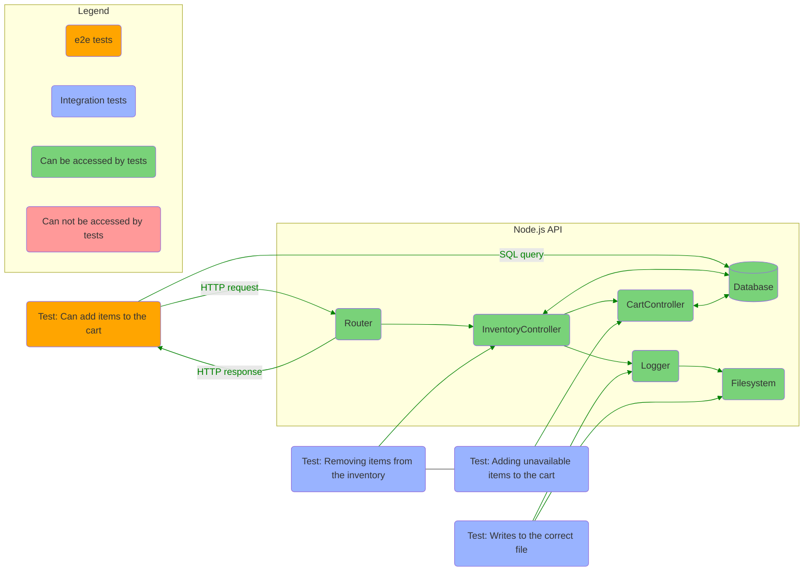

Figure: Integration tests will have access to all the dependencies with which you app interacts.

We should set up testing environment for integration tests to be able:

- cover interactions between multiple functions;
- check writing to DB and FS;
- use test doubles as few as possible;

##### 4.1.3. UNIT TESTING

Unit tests are ideal for function that don't depend on external deps like a DB or the FS.  
Unit tests don't require complex environment. It's enough that their target are extracted to a separate function and exported.

A simple example of such function:

```javascript
const areItemsAmountsWithinTheLimit = (cart) => {
  return Object.values(cart).every((aCartItem) => aCartItem.quantity <= 3)
}
module.exports = { compliesToItemLimit }
```

The function is isolated.

A test for the function:

```javascript
const { areItemsAmountsWithinTheLimit } = require("./areItemsAmountsWithinTheLimit")
describe("areItemsAmountsWithinTheLimit", () => {
  test("returns true for carts with no more than 3 items of a kind", () => {
    const cart = [{ cheesecake: 1, "apple-pie": 3 }]
    expect(areItemsAmountsWithinTheLimit(cart)).toBe(true)
  })
  test("returns false for carts with more than 3 items of a kind", () => {
    const cart = [{ cheesecake: 5, "apple-pie": 2 }]
    expect(areItemsAmountsWithinTheLimit(cart)).toBe(false)
  })
})
```

We can test it:

- as soon as the function written;
- without having to set up complex scenarios;
- without having other parts of the module written and working;
- without having to think about the entire system: HTTP requests, DB, etc;

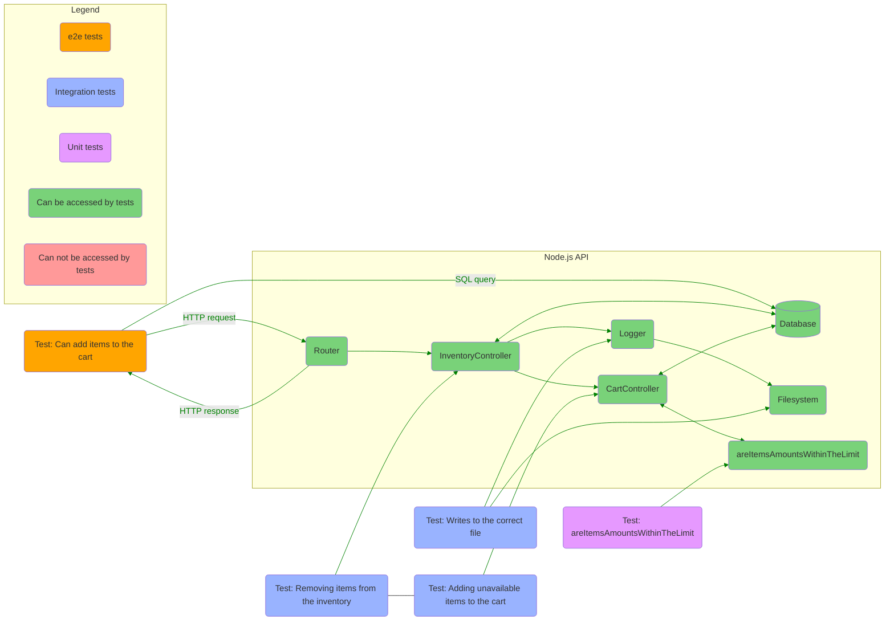

#### SECTION 4.2. TESTING HTTP ENDPOINTS

When testing HTTP endpoints, we aren't directly interacting with the unit under test.  
Instead, we interact with the entire app through HTTP requests.  
In some sense the unit under test is an endpoint: because we hit a particular endpoint.  
And in some sense the unit under test is the entire app: because after hitting an endpoint there are a lot of interactions between modules, including authentication, DB queries, middleware, etc.

A simple HTTP endpoint test:

```javascript
// get-cart-items.test.js
describe("get cart items", () => {
  it("responds with all cart items list", async () => {
    const getCartItemsResponse = await fetch("http://localhost:3080/api/cart", {
      headers: { Authorization: "myAuthToken123" },
    })
    expect(getCartItemsResponse.status).toEqual(200)
    expect(await getCartItemsResponse.json()).toEqual([
      { name: "apple-pie", quantity: 3 },
      { name: "cheesecake", quantity: 5 },
    ])
  })
})
```

##### 4.2.1. TESTING MIDDLEWARE

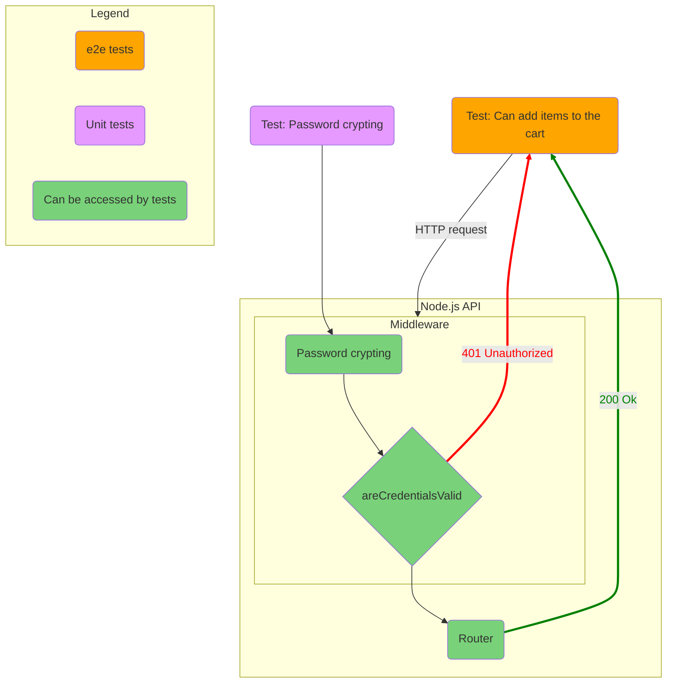

#### SECTION 4.3. DEALING WITH EXTERNAL DEPENDENCIES

No content.

##### 4.3.1. INTEGRATIONS WITH DATABASES

It is possible to mock interactions with a DB,  
but this approach has cons:

- mocking DB separates tests from production environment;
- mocking DB is tricky;

But if we don't mock DB, there are also cons:

- having to config and set up testing DB instance;
- maintenance overhead caused supporting initial DB state;
- changes in DB schema require updating tests;

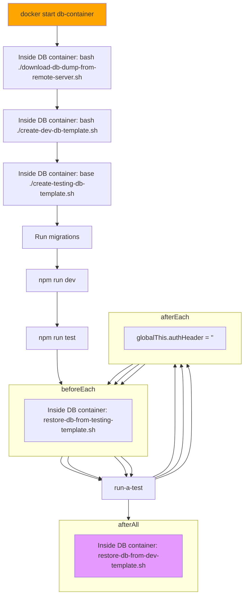

##### 4.3.2. INTEGRATIONS WITH OTHER APIS

No content.

### CHAPTER 5. ADVANCED BACKEND TESTING TECHNIQUES

Our goals, in order of priority:

- Make test **reliable**.
- Make test **easy to maintain**.
- Make test **fast**.

Also, if you can't trust your tests, it doesn't matter how quickly they run or how easy it is to update them.

#### SECTION 5.1. ELIMINATING NONDETERMINISM

**Deterministic tests** are the ones that, given the same input, always produce the same results.

If our tests are *non*deterministic, it will be hard for us to say whether there is a problem in your tests or in your app.  
Nondeterministic tests are useless.

Why it is important to have our test deterministic:

- They fall only when the app doesn't work.
- They increase our confidence.
- They make our progress faster, because they enable us to change bigger chunks of code at a time.
- Nondetermenistic tests are useless.

For example, a test gets nondeterministic, when it depends directly with third-party API.  
To provide consistent results, tests should not depend on internet connection or someone else's service being available.  
We must have full control over such dependencies in tests.

Common sources of nondeterminism:

- each time a test runs, it is given a different initial app state (DB, FS, etc);
- using third-party API;
- depending on internet connection;
- running tests in parallel;
- dealing with shared resources;
- running tests in different environments;
- random values generating;
- dealing with time-dependant code;
- tests interfere in each other's state;

Some situations:

- Your test depends on an IoT device being available?  
  Use a tests double to simulate a response those device would yield.
- Your unit-under-test uses a random number generator like `Math.random`?  
  Mock it so that you eliminate randomness.

  As a rule of thumb, we should **mock everything we can't control**.

##### 5.1.1. PARALLELISM AND SHARED RESOURCES

No content.

##### 5.1.2. DEALING WITH TIME

No content.

#### SECTION 5.2. REDUCING COSTS WHILE PRESERVING QUALITY

No content.

##### 5.2.1. REDUCING OVERLAP BETWEEN TESTS

Tests overlap when the run they run the same pieces of code and repeat each other's verifications.  
By eliminating this overlap you can often reduce the amount of code you have to maintain.

To test some functionality, you can either write 3 different tests (for example, 1 e2e and 2 integration), or you can put all 3 assertions into a single e2e test.  
Putting all 3 assertions into a single e2e test make it easier to reason about them, and easier to maintain.  
But this approach has its downsides: with a single e2e tests you can't test some complex scenarios.

##### 5.2.2. CREATING TRANSITIVE GUARANTEES

Instead of repeating expensive checks when testing each function that requires `myAwesomeFunction`, you can:

- extract `myAwesomeFunction` to a separate module;
- add robust tests for `myAwesomeFunction` isolated within `myAwesomeFunction.test.js`;
- just test whether `myAwesomeFunction` is called with the correct arguments;

Doing this, you can say: _I already know that `myAwesomeFunction` works because I've tested it. Now, I just want to make sure it's invoked with the correct arguments._

##### 5.2.3. TURNING ASSERTIONS INTO PRECONDITIONS

You don't always need a separate test to check a specific behaviour. If other tests depend on that behaviour to pass, you can already consider it covered.

### CHAPTER 6. TESTING FRONTEND APPLICATIONS

#### SECTION 6.1. INTRODUCING JSDOM

Jest can't run in a browser, you should simulate browser environment within Node.js.  
You make assertions on functions return value and DOM elements interactions and contents.  
You simulate scrolling, clicking, typing and dragging.  
You should test if your code interfaces correctly with history and web storage APIs.

#### SECTION 6.2. ASSERTING ON THE DOM

```javascript
const data = { count: 0 }
const incrementCount = () => {
  data.cheesecakes++
  window.document.getElementById("count").innerHTML = data.cheesecakes
}
const incrementButton = window.document.getElementById("increment-button")
incrementButton.addEventListener("click", incrementCount)
```

Because this script runs in a browser, and thus it can manipulate the browser and the elements in the page.

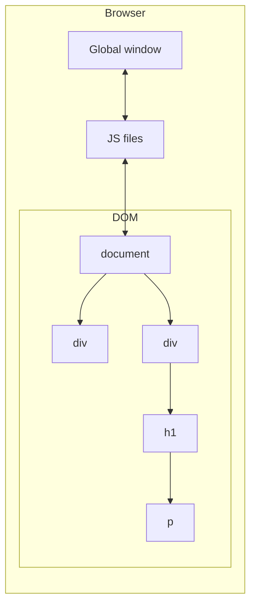

Figure: The JS environment within a browser.

Unlike the browser, Node.js can't run nor that script, neither tests for that script, because the script depends on DOM API.  
`node ./main.js` causes `ReferenceError` because `window is not defined`.

To be able to run your tests in Jest, instead of running them within the browser, you can bring browser APIs to Node.js by using JSDOM.  
JSDOM is an implementation of web standards written purely on JS that you can use in Node.js.

By passing the value `"jsdom"` to Jest's `testEnvironment` option, you can make it set up a global instance of JSDOM, which you can use when running your tests.

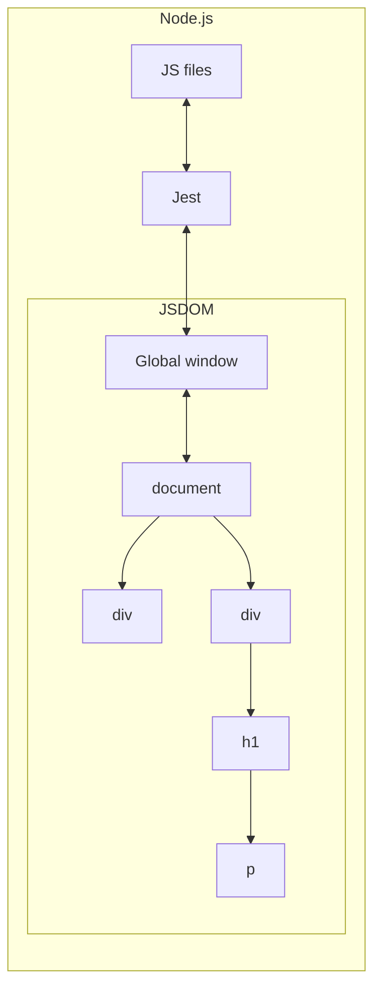

Figure: The JS environment within Node.js.

##### 6.2.1. MAKING IT EASIER TO FIND ELEMENTS

You can find page elements by their ID's or by their position in the page hierarchial chain. But this approach tightly couples the tests to the markup and requires more complex maintenance. Tests may fail after minimal changes to the markup.  
To avoid maintenance overhead and to make tests more readable, use `dom-testing-library`. So you can find elements by their text, alt text, label, role, etc.

##### 6.2.2. WRITING BETTER ASSERTIONS

You can assert, for example, that an element is exists, using the `toBeTruthy` assertion.  
But you can make your assertions more reliable and readable by using `jest-dom`. It extends basic Jest's assertions with new ones, designed specially for testing web pages.  
`.toHaveStyle()`, `.toBeDisabled()`, `.toBeEnabled`, `.toBeVisible()` and other assertions make it easier to write tests.

#### SECTION 6.3. HANDLING EVENTS

#### SECTION 6.4. TESTING AND BROWSER APIS

##### 6.4.1. TESTING A LOCALSTORAGE INTERGRATION

##### 6.4.2 TESTING A HISTORY API INTERGRATION

#### SECTION 6.5. DEALING WITH WEBSOCKETS AND HTTP REQUESTS

##### 6.5.1 TESTING INVOLVING HTTP REQUESTS

##### 6.5.2 TESTING INVOLVING WEBSOCKETS

### CHAPTER 7. THE REACT TESTING ECOSYSTEM

#### SECTION 7.1. SETTING UP A TEST ENVIRONMENT FOR REACT

##### 7.1.1. SETTING UP A REACT APPLICATION

##### 7.1.2. SETTING UP A TESTING ENVIRONMENT

#### SECTION 7.2. AN OVERVIEW OF REACT TESTING LIBRARIES

##### 7.2.1. RENDERING COMPONENTS AND THE DOM

Jest has already set up a JSDOM instance for you.  
You must wrap each of your interactions with a component into a React testing library called `act`., which is part of the `react-dom` package. The `act` function ensures that the updates associated to your interactions have been proceeded and applied to the DOM, which, in this case, is implemented by JSDOM.

```javascript
import React from "react"
import { App } from "./App.jsx"
import { render } from "react-dom"
import { act } from "react-dom/test-utils"

const root = document.createElement("div")
document.body.appendChild(root)

test("renders the appropriate heading", () => {
  act(() => {
    render(<App />, root)
  })
  const heading = document.querySelector("h1")
  expect(header.textContent).toEqual("Inventry contents")
})
```

In the test you have just written, you are accurately simulating how the `App` component gets rendered by a browser. `act` function ensures that the interactions have been proceeded and the necessary updates have been applied to the DOM.  
This test uses `react-dom/test-utils` to render `App` to a JSDOM instance. And then it uses web APIs to find and inspect an `h1` element so that you can assert on it.

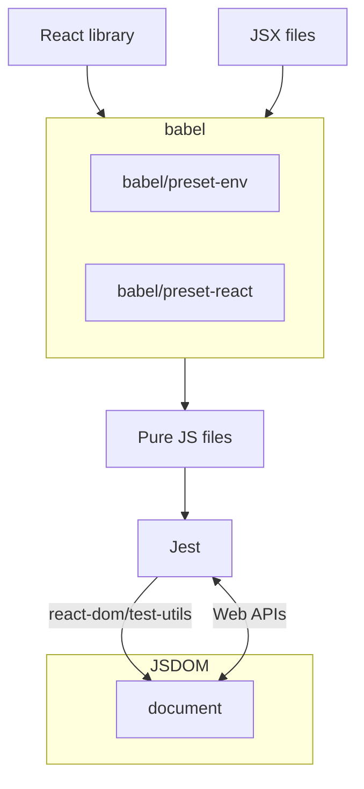

##### 7.2.2. REACT TESTING LIBRARY

We can write tests using only `react-dom/test-utils`.  
Or we can use `react-testing-library`:

```javascript
import { render } from "@testing-library/react"

test("renders the appropriate heading", () => {
  const { getByText } = render(<App />, root)
  expect(getByText("Inventry contents")).toBeInTheDocument()
})
```

Using `react-testing-library` we have the following benefits:

- Your tests don't involve plenty of React-specific concerns, such as manyally attaching a `div` to a JSDOM instance and rendering components inside it using `react-dom`.
- `react-tesing-library` automatically sets up a cleanup hook, which removes the rendered nodes from the DOM.
- The interactions to your components are automatically wrapped into the `act` function to ensure that updates will be proceeded and applied to the DOM.
- `react-testing-library`'s `render` function returns an object containing queries, that are bound to run within the rendered component, not within the whole JSDOM instance.
- `react-testing-library`'s `fireEvent` utility already wraps interactions into `act` calls so that you can using `act` yourself.

To avoid having to use `waitFor` every time you need to wait for an element, you can use `findBy*` instead of `getBy*` queries.  
A `findBy*` query runs asynchronously. The promise returned by this kind of query either resolves with the found element or rejects after one second if it didn't find anything matching the passed criteria.  
You can use it, for example, to replace `waitFor`, which causes your tests to wait for the list to have three children.

##### 7.2.3. ENZYME

No content.

##### 7.2.4. THE REACT TEST RENDERER

Unlike React testing library or Enzyme, it renders components to plain JS objects instead of rendering them to the DOM.  
It can be useful, for example, when you are not using JSDOM, or if you can't use it.  
You don't need any DOM implementation to render components and inspect their contents.  
I don't see the benefit of using React's test renderer.  
Setting up JSDOM is quick, and it makes your tests more reliable because it makes your code run just like it would in a browser.  
The main use case for `react-test-renderer` is when you are not rendering components to a DOM but would still like to inspect their contents. It can be applied in testing `react-native` applications, for example.

### CHAPTER 8. TESTING REACT APPLICATIONS

No content.

#### SECTION 8.1. TESTING COMPONENT INTEGRATION

Tests should provide reliable guarantees that your components work in integration. If your test covers some top-level component like `<App />` or `<Profile />` it will automatically cover its underlying component.

The only downside of having this test is that you will have one extra test to fix if you have one of the underlying components. It may generate significant overlap between your tests. Changes become more expensive.

`react-testing-library` recommendation is: you should write your test as high up in the component tree as you need to obtain reliable guarantees. Because your test resemble your application's run-time scenario more closely.

When you have too many tests that depend on a single point of failure, centralize that point of failure into a single piece that you will use throughout your tests. Create a transitive guarantee. Modularity can make both your application's code and tests more robust.

##### 8.1.1 STUBBING COMPONENTS

No content.

#### SECTION 8.2 SNAPSHOT TESTING

No content.

##### 8.2.1 SNAPSHOTS BEYONG COMPONENTS

No content.

##### 8.2.2 SERIALIZERS

No content.

#### SECTION 8.3. TESTING STYLES

When testing your styles, if you are using an external css file, you will not be able to check whether the specific style rules within a class are applied. You will be able to check only whether a component's `className` property is correct.

I'd recommend you not assert on classes that don't change. It doesn't give any value.

One alternative to make your styling tests more valuable is to write inline styles within your components. Inline styles provide more reliable guarantees because they enforce component to look a certain way.  
But inline styles has their downsides: repetitive assertions, specificity, inability to perform animations.

To address this issue, you can use `css-in-js` libs (like `emotion`) that allows you to use CSS syntax within your components files. Besides making it easier to manage styles within your components, many CSS-in-JS libs also enable you to extend linters to make your automated QA process even more reliable.

You `toHaveStyle` assertions passed inline styles. But with `emotion` they will fail, because your components don't use inline styles to highlight your component in red anymore. Instead, because of how emotion works, your app will have automatically generated classes for the rules you created with `emotion` and apply those classes to your elements. To address this issue you can use `jest-emotion` package which allow you to extend Jest with a `toHaveStyleRule` matcher that verifies the style rules applied by emotion.  
Example: `expect(cheesecakeItem).toHaveStyleRule("color", "red");`

#### SECTION 8.4. COMPONENT-LEVEL ACCEPTANCE TESTS AND COMPONENT STORIES

No content.

##### 8.4.1. WRITING STORIES

No content.

##### 8.4.2. WRITING DOCUMENTATION

No content.

### CHAPTER 9. TEST-DRIVEN DEVELOPMENT

### CHAPTER 10. UI-BASED END-TO-END TESTING

No content.

#### SECTION 10.1. WHAT ARE UI-BASED END-TO-END TESTS

End-to-end tests help you ensure that the _entire_ app works as it should. The scope of these tests is large. The reliability guarantees they generate are strong. End-to-end tests are at the very top of the testing pyramid.

End-to-end tests examples:

- Software under tests is backend app, tests cover endpoints interactions.
- Software under tests is a web browser app, tests cover inputs, buttons and reading page's contents.
- Software under tests is the entire app, including both frontend and backend.

The first two examples are not exactly end-to-end tests because they don't cover the entire app.

- e2e test: Validates all of the app's layers.
- UI-based e2e tests: Validates all of the app layers by interacting with it through its UI.
- UI test: Validates an app through its UI, possibly replacing backend with stubs.

UI tests and e2e tests are not mutually exclusive classifications.  
A test can be both a UI test and an e2e test, or only one of them.

#### SECTION 10.2. WHEN TO WRITE EACH TYPE OF TEST

- Pure e2e tests.
- Pure UI tests.
- UI-base e2e tests.

People often use terms like _e2e tests_, _pure UI tests_, and _UI-based e2e tests_ imprecisely.  
It is common for people to call "e2e tests" any test that interact with an app through a browser.  
Though that defenition is correct, given that these tests' is the entire app under test.  
But we will adopt more pricese terminology.

##### 10.2.1. UI-BASED END-TO-END TESTS

Involves the entire software stack upon which your app depends.  
Goes at the very top of the testing pyramid because it has the broadest possible scope and generates the most reliable guarantees.  
Even within the "e2e tests category", UI tests that cover your entire system go above e2e tests for RESTful APIs.

A single UI-based e2e test covers a large part of your app reliably. Therefore, you need fewer UI-based e2e tests than other kinds of tests.

UI-based e2e tests are more time-consuming to write and to execute.  
You should not update them multiple times as you develop a feature.  
It's wise to write these kinds of tests after implementing complete pieces of functionality.

Should you write a UI-based e2e test?  
Answer the following quesstions:

- How critical the feature under test is?
- How labor it is to validate this feature manually?
- How much will it cost to write a test?

Example:  
You have to test how the Undo button behaves during some continuous UI process.  
Testing such functionality that has many steps is time-consuming and error-prone.  
It is a critical feature that you have to test frequently, and, therefore, you would invest a lot of time performing manual labor.
In this case a UI-based e2e test will be valuable.

On the other hand, if you have a small inessential feature, such as a reset button that clears the form's content. You don't need to invest time to write a UI-base e2e test for it.

Both developers and QA engineers can write UI-based e2e tests.  
In leaner teams, which take a more agile approach to software development, software engineers will write these tests themselves.  
When a QA team is available, they can write UI-based e2e tests.

##### 10.2.2. PURE END-TO-END TESTS

In the testing pyramid, pure e2e tests go a bit below UI-based e2e tests.  
Pure e2e tests don't test your software as precisely as users would.  
But they can be almost as reliable and are much quicker to write.

Unlike UI-based e2e tests can be bundled into your development process and significantly shorten your feedback loop as you write code.  
Pure e2e tests provide reliable quality guarantees and cover a large part of your code.

Additionally, when testing app with no GUI, such as RESTful APIs or distributable software packages, it's not possible to write UI tests.  
Therefore pure e2e tests offer the strongest reliability guarantees you can have.

You should write pure e2e tests as you develop code.  
Pure e2e tests validate your code from a consumer's perspective.  
When writing e2e tests developers should pay attention to how much their tests overlap.  
Developers should carefully adopt their test suit to reduce the burden of maintenanece as their software grows, maintaing a balanced testsing pyramid.

Because writing pure e2e tests requires direct access to the code, they must be written by developers, not QA engineers.

##### 10.2.3. PURE UI TESTS

Pure UI tests can validate your UI:

- either through a real browser
- or through a testing framework, such as Jest

You can consider the tests you've written using RTL as UI tests.  
Thansk to JSDOM, they can interact with your components by dispatchin browserlike events and validate your app by finding elements in the DOM.  
Nonetheless, RTL tests use JSDOM instead of a real browser run-time environment.  
RTL tests don't exactly replicate what happens when your app runs within a browser.

In the testing pyramid, UI tests that run in a browser, go above UI tests that run within testing frameworks.  
Tests that run within a browser can replicate user interactions more accurately and involve fewer test doubles.  
However, they take more time to run and more complex to write.

About pure UI tests that run within _testing frameworks_:

- They are way quicker to write.
- The guarantees they generate are almost as reliable as those running within a browser.
- I'd recommend you to choose them tests most of the time.
- You can write them as you develop features.
- They tend to be small.
- It is straingforward to include them tests into TDD workflow.

About pure UI tests that run within a _browser_:

- I'd recommend to write them only when it's critical to use browser-specific features that you can't accurately simulate with JSDOM.
- Or when performing visual regression testing.

More about pure UI tests:

- They depend on having access to the code either to interface with the unit under test directly or to write test doubles.
- Most of the time, pure UI test must be written by developers, not QA engineers.
- When interactions with other pieces of software are irrelevant to the test, QA engineers can write pure UI tests also.

##### 10.2.4. A NOTE ON ACCEPTANCE TESTING AND THIS CHAPTER'S NAME

No content.

#### SECTION 10.3. AN OVERVIEW OF END-TO-END TESTING TOOLS

The tools described in this section interact with your software through its UI, rather than through your code directly.

~~Invoking a function and expecting its output to match a particular value~~.  
Filling inputs, submitting a form and check whether the browser displays the correct result.

These tools are not coupled to your code and your technology stack.

In the tests we've written before, we mounted our app to an alternative DOM implementation, JSDOM.  
We used JSDOM's pure JS implementation to dispatch events and inspect elements.  
JSDOM is ideal for writing tests during your development process.  
JSDOM simplifies setting up a testing environment and makes your tests quicker and lighter.  
The problem with using JSDOM is that it may not always accurately reflect what real browsers do.  
JSDOM is an excellent and successfull attempt to browser APIs as per specification.  
But JSDOM is still a replica and of browser environment and can replicate not every case exactly: even browsers themselves don't always follow the API's specifications adequately. Therefore, even if JSOM implements those APIs correctly, browser may not.

##### 10.3.1. SELENIUM

Selenium is a browser automation framework frequently used for testing web apps through a real browser.  
Selenium is the precursor of the browser-based e2e testing tools.

Besides being the most accurate way to replicate your user's actions, Selenium provides you with the full range of browser's capabiliaties.  
You can freely navigate between pages, trottle the network speed, record videos and take screenshots.

###### HOW SELENIUM WORKS

Selenium interacts with a browser through programs called _webdrivers_.  
These webdrivers are responsible for receiving Selenium's commands and performing the necessary actions within a real browser.  
When you tell Selenium to click an element, it will send a "click" command to the webdriver you have chosen.  
Because this webdriver is capable of controlling a real browser, it will make the browser to click the selected element.  
To communicate with the Webdriver, selenium uses a protocol called JSON Wire. This protocol specifies a set of HTTP routes for handling different actions to be performed within a browser.

###### USING A WEBDRIVER'S INTERFACES WITHOUT SELENIUM

Even though Selenium is mostly used to test web apps, it is actually a browser automation library.  
Therefore, its an NPM package under the name `selenium-webdriver`, ant it doesn't include a test runner or an assertion library.  
To write tests using Selenium, you will need to pair it with a separate testing framework, such as Jest.

Selenium doesn't ship with any testing tools.  
It can be cumbersome to set up the necessary environment, to start using it for testing apps.  
To avoid going through this setup process yourself, use Nightwatch or WebdriverIO.  
Nightwatch and WebdriverIO, just like Selenium, can interface with multiple Webdrivers, and, therefore, are capable of controlling real browsers.  
The main difference between these tools and Selenium is that they ship with testing utilities.

###### WHEN TO CHOOSE SELENIUM

Selenium, Nightwatch and WebdriverIO support all the major browsers.  
I'd avoid Selenium itself if I'm using it _exclusively_ to write tests. In that case I'd choose Nightwatch or WebdriverIO.  
But if you need to perform other browser-automation tasks, select Selenium.

These tools make it too easy for you to write flaky (nondeterministic) tests. With them, you need to create robust testing mechanisms.  
Also, because they control a browser through HTTP requests they are slower than alternatives like Cypress, which run entirely within a browser.  
Besides their possible slowness, configuring and debuggin tests can be challenging.  
Without build-in tools to outline different test cases, run assertions, and monitor your tests' executions, they can take significantly more time to write.

##### 10.3.2. PUPPETEER

Like Selenium, Puppeteer is not _exclusevily_ a testing framework.  
Instead, Puppeteer is a browser automation tool.

Unlike Selenium, Puppeteer can control _only_ Chrom and Chromium.  
Puppeteer uses Chrome DevTools protocol which allows other programs to interact with the browser's capabilities.

Because Puppeteer involves fewer pieces of software than Webdriver-based tools, it's leaner.  
It is easier to set up and debug.

Because Puppeteer is exclusevily a browser-automation tool, it doesn't ship with any testing frameworks to create test suites and perform assertions.  
If you want to use Puppeteer for testing, you must use separate testing libraries like Jest or Jest Puppeteer.  
Jest Puppeteer ships with all the necessary support for running tests using Puppeteer itself, including extra assertions.

A further advantage of Puppeteer over Selenium is it's event-driven architecture.  
This architecture eliminates the need for time-fixed delays or writing your own retry mechanisms.  
By default, tests written using Puppeteer are much more robust.

Puppeteer's debuggability is much better than Selenium's.  
With Puppeteer, you can easily use Chrome's devtools to solve bugs and its "slow-motion" mode to replay the test's steps in such a way that you can understand precisely what the browser is doing.

###### WHEN TO CHOOSE PUPPETEER

When you want to write cheaper tests: robust, less time to write, easier debugging.  
If you need to support only Chrome and Chromium, Puppeteer is a much better alternative than Webdriver-based tools due to its simplicity and debuggability.  
Because Puppeteer is focused on supporting Chromium, it can provide you with access to more features and offer more elaborated browser APIs.  
If you need to test other browsers, Puppeteer cannot be used in your case.

##### 10.3.3. CYPRESS

Cypress directly interfaces with a browser's remote-control API to find elements and carry out actions.  
This direct communication to a browser makes tests quicker and simplifies setting up a testing environment because it reduces the amount of software needed to start writing tests.  
Cypress's architecture allows you to leverage the Node.js process behind Cypress to perform tasks like managing files, sending requests and accesssinga a DB.  
Because _Cypress is created specifically for testing_ it offers numerous advandages over tools like Webdriver-based tools and Puppeteer, which focus _only_ on automation.

Cypress includes many testing utilities out of the box.  
You don't have to set up an entire testing environment by yourself.  
You don't need to pick and install multiple npm packages for organizing your tests, running assertions, or creating test doubles.
Installing `cypress` is all you need to do to start writing tests.

Cypress's API's are designed with testing in mind.  
Typical situations you'd encounter when writing tests are already built in Cypress's methods.  
These APIs make tests simpler, concise and more readable.  
If you choose Cypress it is very recommended to read its gread docs thoroughly.

Imagine, for example, that you'd like to click a button that appears after a few seconds after accessing your app.  
Browser-automation tools would require you write a line of code that explicitly tells your test to wait for the button to be visible before trying to click it.  
Without this explicit line, browser-automation tools will immediately fail if they don't find the element on which they must click.  
Cypress, in contrast, doesn't require you to write explicit code to write for the button to appear.  
Cypress will, by default, keep trying to find the button on which it wants to click until it reaches a timeout.  
Cypress will will try to perform the click only once it finds the button.

Cypress has the ability to "time travel".  
As Cypress runs tests, it takes snapshots of your app.  
Imagine that you have a test that fills out a form, submits it, and expects the test to update.  
You can use the test's action log to see how your app looked at each of these steps.  
Because you can run Cypress tests within a real browser, you can examine each step in detail using your browser's devtools.  
When tests detects a bug in your app, you can add break points to your app's code and step through its lines.

##### 10.3.4. WHEN TO CHOOSE CYPRESS

If you're looking for a tool _exclusively_ to write tests for Chrome and Firefox.

### CHAPTER 11. WRITING UI-BASED END-TO-END TESTS

No content.

#### SECTION 11.1. YOUR FIRST UI-BASED END-TO-END TESTS

No content.

##### 11.1.1. SETTING UP A TEST ENVIRONMENT

No content.

##### 11.1.2. WRITING YOUR FIRST TESTS

For your tests to be able to run, start your client and server to make them accessible.  
To access elements within the page, call `get` method, or `contain` method or their combination.  
Avoid brittle selectors.

Your tests will fail if Cypress can't find an element.  
You don't necessarily need to explicitly assert that each element exists.  
By default, the `get` and `contains` asserts that elements exist.

Test that interacts with server and DB will pass only once.  
After running such tests for the first time, the DB will already have some data (a TODO created) and your assertions on page's content will no logner valid in subsequent runs.  
To make tests deterministic, you have the following options:

1. Fake server responses for adding and fetching items.
2. Calculate what should be the expected quantity of the item added according to what's currently in the DB.
3. Reset the DB before each test.

The 1st approach mocks the server and covers only the frontend functionality.  
But I like my e2e tests to simulate a user's actions as accurately as possible.  
I use test double only in tests further down in testing pyramid.  
Additionally, the 1st approach involves writing and maintenance test doubles that duplicate the server logic instead of what the user does and what the result of their actions should be.

The 2st approach involves conditional logic inside tests, where if-else branches will essentially be different test cases.

The 3rd approach is the recommended one.  
It guarantees that the app state will be the exact same every time the test runs.  
It always tests the same functionality and is ways simpler to implement and to debug.

##### 11.1.3. Sending HTTP requests

No content.

##### 11.1.4. SENDING HTTP REQUESTS

None of the Cypress commands you've written Cypress is synchronous.  
You don't need to use `await` or chain these commands to sequence these commands.  
Cypress commands are _not_ promises.  
When your test starts, Cypress immediately invokes the functions you've written (executes all lines of code) and adds these functions to the queue.  
Then Cypress executes these actions in the order they were added.  
Once an action in the queue fails or all actions in the queue are complete, your tests finishes.  
To see this behavious, add a `console.log` after the last line of your test. You'll see that Cypress logs the message before carrying out the test's actions.

To run a single test, add a `.only` to it.

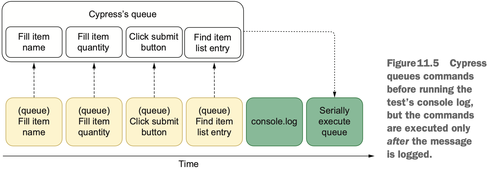

#### SECTION 11.2. Best practices end-to-end tests

No content.

##### 11.2.1. BEST PRACTICES END-TO-END TESTS

The page object pattern: instead of repeating selectors and actions throughout your tests, you'll use a separate object's methods into which those actions are encapsulated.  
The advantage of encapsulating actions into separate methods is that you'll be quicker to update your tests when your page's structure changes.

Imagine, all of your tests depend on an input with placeholder of `"Please, enter your name."`.  
If you change that placeholder, all of your tests will fail.  
To fix them, you'll have to update that field's selector in every test that uses it:

```javascript
it("Test case 1.", () => {
  // cy.get(input[placeholder="Please, enter your name."])
  cy.get(input[(placeholder = "Your name ...")])
})
it("Test case 2.", () => {
  // cy.get(input[placeholder="Please, enter your name."])
  cy.get(input[(placeholder = "Your name ...")])
})
it("Test case 3.", () => {
  // cy.get(input[placeholder="Please, enter your name."])
  cy.get(input[(placeholder = "Your name ...")])
})
```

Making this is tedious and time-consuming.  
You can incapsulate the field's selector into a method and reuse that method throughout your tests.  
In this case, if the field's placeholder changed, you'd have to update only the method's body.

```javascript
class OrderPage {
  static getNameField() {
    // return cy.get(input[placeholder="Please, enter your name."])
    return cy.get(input[(placeholder = "Your name ...")])
  }
}
it("Test case 1.", () => {
  OrderPage.getNameField()
})
it("Test case 2.", () => {
  OrderPage.getNameField()
})
it("Test case 3.", () => {
  OrderPage.getNameField()
})
```

Now you've written this page object.  
The tests doesn't directly include any selectors.  
You should update selectors only once, in the page object's method.  
Eliminate all repeating direct selectors from the tests. Instead, add methods to the page object.

Treat page object exlusively as a selectors storage.  
Page objects should be stateless so they perform the same action each time their actions are called.  
Sharing page objects is a _bad_ idea because it can cause interference between tests.

A single page object doesn't necessarily need to represent an entire page.  
You can, for example, create a separate page object to encasulate methods to work _exclusively_ with menu.

```javascript
class MenuPage {
  static openMenu() { ... }
  static clickMenuItem() { ... }
  static closeMenu() { ... }
}
```

**By using page objects, you'll write tests in terms of what they do, _not_ in terms of what the page's structure is.**

##### 11.2.2. APPLICATIONS ACTIONS

Typically, UI-based e2e tests interface only with your app's GUI.  
App actions allow your tests to interface directly with your app's code.  
When using an app action in a test, instead of finding an element in the page and interacting with it, you invoke a function from your app's code.  
App actions should be used to reduce overlap among different tests, not to completely eliminate page objects.

The disadvantage of using app actions is that they couple your tests to your app code instead of coupling to its UI.

Personally, I use app actions only in my test's _arrange_ step. To _act_ and _assert_, I use selectors from a page object.

#### SECTION 11.3. DEALING WITH FLAKINESS

Flakiness makes you less confident that your tests - your bug-detection mechanisms - can identify mistakes.

##### 11.3.1. AVOIDING WAITING FOR FIXED AMOUNT OF TIME

As a rule of thumb, whenever using Cypress, you should avoid waiting for a fixed amount of time.  
Using `cy.wait` is almost always a **bad** idea.  
It's a bad practice bacause your software may take different a different amount of time to respond every time a test runs.  
If you're always waiting for a server to respond within 2 seconds, your test will fail if it takes 3.  
Additionally, by increasing these waiting periods in attempt to make tests deterministic, you'll be making your tests slower.  
Instead of waiting for a fixed amount of time, you should wait for conditions to be met.  
Example: if you expect your page to contain a new element once the server responds, don't wait for a few seconds before checking the page's elements. Instead, configure the test to proceed when it detects the new element is there.  
This practice allows your tests to run more quickly because they'll wait for only minimum necessary amount of time.

##### 11.3.2. STUBBING UNCONTROLLABLE FACTORS

To have deterministic tests, you have to stub uncontrollable behaviour when writing tests.  
When writing UI-based e2e tests, you should use stubs to make tests deterministic, _not_ to isolate different parts of your app.

- Cypress's fake timers allow you to control time-related methods.
- Stubbing API requests is useful for non-free or temporary-unavailable third-party APIs.
- Stubbing functions allows when you're using functions which results are non-deterministic: `Math.random`, etc.

##### 11.3.3. RETRYING TESTS

Imagine, your test has become non-deterministic and you don't have enough time to make it deterministic right now.  
You can set up restarting your tests.

#### SECTION 11.4. RUNNING TESTS ON MULTIPLE BROWSERS

##### 11.4.1. USING A TESTING FRAMEWORK FOR RUNNING TESTS WITHIN A BROWSER

##### 11.4.2. RUNNING UI-BASED TESTS IN MULTIPLE BROWSERS

##### 11.5. VISUAL REGRESSION TESTS

To ensure that your app is correctly displayed, visual regresssion tests compare how your app looks to previously approved snapshots.

Jest's snapshots allow to achieve the same purpose, and the process is similar.  
The difference between these two ways is that visual regession tests compare images, not strings.  
Visual regression tests are more reliable.  
Imagine that you have a component that you've tested with Jest's snapshot, and that component has another component nearby.  
Now another component become bigger, for example, now it has bigger margins.  
In this case, our component's Jest's snapshots tests still pass.  
But in fact our component became ugly because it has less space.  
Visual regression tests can see the entire scene and will detect such non-trivial bugs such as caused by different components' styles interference.

My favourite tool is Percy, which has integration with Cypress.  
Check its docs, `npm install --save-dev @percy/cypress` and write your visual regression tests.

## Part 3: BUSINESS IMPACT

### CHAPTER 12. CONTINIOUS INTEGRATION AND CONTINIOUS DELIVERY

When developers write code in their own branch for a long time without integration their work with others' work, the consequences are bad. The main branch, the code upon which they building their branch might have already changed. This causes a lot of rework and conflicts, which is constly, risky and frustrating. **Deliver early and deliver frequently.** You will get customer's feedback sooner and learn more about what to build next.

#### SECTION 12.1. WHAT ARE CONTINUOUS INTEGRATION AND CONTINUOUS DELIVERY

**Successfull businesses** delight customers by:

- communicating frequently;
- iterating quickly;
- delivering early;
- listening to feedback;
- acting on the feedback.

These businesses **focus on delivering delightful finished products rather than** constantly working on **mediocre new features**.

There are two prictices at the core of this success:

- CI – frequently integrating your work with others' work;
- CD – delivering your product to your customers early and often.

##### 12.1.1. CONTINUOUS INTEGRATION

Integrating with others' work **reduces waste and rework**.

Imagine that two devs are working on the same feature in different branches. CI makes work **less frustrating and more predictable** when time to **merge** comes.

With CI, you will **frequently integrate** your work **with** the project **main** branch, and so will your coworker. Both of you will **constantly correct course** as you develop your feature.

You are communicating the changes you are doing, so that everyone is working on top of a working version of your software.

To make CI painless you should **automate**:

- executing **static analysis**;
- enforcing **code style**;
- running **tests**;
- **building** the project.

I also recommend adopt **code-review before merging to the main** branch.

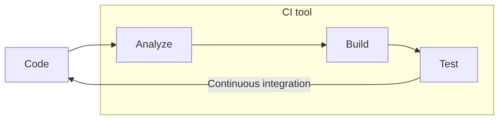

With this automation, it takes only a **few seconds** for a developer **to know** whether their work **is valid** when combined with the changes in the project's main branch.

> Automate your quality control process. Incorporate it into your build process. Launch it after each change to the repo is commited.

If you use a CI tool, but you integrate your work with the main branch only once a month, you are not doint CI.

After some commit broken your app, you can either fix it or rollback the changes.

Additionally, **if** you have a **broken** build, you will **forbid others from merging new code** because, if they do, you will not know whether their code have failures, too, given that the build is already broken. Furthermore, it will be more challenging to find the problem's root cause bacause you will have more changes to investigate. **Your CI builds should always be working.**

Those builds should happen **quickly**. Devs need to notice their mistakes as soon as possible. Fast build speeds up the team delivery rhythm because you do not need wait for a long time to the previous changed validated.

##### 12.1.2. CONTINUOUS DELIVERY

Instead of merely merging your work into main, produce artifacts that you can immediately put into the hands of customers.

With CD, you are able to deploy an up-to-date version of the app at any point in time.

CI is a prerequisite for CD.

Instead of developing a huge feature your customer may not need, you can build small parts at a time, listen to your customers' feedback, and deliver the exact product they want.

Feature flags are a useful technique to enable teams to perform continuous deployment.

By deploying new features behind FFs, devs can send to prod code that **does not yet impact users**, or that is available only for a small percentage of them.  
Besides allowing devs to ship code more often, FFs reduce communication overhead because they separate the process of making features available from the process of deploying them.  
With FFs, you can hide some part of the app that are not ready for the users to see, such as screens whose UI is incomplete.  
[A post about FFs](https://martin-fowler.com/articles/feature-toggles.html)

Early feedback helps you understand what matters to your customers and, therefore, avoid writing unnecessary code.

~~Writing as much code as possible.~~ Providing as much value as possible.

###### CONTINUOUS DELIVERY VS CONTINUOUS DEPLOYMENT

With continuous delivery, a human still needs to decide to "push the button".

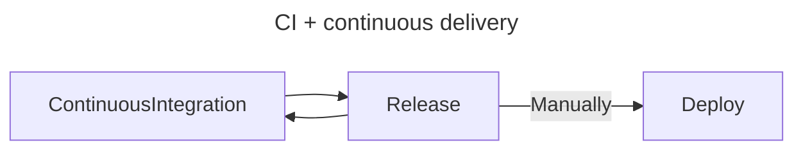

With continuous deployment, every release is sent to production automatically.

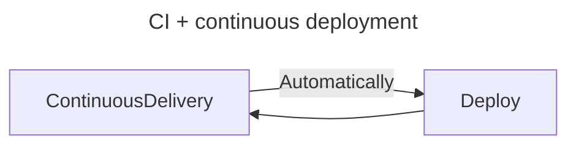

As you move from continuous integration to continuous delivery, and then to continuous deployment, the pace of releases becomes quicker, forching you to implement more sophisticated deployment techniques and automations, better monitoring, and more reliable quality guarantees.

#### SECTION 12.2. THE ROLE OF AUTOMATED TESTS IN A CI / CD PIPELINE

Automated testing is the most crucial technique to enable a team to perform CD because it allows you to increase your delivery frequency without significantly increasing your costs.

These tests are integrated into your CI / CD pipeline.

**Setting up CI routine VS implementing a CI / CD pipeline.**  
When performing CI, your team will validate its software every time someone pushes code to the main. This validation process may include trying to build the app, running tests, and performing static analysis.  
A CI / CD pipeline, **besides validating** your software, prepares any artifacts necessary for releases so that you can deploy them by "pushing a button".  
If you are writing a Node.js app, for example, your CI / CD pipeline can validate it, build the necessary containers, and push them to a containers repo.  
After your pipeline runs, you will be able to quickly deploy your software by pushing a button, because you will not have to build your containers again. Instead, you will simply pull what is already built.  
Additionally, to test the deployment process itself, you should have a separate production-like environment to which you deploy your software.

Your CI / CD pipeline validations should give you quick and precise feedback so that you can detect mistakes earlier. To make it possible, your CI / CD pipeline must include all kinds of tests.

#### SECTION 12.3. VERSION-CONTROL CHECKS

### CHAPTER 13. A CULTURE OF QUALITY

#### SECTION 13.1. USING TYPE SYSTEMS TO MAKE INVALID STATES INPRESENTABLE

#### SECTION 13.2. REVIEWING CODE TO CATCH PROBLEMS MACHINES CAN'T

#### SECTION 13.3. USING LINTERS AND FORMATTERS TO PRODUCE CONSISTENT CODE

#### SECTION 13.4. MONITORING YOUR SYSTEMS TO UNDERSTAND HOW THEY ACTUALLY BEHAVE

#### SECTION 13.5. EXPLAINING YOUR SOFTWARE WITH GOOD DOCUMENTATION
