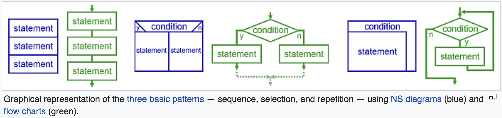
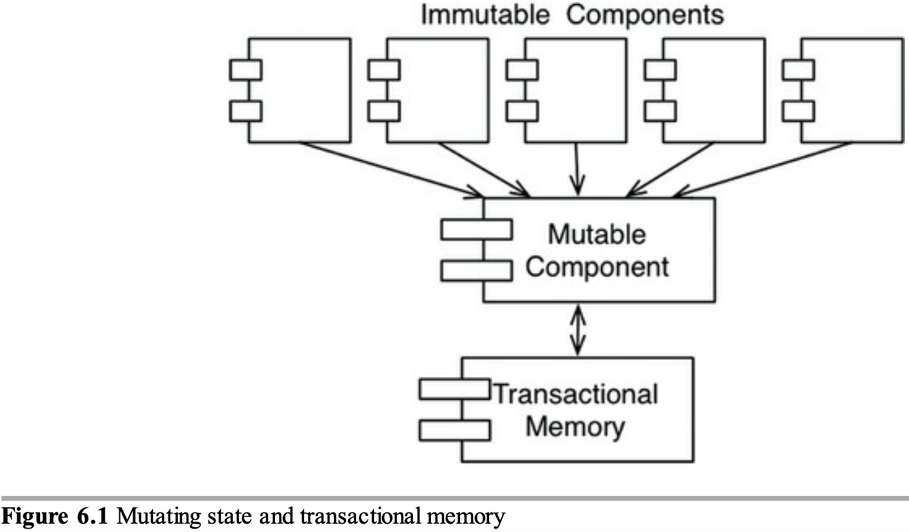

# TECHNICAL INTERVIEW

## ARCHITECTURE

<details>
<summary>Structured programming</summary>

- also known as «modular»;
- three basic patterns: **sequence**, **selection** (conditions) and **repetition** (loops);
  
- facilitates **readable** code and **reusable** components;
- encourages **hierarchy** of modules;
- uses **constuctions** like `if`, `while`;
- unconditional transfer of control (`goto`) is **prohibited**;
- improves code **quality**;
- **decomposes** large-scale problem statements into functions;
- enables **testing**;
- eliminates «spaghetti» code;
- all others paradighms are subtypes of SP;
- all **modern languages** use SP.

</details>

<details>
<summary>Functional programming</summary>

- 🧼 pure functions;
- 🐢 immutability;
- 🐚 disciplined state;
- 𝑓 first-class functions and higher-order functions;
- 👥 referential transparency (we can replace a function call with its invocation result and the final result will be the same);
- 💾 expensive;

### PURE FUNCTIONS

A pure function is an architectural **complexity dead end** because for the external system its complexity is reduced to only the its arguments and the return value (its API).

In contrast:

- in OOP, object methods mutate the state of the object;
- in PP, code mutates global state;

In practice, some functions designed to be pure, may end up to interact with broader context (e. g. «effects» in React).

### FIRST CLASS FUNCTIONS

In FP, **functions** are treated **as data**: we assign functions to variables, pass as arguments to other functions. It gives flexibility.

### HIGHER ORDER FUNCTION

HOF is a function that **operates upon a function** – accepts a function as an argument or returns a function.

### IMMUTABILITY

Avoid side effects. **Don't modify** the arguments and data **outside** the function. Instead, the **return** value should reflect the work done.

#### SEGREGATION OF MUTABILITY

We can't make everything immutable, because it requires a lot of storage and processor speed.

🤔 One of the compromises is to **segregate** the app into **mutable and immutable** parts.  
🧼 The immutable components **perform their tasks** in a purely functional way.  
🤝 Immutable components **communicate** with mutable ones.



So what?

- 👍 it's wise to push as **much** processing as possible **into** the **immutable** components;
- 👋 we should drive as **much** code as possible **from mutable** components;

#### EVENT SOURCING

> Event storing is a pattern for **storing data as events in an append-only** log.

- events are the **source of truth**;
- ES allows to **store the context** of the event: its timestamp, reason, etc.;
- to **source (derive) the state from the events**, we replay all the events in order of occurence;
- ES enables **audit**, **time travel** and **reshape**.
- state deriving can be **optimized by computing and saving the state**, e. g. every midnight; so, during the day, we calculate based on this saved state and the transactions executed from midnight.

</details>

<details open>
<summary>Object-oriented programming</summary>

> OOP is a programming paradighm that relies on the **concept of classes and objects**.

OO is the proper **admixture** of encapsulation, inheritance and polymorphism.

#### ENCAPSULATION

- objects **provide an interface to other** code that wants to use them;
- a line (firewall) can be drawn around a **cohesive set of data and functions**;
- clients **don't have direct access to** either the **data** or the internal **implementation**; they **call methods** that return the data in a reasonable format;
- available in any language, but OO languages are more **frendly** for it;
- the `public`, `private` and `protected` **keywords** encourage encapsulation;
- you **control** how your data is **accessed and manipulated**;
- allows to write **safer**, **mainatainable** and **debuggable** code;
- Java and C# put **header and implementation side by side**, thereby **weaking encapsulation**; in these languages it's impossible to separate the declaration and definition of a class.

#### INHERITANCE

> Inheritance is a **redeclaration of fields** in classes **hierarchy**.

- allows **classify objects** per common characteristicts;
- allows **use**, **replace**, and **partially replace** inherited fields.

#### POLYMORPHISM

> Polymorphism is the **ability** of an element **to have many forms**.

- _poly_ = _many_, _morphism_ = _types_;
- allows to represent a function in many types and many forms;
- lets the system **choose** which function to call **based on** type and parameter **signatures**.
- **OOP** didn't invent it, but **provides a way to implement** polymorphism much **safer**, **convenient** and even trivial.

Example:

- The `+` operator in JS is polymorphic, as it can either sum or concatenate, depending on the data type of its operands.

##### STATIC POLYMORPHISM

Also: compile-time polymorphism, method overloading.

Static polymorphism allows to defined **multiple methods** with the **same name**, but with **different signatures** (parameters types).

```
add(a: number, b: number) { ... }
add(a: string, b: string) { ... }

add(1, 3) // Variant 1 is called (activated).
add("Hehe", "Haha") // Variant 2 is (activated).
```

Which method will be called is defined by **which of the parameters set is passed** (= which of the forms is activated) by client code.

##### DYNAMIC POLYMORPHISM

Also: run-time polymorphism, method overriding.

TODO: CONTINUE HERE.

#### ABSTRACTION

> Abstraction **hides all but the relevant data** about an object through in order to **reduce complexity** and **increase efficiency**;

</details>
