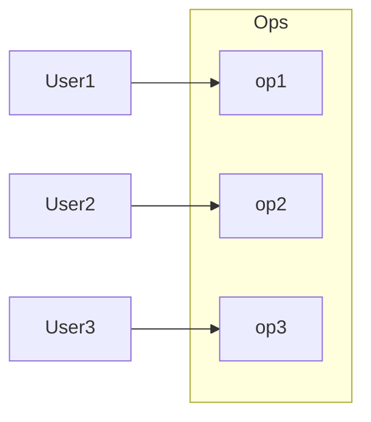
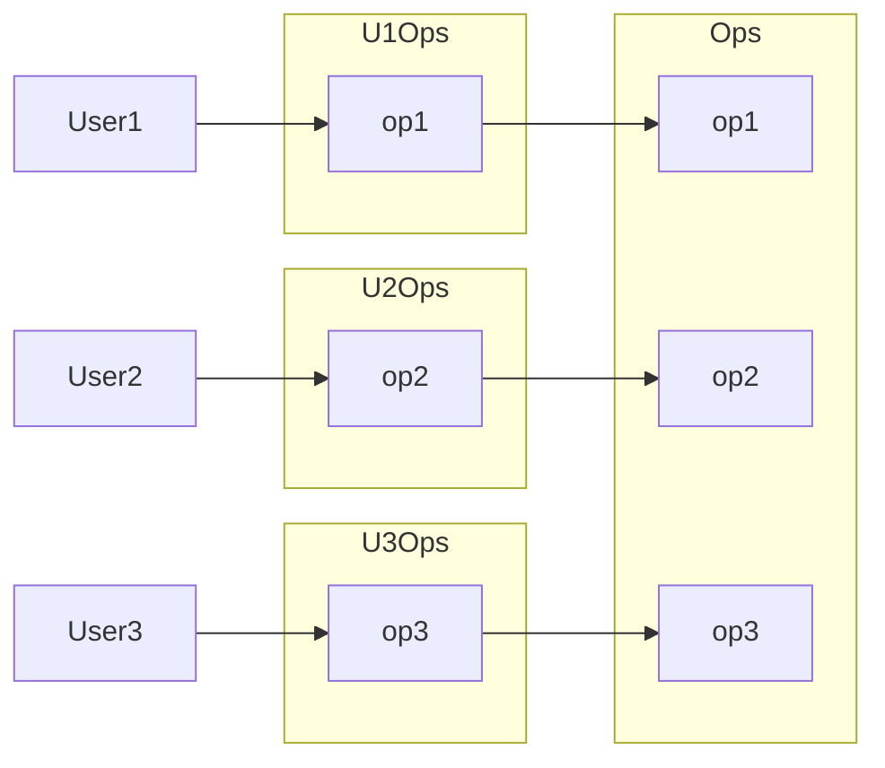
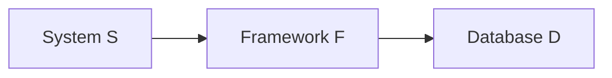

# TECHNICAL INTERVIEW

## ARCHITECTURE

<details>
<summary>Structured programming</summary>

- also known as «modular»;
- three basic patterns: **sequence**, **selection** (conditions) and **repetition** (loops);
  
- facilitates **readable** code and **reusable** components;
- encourages **hierarchy** of modules;
- uses **constuctions** like `if`, `while`;
- unconditional transfer of control (`goto`) is **prohibited**;
- improves code **quality**;
- **decomposes** large-scale problem statements into functions;
- enables **testing**;
- eliminates «spaghetti» code;
- all others paradighms are subtypes of SP;
- all **modern languages** use SP.

</details>

<details>
<summary>Functional programming</summary>

- 🧼 pure functions;
- 🐢 immutability;
- 🐚 disciplined state;
- 𝑓 first-class functions and higher-order functions;
- 👥 referential transparency (we can replace a function call with its invocation result and the final result will be the same);
- 💾 expensive;

### PURE FUNCTIONS

A pure function is an architectural **complexity dead end** because for the external system its complexity is reduced to only the its arguments and the return value (its API).

In contrast:

- in OOP, object methods mutate the state of the object;
- in PP, code mutates global state;

In practice, some functions designed to be pure, may end up to interact with broader context (e. g. «effects» in React).

### FIRST CLASS FUNCTIONS

In FP, **functions** are treated **as data**: we assign functions to variables, pass as arguments to other functions. It gives flexibility.

### HIGHER ORDER FUNCTION

HOF is a function that **operates upon a function** – accepts a function as an argument or returns a function.

### IMMUTABILITY

Avoid side effects. **Don't modify** the arguments and data **outside** the function. Instead, the **return** value should reflect the work done.

#### SEGREGATION OF MUTABILITY

We can't make everything immutable, because it requires a lot of storage and processor speed.

🤔 One of the compromises is to **segregate** the app into **mutable and immutable** parts.  
🧼 The immutable components **perform their tasks** in a purely functional way.  
🤝 Immutable components **communicate** with mutable ones.


So what?

- 👍 it's wise to push as **much** processing as possible **into** the **immutable** components;
- 👋 we should drive as **much** code as possible **from mutable** components;

#### EVENT SOURCING

> Event storing is a pattern for **storing data as events in an append-only** log.

- events are the **source of truth**;
- ES allows to **store the context** of the event: its timestamp, reason, etc.;
- to **source (derive) the state from the events**, we replay all the events in order of occurence;
- ES enables **audit**, **time travel** and **reshape**.
- state deriving can be **optimized by computing and saving the state**, e. g. every midnight; so, during the day, we calculate based on this saved state and the transactions executed from midnight.

</details>

<details>
<summary>Object-oriented programming</summary>

> OOP is a programming paradighm that relies on the **concept of classes and objects**.

OO is the proper **admixture** of encapsulation, inheritance and polymorphism.

#### ENCAPSULATION

- objects **provide an interface to other** code that wants to use them;
- a line (firewall) can be drawn around a **cohesive set of data and functions**;
- clients **don't have direct access to** either the **data** or the internal **implementation**; they **call methods** that return the data in a reasonable format;
- available in any language, but OO languages are more **frendly** for it;
- the `public`, `private` and `protected` **keywords** encourage encapsulation;
- you **control** how your data is **accessed and manipulated**;
- allows to write **safer**, **mainatainable** and **debuggable** code;
- Java and C# put **header and implementation side by side**, thereby **weaking encapsulation**; in these languages it's impossible to separate the declaration and definition of a class.

#### INHERITANCE

> Inheritance is a **redeclaration of fields** in classes **hierarchy**.

- allows **classify objects** per common characteristicts;
- allows **use**, **replace**, and **partially replace** inherited fields.

#### POLYMORPHISM

> Polymorphism is the **ability** of an element **to have many forms**.

- _poly_ = _many_, _morphism_ = _types_;
- allows to represent a function in many types and many forms;
- lets the system **choose** which function to call **based on** type and parameter **signatures**.
- **OOP** didn't invent it, but **provides a way to implement** polymorphism much **safer**, **convenient** and even trivial.

Example:

- The `+` operator in JS is polymorphic, as it can either sum or concatenate, depending on the data type of its operands.

##### STATIC POLYMORPHISM

Also: compile-time polymorphism, method overloading.

Static polymorphism allows to defined **multiple functions** with the **same name**, but with **different signatures and implementations**.  
Each of those overloaded functions provides **different**, but very **similar functionality**.

```java
class HelloWorld {
    public static void main(String[] args) {
        HelloWorld helloWorld = new HelloWorld();
        helloWorld.add(3, 4);
        helloWorld.add("Hehe", "Haha", "Hihi");
    }
    public void add(int a, int b) {
        System.out.println("Add two numbers. Result: " + a + b);
    }
    public void add(String a, String b, String c) {
        System.out.println("Concatenate three strings. Result: " + a + b + c);
    }
}

// Output.
Two numbers were added. Result: 34
Three strings were concatenated. Result: HeheHahaHihi
```

Which method will be called is defined by **which of the parameters set is passed** (= which of the forms is activated) by client code.

##### DYNAMIC POLYMORPHISM

Also: run-time polymorphism, method overriding.

Dynamic polymorphism doesn't allow the compiler to determine the executed method; it's done in runtime;

It's more related to classes and inheritance. I don't understand it properly. There is a good explanation here: https://stackify.com/oop-concept-polymorphism.

#### ABSTRACTION

> Abstraction **hides all but the relevant data** about an object through in order to **reduce complexity** and **increase efficiency**;

</details>

<details>
<summary>SOLID</summary>

SOLID tells us how to **arrange functions and data structures into groupings** and how those groupings should be **interconnected**.

Good high-level design decisions don't matter much if there is a mess at mid-level.

The goal of SOLID is creation of **mid-level** software structures that:

- **tolerate change**;
- are easy to **understand**;
- are the **basis of components** that can be used in different software systems.

«Mid-level» means applicable at the **module level**.

</details>

<details>
<summary>Single responsiblity principle</summary>

> A module should have one and only **one reason to change**, meaning it should have only **one job**.

Why you might want to change this module? Is there **«and»** in your answer? Shouldn't be.  
No swiss knifes, no god-objects, that know and can everything.

When there are **new requirements** ~~it's easier to stick new line of code to an existing module~~ we should carefully think if **new functionality** should be a part of an **existing module**, **or** we should create a **separate module**.

Benefits:

- **prevents unexpected side-effects** of future changes;
- when the requirements change, it's **clear in which module changes** should be done;
- it's **easier to understand**, explain and **implement** modules that do only one thing;
- **prevents merge conflicts** to occur;
- increases testability.

There is another principle like that: **function should do only one thing**. We use that principle when we're refactoring large function into smaller ones; we use it at the lowest levels. But it **is not SRP**.

The **SRP is about functions and classes** – **but** it reappears in a different form at **two more levels**:

- at the level of components, it becomes the _Common closure principle_;
- at the architectural level, it becomes the _Axis of change_ responsible for _Architectural boudaries_.

</details>

<details>
<summary>Open / closed principle</summary>

> Software entities should be **open for extension** but **closed for modification**.

A software entity ought to be **extensible without having to modify that artifact**.

If simple extensions to the requirements force massive changes to the software, it's the architect's failure.

The OCP is **significant** at the levels of **modules** and **architectural components**.

Use **interfaces** instead of superclasses to **allow different implementations** which you can **easily substitute** without changing the code that uses them. Interfaces are **closed to modifications**, you can provide new implementations to **extend** the functionality of your software.

When changes are made to a module, OCP prevents the need to change its depending / related modules.

OCP allows to **avoid unexpected errors** in code that use the module we change, because we actually **don't change** it, **but add** new functionality.

The OCP goal is accomplished by **partitioning** the system into **components** and arranging those components into a **dependency hierarchy** that **protects higher-level** components **from** changes in **lower-level** components.

</details>

<details>
<summary>Liskov substitution principle</summary>

> Objects of a superclass should be replaceable with objects of its subclasses without breaking the app.

The LSP **extends the OCP** by focusing on the behavior of a superclass and its subclasses, which is in the middle of the scene.

**The objects** of a **subclasses** and the objects of their **superclass** should:

- **behave in the same way**; subclasses fields shouldn't contradict superclass fields;
- **accept** in their **methods the same parameters**; subclasses **should not implement stricter validation** rules on input parameters than implemented by the parent class;
- **return from** subclasses **methods** (or properties) a value of **the same type** as superclass has, **or** a value of the more **stricter subtype**.

The OCP requires the objects of subclasses to **behave in the same way** as the objects of their superclass.

**Inheritance allows** to ~~re-use some fields of the superclass and completely **replace** the other fields~~ **extend** the behavior defined in the **superclass**.

</details>

<details open>
<summary>Interface segregation principle</summary>

> Code clients shouldn't depend upon interfaces that they don't use.

The goal of ISP is to **reduce the side effects** and **frequency of required changes** by **splitting** an interface into multiple, **independent** ones.

**Several specialized interfaces are better than a single universal one.**

Depending on something that carries baggage that you don't need can cause you troubles that you didn't expect.

ISP is **like SRP** but for interfaces.

#### EXAMPLE 1



There are several users who use the operations of the `Ops` class. Let's assume that:

- `User1` uses only `op1`;
- `User2` uses only `op2`;
- `User3` uses only `op3`;

In that case, the source code of `User1` **depends** on `op2` and `op3`, **even though it doesn't call** them. This dependence means that a change to the source code of `op2` of `Ops` will force `User1` to be **recompiled and redeployed** (in Java), even though nothing that it cared about has actually changed.

This problem can be resolved by **segregating the operations into interfaces**:



After this change, the source code of `User1` will depend on `U1Ops` and `op1`, but will not depend on `Ops`. Thus **`User1` doesn't care about changes to `Ops`**.

#### EXAMPLE 2

Suppose that D contains features that `F` doesn't use, and therefore `S` doesn't care about. Changes to those features within `D` may force the redeployment of `F`, and, therefore, the redeployment of `S`. Even worse, a failure of one of those features within `D` may cause failures in `F` and `S`.



</details>
